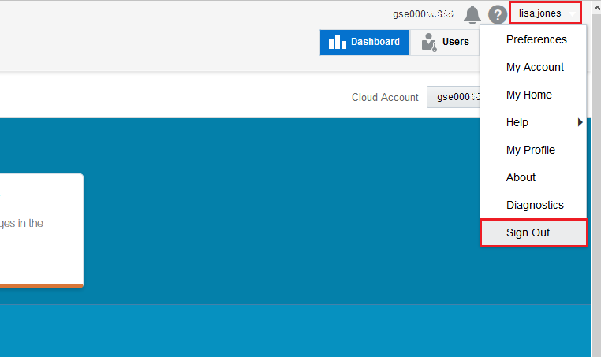

# ORACLE Cloud Test Drive #
-----
## 301: 导航Oracle集成云服务 ##

### 介绍 ###
本教程演示如何:
- 在Oracle集成云服务基于Web的仪表板中导航

### 关于今天的练习 ###
在这个练习中，我们将:
- 导航基于Web的集成云服务（ICS）仪表板以熟悉并体验它与传统应用程序开发的不同之处。.

### 先决条件 ###
- Oracle公有云服务帐户，包括集成云服务（如果您没有，请与指导人员联系）

#### 浏览Oracle集成云服务 ####

1. 在完成之前的微服务实验室之前，我们可以从云仪表板注销，然后继续本实验练习。在仪表板的右上角，点击您的用户名，然后点击注销。.

2. 点击确认按钮注销.

3. 从 [https://cloud.oracle.com/sign-in](https://cloud.oracle.com/sign-in) 登陆云, 首先选择您的数据中心，然后提供Integration Cloud Service（ICS）的身份域和凭证. 

** 或者，您可以通过教师提供的访问文档 - 集成实验室部分进行访问.**  

（*注意：此集成实验室的标识域和凭证与以前在JavaApps实验室和微服务实验室中使用的标识域和凭证不同，请仔细检查教师提供的详细信息）

成功登录后，您将看到您的仪表板。 找到集成服务磁贴，然后点击汉堡包图标。 在下拉菜单中单击打开服务控制台。

4.	如果找不到集成服务磁贴，请单击浏览器右上角的自定义仪表板按钮，然后单击自定义仪表板对话框窗口集成部分的显示按钮。

5. 在打开的服务控制台上，ICS主页显示如下：

  \* 关闭指南我快速浏览如果运行点击Got it！ 按钮在底部，我们不需要在实验室练习。

6. 	主页提供了Oracle集成云服务主要开发功能的链接：连接，集成，监视，查找，包，代理，适配器和库。

7. 	使用导航窗格，单击左上角  显示导航窗格.

导航窗格使您可以访问Oracle集成云服务中的所有开发功能。

[Procced to Next - 302: Import and Define Connections for CRM Customer Activity Service and REST Service Exposure](302-IntegrationsLab.md)

or

[Back to Integrations Lab Home](README.md)
