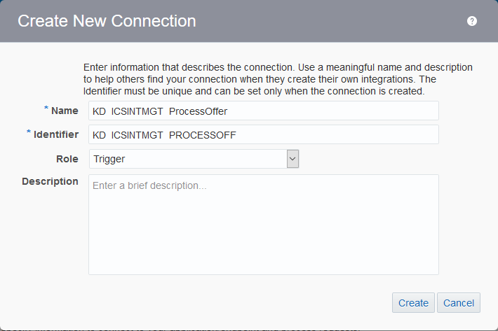

#### 302: Define Connections for CRM Customer Activity Service and REST Service Exposure ####

6. Go to **Connections** Summary Page by click on the `Connection` green icon.

Alternatively, you can go to **Connections** Summary Page by click the hamburger icon at the top left corner, click `Designer` and then `Connections`

7. In the home page of **Connections**, click `Create` button on the top left corner, the **Create Connection - Select Adapter** dialog window is shown.  
   You could see different types of connection adapters are available, such as *Sales Cloud, E-Business Suite, Twitter, Salesforce and more*. However in this lab exercise, we will create a simple *SOAP* connection to connect a CRM Customer Activity Service interface.  
   Now, do a search by entering `SOAP` in the search text box, then click `Select` button in the **SOAP** adapter connection box like below.

8. A new dialog window **Create New Connection** is shown, enter the following information to create our first *SOAP Connection*:
    * **Name:** Provide an unique and easily identified *Connection* Name, such as <Your Short Name\_<System_Name>\_<Service_Name>. In our example, this is **KD_CRM_CustomerService**, while *KD* is short name of *Kelvin Durant*.
	* **Identifier:** The **Identifier** will be automatically filled-in while you type the **Name** above, however you can provide another unique identifier, suggest include your short name as prefix.
	* **Role:** Select **Invoke** from the drop-down list. (We are going to *Invoke* this service only)
	* **Description (Optional):** You can leave it empty or enter any meaningful text to describe this *SOAP Connection*.

9. Click `Create` button, the **SOAP Connection** page with your provided **Name** is shown.

10. Scroll down to **Connection Properties** section, click `Configure Connectivity` button, the **Connection Properties** dialog window is shown. Fill in the **WSDL URL** by providing **Property Value** in the format of:
    * **http://\<Your Java Cloud Service Instance IP Address\>/crm/CustomerServicePort?WSDL**  
	*\*If you forget your JCS instance IP address, [Click Here!](../Java%20Apps/java.cloud.md)*  
	Leave other properties **empty** as they are optional and not required in this lab exercise.
	

11. Click `OK` button to save changes made.  
    Scroll down to **Security** section, click `Configure Security` button, the **Credentials** dialog window is shown.  
    From **Security Policy**, select `No Security Policy` from the drop-down list. Although *Basic Authentication* and *Username Password Token* are supported, we skip to use no security policy which is used by the lab exercise.

13. Click `OK` button to save changes made.  
    From the **SOAP Connection** page, click `Test` from top right corner, the test **Confirmation** dialog window is shown.  
	Click `Validate and Test` button.

14. You should find a green dialog text area about **Connection was tested successfully**.

15. Next, click `Save` from top right corner.

16. Similarly you should find a green dialog text area about **Connection was saved successfully**.  
    Click `Close` to exit and back to **Connection** Summary Page.

17. A *SOAP Connection* to CRM Customer Service was made and ready to be \*invoked\*. Now we are going to create another *REST* connection.  
    However, this time the *Connection* is **NOT** to \*invoke\* any endpoint service, but instead it is a *\*trigger\** which is being called by a front client, i.e. A mobile client *triggers* to this *REST* connection service.  
	
	Make sure you are still on **Connections** Summary Page. If not, follow step 6 previously.  
	
	Click `Create` button on the top left corner, the **Create Connection - Select Adapter** dialog window is shown.  
	Enter search text `REST` in the search text box, then click `Select` button in the **REST** adapter connection box like below.
	

18. A new dialog window **Create New Connection** is shown, enter the following information to create our *REST Connection*:
    * **Name:** Provide an unique and easily identified *Connection* Name, such as <Your Short Name>\_<System_Name>\_<Service_Name>. In our example, this is **KD_ICSINTMGT_ProcessOffer**, while *KD* is short name of *Kelvin Durant*.
	* **Identifier:** The **Identifier** will be automatically filled-in while you type the **Name** above, however you can provide another unique identifier, suggest include your short name as prefix.
	* **Role:** Select **Trigger** from the drop-down list. (We are going to *Trigger* this service only)
	* **Description (Optional):** You can leave it empty or enter any meaningful text to describe this *REST Connection*.

19. Click `Create` button, the **REST Connection** page with your provided **Name** is shown.  
   This time, the page is more simpler due to the *Trigger* type connection.

20. On **Security** section, click `Configure Security` button, the **Credentials** dialog window is shown.  
    From **Security Policy**, the default and only available option is `Basic Authentication` from the drop-down list. This is the minimal security policy required by ICS.  
	Click `OK` button to save changes made.
    

21. From the **REST Connection** page, click `Test` from top right corner.  
    You should find a green dialog text area about **Connection was tested successfully**.

22. Next, click `Save` from top right corner.  
    You should find a green dialog text area about **Connection was saved successfully**.  
    Click `Close` to exit and back to **Connection** Summary Page.

23. Two *Connections* are just made ready, the **SOAP Connection - \*Invoke\* to CRM Customer Service** and **REST Connection - \*Trigger\* to ICS for Process Offer** respectively.
