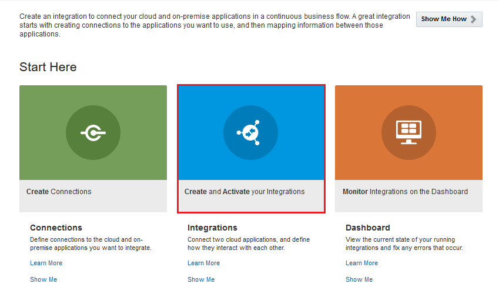
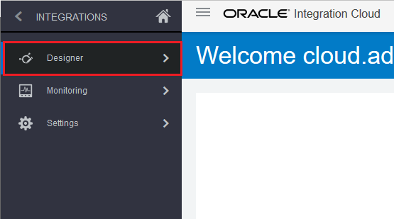
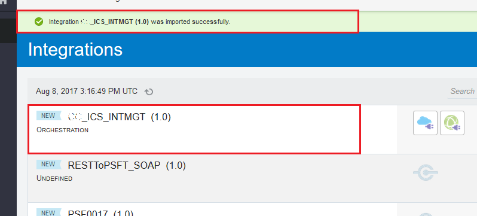
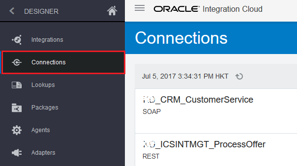
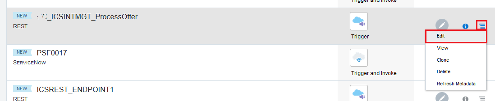

# ORACLE Cloud Test Drive #
-----
## 302: Import and Define Connections for CRM Customer Activity Service and REST Service Exposure ##

### Introduction ###
This tutorial demonstrates how to:
- Import and define ICS connections for a REST trigger service exposure and invoke an external SOAP service

### About the Exercise Today ###
In this exercise, we will:
- Using the web-based click and configure techniques to import and define ICS connection resources: **SOAP** and **REST** respectively.

### Prerequisites ###
- Oracle Public Cloud Service account including Integration Cloud Service
- An Integration Archive File (IAR) name as `XXX_ICS_INTMGT_01_lab.iar` distributed by instructor

#### Import Integration Cloud Service Project Artifact ####

1. Go to **Integrations** Summary Page by click on the `Integrations` blue icon.

Alternatively, you can go to **Integrations** Summary Page by click the hamburger icon at the top left corner, click `Designer` and then `Integrations`.

2. Click `Import` on the top right corner, the **Import Integration?** dialog window appears. Click `Browse` button.

3. Browse and open your machine local directory to select the *IAR* file provided by instructor previously, then click `Import` button.

4. You should find a green dialog text area about **Integration was imported successfully** and the newly imported entity named **XXX_ICS_INTMGT (1.0)** shown on the integration list.

You have successfully imported a set of partial pre-built artifacts. We will walk-thru what has been built and complete the remaining part.  

#### Define SOAP Connection for CRM Customer Activity Service ####

5. Go to **Connections** Summary Page by click the hamburger icon at the top left corner, click `Designer` and then `Connections`.

6. In the home page of **Connections**, you should be able to locate the newly imported connection entities named as **XXX_CRM_CustomerService** and **XXX_ICSINTMGT_ProcessOffer** respectively.

7. Next, on the row of **XXX_CRM_CustomerService** Connection, click the hamburger menu icon at the right side and select `Edit` like below.

8. The **XXX_CRM_CustomerService** Connection detail page is shown. As stated, this is a *SOAP* protocol based connection which will *Invoke* a service endpoint. We are going to define this connection detail.

9. Scroll down to **Connection Properties** section, click `Configure Connectivity` button.

10. The **Connection Properties** dialog window is shown. Fill in the **WSDL URL** by providing **Property Value** in the format of:
    * **http://\<Your Java Cloud Service Instance IP Address\>/crm/CustomerServicePort?WSDL**  
	*\*If you forget your JCS instance IP address, [Click Here!](../../Java%20Apps/java.cloud.md)*  
	Leave other properties **empty** as they are optional and not required in this lab exercise.
	

11. Leave other property settings unchanged. Click `OK` button to save changes made.  
Notice that `No Security Policy` is selected as this is required by the endpoint interface.  

12. From the top of **SOAP Connection** page, click `Test` from top right corner, the test **Confirmation** dialog window is shown.  
	Click `Validate and Test` button.

13. You should find a green dialog text area about **Connection was tested successfully**.

14. Next, click `Save` from top right corner.

15. The **Save Changes?** dialog window appears to warn about reactivating integrations, just click `Save` to confirm and close the dialog.

16. You should find a green dialog text area about **Connection was saved successfully**.  
    Click `Close` to exit and back to **Connection** Summary Page.

17. A *SOAP Connection* to CRM Customer Service was updated and ready to be \*invoked\*.  

#### Define REST Connection for ICS Service Exposure ####

18. Now we are going to update the **XXX_ICSINTMGT_ProcessOffer** connection.  
    However, this time the *Connection* is **NOT** to \*invoke\* any endpoint service, but instead it is a *\*trigger\** which is being called by a front client, i.e. A mobile client *triggers* to this *REST* connection service.  
	
	Make sure you are still on **Connections** Summary Page. If not, follow step 1 previously.  
	On the row of **XXX_ICSINTMGT_ProcessOffer** Connection, click the hamburger menu icon at the right side and select `Edit` like below.
	

19. This time, the **XXX_ICSINTMGT_ProcessOffer** Connection detail page is shown and is more simpler due to the *REST Trigger* type connection.

20. From **REST Connection** page, click `Test` from top right corner.  
    You should find a green dialog text area about **Connection was tested successfully**.

21. Next, click `Save` from top right corner.  
Similarly, the **Save Changes?** dialog window appears to warn about reactivating integrations, click `Save` to confirm and close the dialog again.

22. You should find a green dialog text area about **Connection was saved successfully**.  
    Click `Close` to exit and back to **Connection** Summary Page.

23. Two *Connections* are just made ready, the **SOAP Connection - \*Invoke\* to CRM Customer Service** and **REST Connection - \*Trigger\* to ICS for Process Offer** respectively.

[Procced to Next - 303: Complete an Integration - An Orchestration Integration Flow](303-IntegrationsLab.md)

or

[Back to Integrations Lab Home](README.md)
