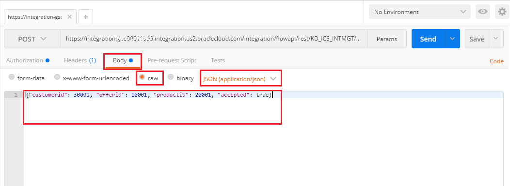
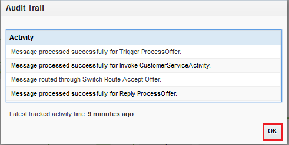

# ORACLE Cloud Test Drive #
-----
## 304: Testing the service and Monitoring with ICS Dashboards ##

### Introduction ###
This tutorial demonstrates how to:
- Consume and monitor a service exposed by Integration Cloud Service (ICS) 

### About this tutorial ###
In this exercise, we will:
- Test an integration flow with REST trigger connection being exposed
- Examine test results from varies ICS monitoring facilities

### Prerequisites ###
- Oracle Public Cloud Service account including Integration Cloud Service
- SOAP and REST connections and an orchestration flow in ICS already configured (303-IntegrationsLab.md)

#### Testing and Monitoring Your Work on ICS ####

1. Previously we have successfully deployed an integration flow which accepts a REST JSON request, route to a SOAP CRM customer service and then reply a REST JSON response. Let's test this service and monitor how it goes.  
	To do so, [install Postman and use Google Chrome browser to access here](https://chrome.google.com/webstore/detail/postman/fhbjgbiflinjbdggehcddcbncdddomop), launch it after installation.

2. In the Postman, provide the following information:
- Select **POST** from drop down list of HTTP methods.
- In **Enter request URL** text box: Put the URL `https://integration-<Your ICS Identity Domain>.integration.us2.oraclecloud.com/integration/flowapi/rest/<Your Integration Service Name>/v01/processoffer`
- Under **Authentication** tab: select `Basic Auth` from drop down list and enter your ICS username and password respectively.

3. Go to **Headers** tab: enter `Content-Type` under **Key** and `application/json` under **Value** respectively.

4. Go to **Body** tab: select `raw` as body format, `JSON (application/json)` as content type and enter body text as either one of following:
- Test 1: `{"customerid": 30001, "offerid": 10001, "productid": 20001, "accepted": true}`
- Test 2: `{"customerid": 30002, "offerid": 10002, "productid": 20002, "accepted": false}`

(\*Notice: The tests above are not using real data, it just aims for testing the availability of API on ICS)

5. Click `Send` button to fire the request, you have received Status `200 OK` and response body content like below.

6. Back to ICS, click the hamburger menu icon on top left corner, and then click `Monitoring`.

7. By default, the ICS Monitoring **Dashboard** is shown.
    The dashboard summarizes entire ICS traffic condition/trend amongst, *CONNECTIONS*, *INTEGRATIONS*, *SUCCESS*, *FAILURES* and other information, which are critical to integration monitoring.  
	(Optional) Notice on the right of dashboard, you can access to `Activity Stream`, `Download Diagnotics Logs` and `Download Incident`. Feel free to further explore.

8. Under `MONITORING`, click on `Integrations`, you can see the recently test messages fired previously.  
    Now click on `View Messages` icon on the right.

9. The **Track Instances** flow window for your particular integration is shown.  
    Click on one of your tested instance like below: 

10. The flow instance of the specific message transaction is shown.  
    The green path throughout the flow instance shows the normal/success flow of the message passing thru.  
	Now click on the hamburger menu icon on top right corner, and then click `Business Identifiers`.

11. The `Business Identifiers` dialog window is shown.  
    Notice the values of `customerid`, `offerid` and `productid` of this particular message are logged.  
	Click `OK`.

12. Click on the hamburger menu icon at top right corner, click `View Audit Trail`.  
    The **Audit Trail** of overall activity executed by the integration flow dialog window is shown.  
    Click `OK` button and then click `Close`.

You have finished this lab.

[Back to Integrations Lab Home](README.md)
