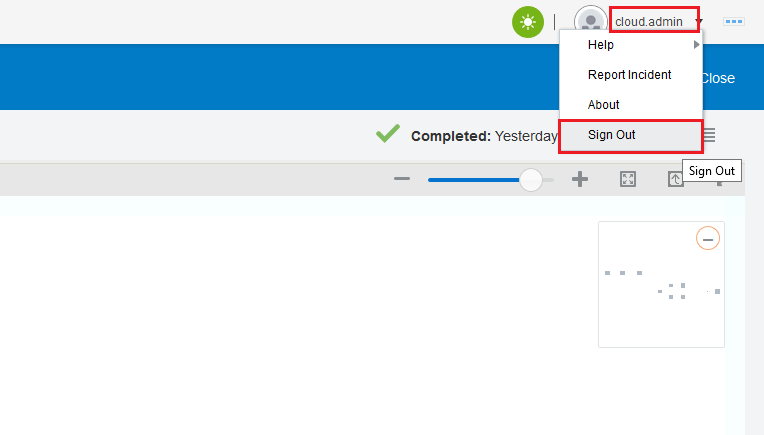

# ORACLE Cloud Test Drive #
-----
## 304: 使用ICS仪表板测试服务和监控 ##

### 介绍 ###
本教程演示如何:
- 使用集成云服务（ICS）公开的服务

### 关于本教程 ###
在这个练习中，我们将:
- 在REST触发器连接暴露的情况下测试集成流
- 检查各种ICS监测设施的测试结果

### 先决条件 ###
- Oracle公有云服务帐户，包括集成云服务
- SOAP和REST连接以及已配置的ICS中的编排流程 (303-IntegrationsLab.md)

#### 测试和监控您在ICS上的工作 ####

1. 以前我们已经成功地部署了一个集成流程，它接受一个REST JSON请求，路由到一个SOAP CRM客户服务，然后回复一个REST JSON响应。 让我们来测试这个服务并且监控它是如何发生的s.  
	为此，, [请安装Postman并使用Google Chrome浏览器访问此处](https://chrome.google.com/webstore/detail/postman/fhbjgbiflinjbdggehcddcbncdddomop),然后在安装后启动它.

2. 在Postman中，提供以下信息:
- 从HTTP方法的下拉列表中选择POST.
- 在输入请求URL文本框中输入： `https://integration-<Your ICS Identity Domain>.integration.us2.oraclecloud.com/integration/flowapi/rest/<Your Integration Service Name>/v01/processoffer`
- 在身份验证标签下：从下拉列表中选择基本身份验证，然后分别输入您的ICS用户名和密码。

3. 转到Headers选项卡：分别在Key下输入Content-Type，在Value下输入application / json.

4. 转到Body选项卡：选择raw作为正文格式，JSON（application / json）作为内容类型，并以下列任一方式输入正文:
- Test 1: `{"customerid": 30001, "offerid": 10001, "productid": 20001, "accepted": true}`
- Test 2: `{"customerid": 30002, "offerid": 10002, "productid": 20002, "accepted": false}`

(\*注意：上面的测试不是使用真实的数据，它只是为了测试ICS上API的可用性)

5. 点击发送按钮来触发请求，你已经收到状态200 OK和响应正文内容如下。

6. 返回ICS，点击左上角的汉堡菜单图标，然后点击监测.

7. 默认情况下显示ICS监控仪表板。 仪表板总结了对于集成监控至关重要的整个ICS交通状况/趋势，连接，集成，成功，失败和其他信息.  
	（可选）通知仪表板右侧，您可以访问活动流，下载诊断日志和下载事件。 随意进一步探索。

8. 在“监视”下，单击“集成”，可以看到之前触发的最近测试的消息。
   现在点击右侧的查看消息图标。

9. 显示您的特定集成的“轨道实例”流程窗口.  
   点击下面的一个测试实例: 

10. 显示特定消息事务的流程实例 
    整个流程实例中的绿色路径显示消息传递的正常/成功流程。
    现在点击右上角的汉堡包菜单图标，然后点击商户标识符。

11. 显示业务标识符对话窗口。  
    注意这个特定消息的customerid，offerid和productid的值被记录下来。
    点击OK。

12. 12.	点击右上角的汉堡菜单图标，点击查看审计跟踪。  
    显示了集成流程对话窗口执行的整体活动的审计跟踪。
    单击确定按钮，然后单击关闭。

13. 最后，我们可以从Integration Cloud Service注销，然后继续下一个实验练习。 
   在ICS仪表板的右上角，单击您的用户名，然后单击注销。

14. 点击确认按钮注销。

你已经完成了这个实验！！！

[Back to Integrations Lab Home](README.md)
