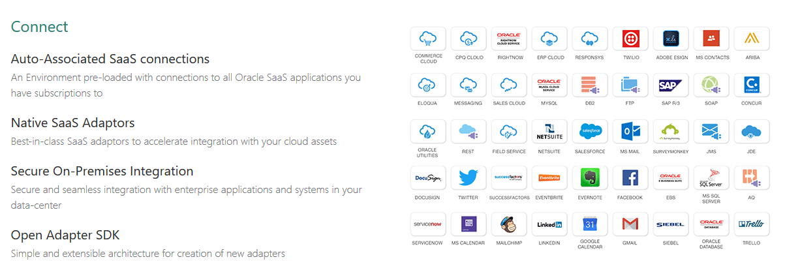

# ORACLE Cloud Test Drive #
-----
## Rapid Connect Applications by Oracle Integration Cloud Service ##

### About this tutorial ###
**Oracle Integration Cloud Service is a complete, secure, but lightweight integration solution that enables you to connect your applications in the cloud. It simplifies connectivity between your applications and connects both your applications that live in the cloud and your applications that still live on premises. Oracle Integration Cloud Service provides secure, enterprise-grade connectivity regardless of the applications you are connecting or where they reside.

Oracle Integration Cloud Service provides native connectivity to Oracle Software as a Service (SaaS) applications, such as Oracle Sales Cloud, Oracle RightNow Cloud, and so on. Oracle Integration Cloud Service adapters simplify connectivity by handling the underlying complexities of connecting to applications using industry-wide best practices. You only need to create a connection that provides minimal connectivity information for each system. Oracle Integration Cloud Service lookups map the different codes or terms used by the applications you are integrating to describe similar items (such as country or gender codes). Finally, the visual data mapper enables you to quickly create direct mappings between the trigger and invoke data structures. From the mapper, you can also access lookup tables and use standard XPath functions to map data between your applications.

Once you integrate your applications and activate the integrations to the runtime environment, the dashboard displays information about the running integrations so you can monitor the status and processing statistics for each integration. The dashboard measures and tracks the performance of your transactions by capturing and reporting key information, such as throughput, the number of messages processed successfully, and the number of messages that failed processing. You can also manage business identifiers that track fields in messages and manage errors by integrations, connections, or specific integration instances.

The key features of Oracle Integration Cloud Service include:

Project creation, configuration, and user management

1 Connect
2 Design
3 Monitor and Manage
4 Accelerate
  * Pre-Built Integrations - Portfolio of pre-built integrations available for immediate use as-is, or customizable for your business requirements
  * Cloud Marketplace - Pre-built adapters and integrations, published by Oracle and Oracle partners
  
Oracle Developer Cloud Service is available as a web interface accessible from a web browser and from Integrated Development Environments (IDEs) such as Oracle Enterprise Pack for Eclipse (OEPE), Oracle JDeveloper, and NetBeans IDE.

This tutorial shows how to deploy Loyalty Management application to Java Cloud Services using Oracle Developer Cloud Services.

The Loyalty Management application is a JEE web application serving simple JSP pages.

This tutorial demonstrates how to:

- Configure Build Job for the Loyalty Management - A JEE application
- Configure Java Cloud Service - WebLogic Server deployment in Developer Cloud Service
- Build and Deploy Loyalty Management Application using Developer Cloud Service

### Prerequisites ###

- Oracle Public Cloud Service account including Developer Cloud Service and Java Cloud Service

----

#### Open Oracle Developer Cloud Service Project ####

1. [Sign in](sign.in.to.oracle.cloud.md) to [https://cloud.oracle.com/sign-in](https://cloud.oracle.com/sign-in). First select your datacenter then provide the identity domain and credentials. After a successful login you will see your Dashboard. Find the Developer services tile and click the hamburger icon. In the dropdown menu click **Open Service Console**.

