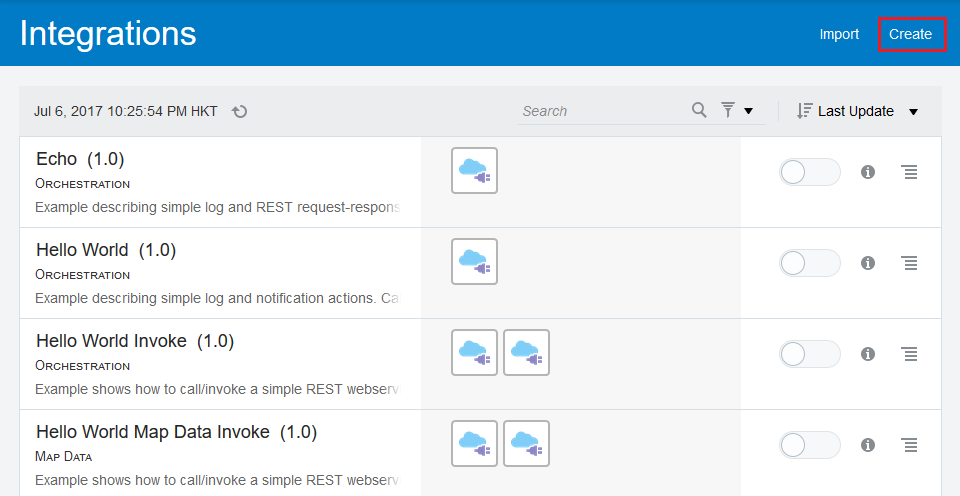
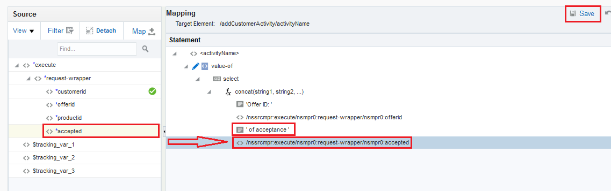
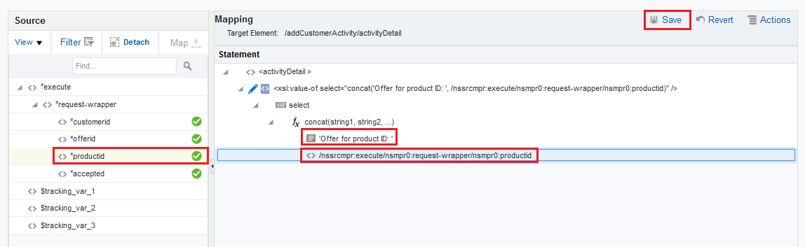
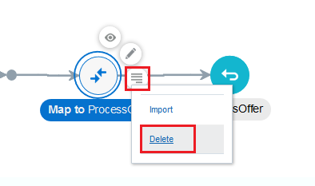

# ORACLE Cloud Test Drive #
-----
## Rapid Connect Applications by Oracle Integration Cloud Service ##

### About this tutorial ###
**Oracle Integration Cloud Service (ICS)** is a complete, secure, but lightweight integration solution that enables you to connect your applications in the cloud. It simplifies connectivity between your applications and connects both your applications that live in the cloud and your applications that still live on premises. Oracle Integration Cloud Service provides secure, enterprise-grade connectivity regardless of the applications you are connecting or where they reside.

Oracle Integration Cloud Service provides native connectivity to Oracle Software as a Service (SaaS) applications, such as Oracle Sales Cloud, Oracle RightNow Cloud, and so on. Oracle Integration Cloud Service adapters simplify connectivity by handling the underlying complexities of connecting to applications using industry-wide best practices. You only need to create a connection that provides minimal connectivity information for each system. Finally, the visual data mapper enables you to quickly create direct mappings between the trigger and invoke data structures. From the mapper.

Once you integrate your applications and activate the integrations to the runtime environment, the dashboard displays information about the running integrations so you can monitor the status and processing statistics for each integration. The dashboard measures and tracks the performance of your transactions by capturing and reporting key information. You can manage business identifiers that track fields in messages and manage errors by integrations, connections, or specific integration instances.

The key features of Oracle Integration Cloud Service include:

Project creation, configuration, and user management

1. **Connect**
    - Auto-Associated SaaS connections
	- Native SaaS Adaptors
	- Secure On-Premises Integration
	- Open Adapter SDK
2. **Design**
    - Intuitive Visual Designer and Mobile Ready - Rich Point and click browser-based designer to build integrations anywhere - on your computer or your favorite tablet
    - Oracle Recommends™ - Smart Data Mapper provides accurate recommendations using Oracle Recommends™
    - Business User Friendly - Business friendly terminology combined with videos and tutorials for ease of use
    - API-Ready - Publish your integrations as an API for external consumption
3. **Monitor and Manage**
    - End to End Visibility - Simple and powerful search to help you zero in on transactions of interest. Comprehensive drill-down capabilities for detailed auditing and analysis
    - Monitor KPIs - Real-time insight into key performance indicators on a high-performance visual dashboard
    - Robust Error Management - Rapidly detect and diagnose errors for corrective action
4. **Accelerate**
    - Pre-Built Integrations - Portfolio of pre-built integrations available for immediate use as-is, or customizable for your business requirements
    - Cloud Marketplace - Pre-built adapters and integrations, published by Oracle and Oracle partners

This tutorial shows how to connect to different applications to serve frontend mobile consumers using Oracle Integration Cloud Service. Once ICS receives a request from mobile consumer, it routes to CRM to perform customer activity log about acceptance of a product offer, and then it returns QR code image URL if user accepted the offer.

This tutorial demonstrates how to:

- Configure Connection definiton to a Simple Object Access Protocol (SOAP) based Customer Relationship Management (CRM) service and Expose into Representational State Transfer (REST) based service
- Configure Integration flow to interconnect service endpoints, mapping request and response data attributes and orchestrate decision logic
- Monitor integration flow transaction and endpoint status, performance statistics and business identifiers

### Prerequisites ###

- Oracle Public Cloud Service account including Integration Cloud Service

----

#### Navigating Oracle Integration Cloud Service ####

1. [Sign in](sign.in.to.oracle.cloud.md) to [https://cloud.oracle.com/sign-in](https://cloud.oracle.com/sign-in). First select your datacenter then provide the identity domain and credentials of **Integration Cloud Service \(ICS\)**. After a successful login you will see your Dashboard. Find the **integration** services tile and click the hamburger icon. In the dropdown menu click `Open Service Console`.

2. If you cannot find the **integration** services tile, click `Customize Dashboard` button at top right corner of browser, and then click `Show` button at the integration section of the **Customize Dashboard** dialog window.

3. On Service Console opened, the ICS home page is displayed as following:

  \*Close the **Guide Me** Quick Tour if running by click `Got it!` button at the bottom, we don't need it during the lab exercise.

4. The home page provides links to the primary development features of Oracle Integration Cloud Service: connections, integrations, monitoring, lookups, packages, agents, adapters, and libraries.

5. Using the Navigation Pane, click  in the upper left corner to show the navigation pane.

The navigation pane provides you with access to all the development features in the Oracle Integration Cloud Service.

#### Define Connections for CRM Customer Activity Service and REST Service Exposure ####

6. Go to **Connections** Summary Page by click on the `Connection` green icon.

Alternatively, you can go to **Connections** Summary Page by click the hamburger icon at the top left corner, click `Designer` and then `Connections`

7. In the home page of **Connections**, click `Create` button on the top left corner, the **Create Connection - Select Adapter** dialog window is shown.  
   You could see different types of connection adapters are available, such as *Sales Cloud, E-Business Suite, Twitter, Salesforce and more*. However in this lab exercise, we will create a simple *SOAP* connection to connect a CRM Customer Activity Service interface.  
   Now, do a search by entering `SOAP` in the search text box, then click `Select` button in the **SOAP** adapter connection box like below.

8. A new dialog window **Create New Connection** is shown, enter the following information to create our first *SOAP Connection*:
    * **Name:** Provide an unique and easily identified *Connection* Name, such as <Your Short Name\_<System_Name>\_<Service_Name>. In our example, this is **KD_CRM_CustomerService**, while *KD* is short name of *Kelvin Durant*.
	* **Identifier:** The **Identifier** will be automatically filled-in while you type the **Name** above, however you can provide another unique identifier, suggest include your short name as prefix.
	* **Role:** Select **Invoke** from the drop-down list. (We are going to *Invoke* this service only)
	* **Description (Optional):** You can leave it empty or enter any meaningful text to describe this *SOAP Connection*.

9. Click `Create` button, the **SOAP Connection** page with your provided **Name** is shown.

10. Scroll down to **Connection Properties** section, click `Configure Connectivity` button, the **Connection Properties** dialog window is shown. Fill in the **WSDL URL** by providing **Property Value** in the format of:
    * **http://\<Your Java Cloud Service Instance IP Address\>/crm/CustomerServicePort?WSDL**  
	*\*If you forget your JCS instance IP address, [Click Here!](../Java%20Apps/java.cloud.md)*  
	Leave other properties **empty** as they are optional and not required in this lab exercise.
	

11. Click `OK` button to save changes made.  
    Scroll down to **Security** section, click `Configure Security` button, the **Credentials** dialog window is shown.  
    From **Security Policy**, select `No Security Policy` from the drop-down list. Although *Basic Authentication* and *Username Password Token* are supported, we skip to use no security policy which is used by the lab exercise.

13. Click `OK` button to save changes made.  
    From the **SOAP Connection** page, click `Test` from top right corner, the test **Confirmation** dialog window is shown.  
	Click `Validate and Test` button.

14. You should find a green dialog text area about **Connection was tested successfully**.

15. Next, click `Save` from top right corner.

16. Similarly you should find a green dialog text area about **Connection was saved successfully**.  
    Click `Close` to exit and back to **Connection** Summary Page.

17. A *SOAP Connection* to CRM Customer Service was made and ready to be \*invoked\*. Now we are going to create another *REST* connection.  
    However, this time the *Connection* is **NOT** to \*invoke\* any endpoint service, but instead it is a *\*trigger\** which is being called by a front client, i.e. A mobile client *triggers* to this *REST* connection service.  
	
	Make sure you are still on **Connections** Summary Page. If not, follow step 6 previously.  
	
	Click `Create` button on the top left corner, the **Create Connection - Select Adapter** dialog window is shown.  
	Enter search text `REST` in the search text box, then click `Select` button in the **REST** adapter connection box like below.
	

18. A new dialog window **Create New Connection** is shown, enter the following information to create our *REST Connection*:
    * **Name:** Provide an unique and easily identified *Connection* Name, such as <Your Short Name>\_<System_Name>\_<Service_Name>. In our example, this is **KD_ICSINTMGT_ProcessOffer**, while *KD* is short name of *Kelvin Durant*.
	* **Identifier:** The **Identifier** will be automatically filled-in while you type the **Name** above, however you can provide another unique identifier, suggest include your short name as prefix.
	* **Role:** Select **Trigger** from the drop-down list. (We are going to *Trigger* this service only)
	* **Description (Optional):** You can leave it empty or enter any meaningful text to describe this *REST Connection*.

19. Click `Create` button, the **REST Connection** page with your provided **Name** is shown.  
   This time, the page is more simpler due to the *Trigger* type connection.

20. On **Security** section, click `Configure Security` button, the **Credentials** dialog window is shown.  
    From **Security Policy**, the default and only available option is `Basic Authentication` from the drop-down list. This is the minimal security policy required by ICS.  
	Click `OK` button to save changes made.
    

21. From the **REST Connection** page, click `Test` from top right corner.  
    You should find a green dialog text area about **Connection was tested successfully**.

22. Next, click `Save` from top right corner.  
    You should find a green dialog text area about **Connection was saved successfully**.  
    Click `Close` to exit and back to **Connection** Summary Page.

23. Two *Connections* are just made ready, the **SOAP Connection - \*Invoke\* to CRM Customer Service** and **REST Connection - \*Trigger\* to ICS for Process Offer** respectively.

#### Create an Integration - An Orchestration Integration Flow ####

24. Using the Navigation Pane, click  in the upper left corner to show the navigation pane, and then click `Integrations`.

25. The home page of **Integrations** is shown, click `Create` button on the top left corner.

26. The **Create Integration - Select a Style\/Pattern** dialog window is shown.  
    You could see different types of integration are available, including *Orchestration, Map Data, Publish To ICS and Subscribe To ICS*. However in this lab exercise, we will create an *Orchestration* integration.  
    Click `Select` button under *Orchestration* box.   

27. A new dialog window **Create New Integration** is shown, enter the following information to create our *Integration*:
    * **What triggers this integration?** Keep the default selected *Application event or business object*.
    * **What do you want to call your integration?** Provide an unique and easily identified *Integration* Name, such as <Your Short Name>\_<System_Name>\_<Service_Name>. In our example, this is **KD_ICS_INTMGT**, while *KD* is short name of *Kelvin Durant*.
	* **Identifier** The **Identifier** will be automatically filled-in while you type the **Name** above, however you can provide another unique identifier, suggest include your short name as prefix.
	* **Version** Select Keep the default value. (Change only if you are going to create a new *versioned* integration)
	* **What does this integration do? (Optional)** You can leave it empty or enter any meaningful text to describe this *Integration*.
	* **Which package does this integration belong to? (Optional)** You can leave it empty or enter any meaningful package name to collectively group with other integrations.
	

	
28. Click `Create` button, the integration orchestration editor is shown.

29. First of all, we are going to define how this integration flow being exposed to client consumer by setting up a **Trigger**.  
    Now, click `Triggers` at the right side bar, the palette title on the right changed to **Triggers**.  
    Select `REST`, the list of available *REST Trigger Connection* is shown.  
    Drag and Drop your newly created *Trigger Connection* (Our example is 'KD_ICSINTMGT_ProcessOffer'), to the "+" icon of flow diagram inside the big *circle* under *START*.

30. The **Configure Oracle REST Endpoint** dialog window is shown. Provide the following information:
    * **What do you want to call your endpoint?** Enter `ProcessOffer`
	* **What is the endpoint's relative resource URI?** Enter `/processoffer`
	* **What action does the endpoint perform?** Select `POST`
	* Check to select **Configure a request payload for this endpoint**
	* Check to select **Configure this endpoint to receive the response**
	* Leave others empty or unselect.
	
	Click `Next` button.

31. The **Configure the Request Payload** page is shown, check:
    * **Select the request payload file** `JSON Sample`
	* **Select the type of payload with which you want the endpoint to receive** `JSON`
	
	Click `<<< inline >>>` link next to **--OR-- enter sample JSON**
	

32. The **Request Sample Json Payload** page is shown.
    Copy this text `{   "customerid": 21767684,   "offerid": 49531393,   "productid": 28916305,   "accepted": true }` to the text area under **Enter Sample JSON**.  
    Click `OK` button at the bottom.

33. Click `Next` button to proceed next, **Configure the Response Payload** page, check:
    * **Select the response payload file** `JSON Sample`
	* **Select the type of payload with which you want the endpoint to reply** `JSON`
	
	Click `<<< inline >>>` link next to **--OR-- enter sample JSON**

34. The **Response Sample Json Payload** page is shown.
    Copy this text `{   "activityid": "10001-43513-v1.0",   "imgurl": "tmptext" }` to the text area under **Enter Sample JSON**.  
    Click `OK` button at the bottom.

35. Click `Next` button to proceed next, **Oracle REST Endpoint Configuration Summary** page.  
    Your setup should look like below, then click `Done` button. We just finish defining a REST **Trigger** to expose this integration flow to client consumer.
	

36. Back to the *Integration Orchestration Editor*, you can:
    * Drag and drop to re-arrange each node of integration orchestration flow to different location.
    * Click `-` or `+` button on top left corner to re-size flow diagram to fit your screen resolution.
	* As best practice, regularly click `Save` button at the top left corner to store your work from time to time.
	

37. Next, we are going to define a service callout, to **Invoke** an endpoint service - CRM Customer Service.  
    Now, click `Invokes` at the right side bar, the palette title on the right changed to **Invokes**.  
    Select `SOAP`, the list of available *SOAP Invoke Connection* is shown.  
    Drag and Drop your newly created *Invoke Connection* (Our example is 'KD_CRM_CustomerService'), to the middle of integration flow, between **ProcessOffer** and **Map to ProcessOffer** activity.

38. The **Configure SOAP Endpoint** dialog window is shown. Provide the following information:
    * **What do you want to call your endpoint?** Enter `CustomerServiceActivity`
	* **What does this endpoint do?** Optional
	* **Do you want to configure this as a callback invoke?** Select `No`

	
39. Do not change other values, click `Next` -> `Next` -> `Next` and finally `Done` buttons. You should have a similar integration flow as below.  
    We just finish defining an **Invoke** to call a CRM customer service SOAP endpoint.  
	
	Now, we are going to define how different data fields are being passed incoming from **Trigger** to outgoing **Invoke*.  
	Click the **Map to CustomerServiceActivty** node and then further click on the `pencil` icon to enter data mapper screen.

40. In the data mapper window, drag the `customerid` radio button on left **Source** pane, and then drop to the `customerId` radio button on right **Target** pane.

41. A 'Green' line linking source and target customerId is created.

42. Next, we want to send text data on the `activityName` field of *addCustomerActivity* target, in the format of: `Offer ID: <'offerid' field from Source> of acceptance <'accepted' field from Source>`.  
    In order to setup, click on the field `activityName` on the **Target** *addCustomerActivity* pane directly. The **Build Mappings** dialog window is shown.

43. Expand `Mapping Components` from the left pane, then expand `String`.  
    Drag the `f(x) concat` from left pane, to the location of `-- Drag and Drop or Type value here...` under <activityName> in the right pane.

44. Click on `string1`, enter `'Offer ID: '`, then **Enter**.  
    Expand `Source` from the left pane, drag the `offerid` field and drop it onto `string2`. A string is automatically inserted. \(This is the XSLT variable representation of 'offerid'\)

45. Select on the last entry of concatenated string list, right click and select `Insert Sibling After`.

46. Click on the newly added entry `-- Drag and Drop or Type value surrounded with quotes here...`, enter `' of acceptance '`, then **Enter**.  
    Repeat last step 45 to add one more entry by `Insert Sibling After`.  
	Expand `Source` from the left pane, drag the `accepted` field and drop it on the last entry `-- Drag and Drop or Type value surrounded with quotes here...`. A string is automatically inserted. \(This is the XSLT variable representation of 'accepted'\)  
	Click `Save` on the top right corner.

47. The `activityName` field is defined with **Mapping** `f(x), offerid, of acceptance, accepted`.  
    Next, click on `activityDetail` link to setup this field.

48. **(Simple Challenge)**  
    Follow the same steps as what you did to setup `activityName` field, setup the `activityDetail` field in the format of:  
    `'Offer for product ID: ' + <productid>`  
    Do not forget to click `Save` to save your work, before click `Close` to exit the **Build Mappings** dialog window.

49. The `activityDetail` field is defined with **Mapping** `f(x), productid`.  
    Finally, click `activityDate` field to setup up this field.

50. The **Build Mappings** dialog window is shown. Expand `Mapping Components` from the left pane, then expand `Date`.  
    Drag the `f(x) current-date` from left pane, to the location of `-- Drag and Drop or Type value here...` under <activityDate> in the right pane.  
	Click `Save` to save your work and then click `Close` to exit the **Build Mappings** dialog window.

51. The *Data Mapping* for *CustomerService Activity* has just been completed.  
    Click `Validate`, the green banner `Mapping is valid and ready to use.` appears at the top.  
	(Optional) You can test the data mapping by click `Test` button on the right. Try it!  
	Click `Close` to return integration flow editor and click `Save` again to save your work.

52. Finally, we are going to define how to response data back to client consumer thru this integration flow.  
    The logic is based on the acceptance - **accepted** field of an offer from customer by:  
	- If **true**, means customer accepted the offer, then return the CRM logged *activityId* and the QR code image URL, which is generated based on *offerId*.
	- If **false**, means customer denied the offer, then return the CRM logged *activityId* (still required as a 'denied' customer action) and an empty QR code image URL, i.e. no QR code image will be displayed.  
	
    To do so, click `Actions` on the right side pane, then drag the `Switch` and drop it onto the integration flow, between **CustomerServiceActivity** node and **Map to ProcessOffer** node.
	

	
53. You should have a similar flow diagram as below. Adjust node and line position, zoom out or zoom in if necessary.

54. Click the newly added switch node - `Undefined`, click `Edit`.

55. The **Expression Editor** is shown. Perform the following step to setup a condition:
    1. Enter `Accept Offer` in the **Expression Name**.  
	2. Expand **Components** -> `Functions` -> `String`, drag the `fx lower-case` from left pane, and drop it onto the *New Condition* text area at right pane.  
	3. Expand **Source**, drag the `accepted` field from left pane, and drop it onto the newly added text `fn:lower-case(string)` at right pane.  
	4. Enter `"true"` in the text area under `=` drop down box.  
	5. Click `Expression Mode` button on the top left corner.

56. Verify the content in **Expression** and the **Expression Summary**, click `Validate` on the top left corner.  
    A green banner `Expression is valid and ready to use` is shown. Click `Close` to back integration flow editor.

57. Under *if* or *otherwise* condition, different response data will be returned. Here we delete the default `Map to ProcessOffer` response data mapping.  
    Click on the `Map to ProcessOffer`, click the hamburger icon and then click `Delete` to remove this node. 

58. 

59. 

#### Testing the service and Monitoring with ICS Dashboards ####

