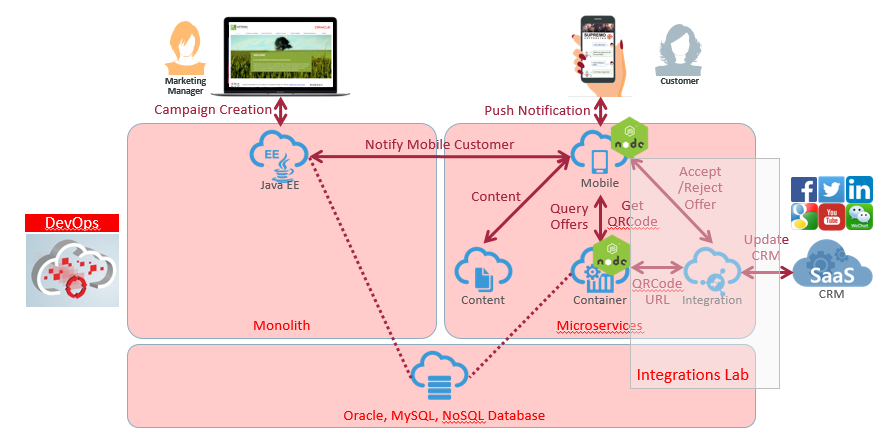

# ORACLE Cloud Test Drive #
-----
## 3. Oracle集成云服务的快速连接应用程序 ##

** 通过Oracle集成云服务快速连接应用程序. 这是实验室的简化版本，长度约为45至60分钟。 如果您有兴趣，请随时浏览完整版本 [HERE](long/README.md)

### 介绍 ###
本实验室是亚太地区云试驾的一部分，是第三个快速连接和集成CRM应用程序的实验室。
本节介绍如何通过Oracle集成云服务简单地使用基于Web的仪表板来集成应用程序。

#### 关于今天的练习 ####

在本练习中，我们将连接到后端应用程序并使用Oracle Integration Cloud Service来提供前端移动消费者请求。 当ICS接收到移动消费者的请求时，它会路由到CRM以执行关于接受产品报价的客户活动日志，然后在用户接受报价时返回QR码图像URL。

**实验假设**
+ 您是快速整合CRM系统的“集成架构师
+ CRM系统和所需的服务端点已准备就绪，可以连接和使用
+ 在第二个实验室之后，QR Code服务已经在Application Container Cloud Service中准备就绪

**Oracle Integration Cloud Service (ICS)** 是一个完整，安全，但轻量级的集成解决方案，使您能够连接您的云中的应用程序。 它简化了您的应用程序之间的连接，并将您云中的应用程序和仍然驻留在本地的应用程序连接起来。 Oracle集成云服务提供安全的企业级连接，无论您连接的应用程序或其驻留的位置如何。

Oracle集成云服务提供与Oracle软件即服务（SaaS）应用程序（如Oracle销售云，Oracle RightNow云等）的本地连接。 Oracle集成云服务适配器通过使用行业范围的最佳实践处理连接到应用程序的底层复杂性，简化了连接。您只需创建一个连接，为每个系统提供最少的连接信息。最后，可视化数据映射器使您能够快速创建触发器之间的直接映射，并从映射器调用数据结构。
一旦集成应用程序并激活集成到运行时环境，仪表板将显示有关正在运行的集成的信息，以便您可以监视每个集成的状态和处理统计信息。仪表板通过捕获和报告关键信息来衡量和跟踪交易的表现。您可以管理跟踪消息中字段的业务标识符，并通过集成，连接或特定集成实例来管理错误。
 
Oracle集成云服务的主要功能包括:
1. **连接**
    - 自动关联的SaaS连接
    - 原生SaaS适配器
    - 安全的本地集成
    - 打开适配器SDK
2. **设计**
    - 直观的可视化设计器和移动就绪 - Rich Point，并点击基于浏览器的设计器，以在任何地方构建集成 - 在您的计算机或您喜欢的平板电脑上
    - Oracle推荐™ - 智能数据映射器使用Oracle推荐™提供准确的建议
    - 商业用户友好 - 商业友好的术语结合视频和教程易于使用
    - API就绪 - 将您的集成发布为外部消费的API
3. **监视和管理e**
    - 端到端的可视性 - 简单而强大的搜索，帮助您完成感兴趣的交易。全面的深入细致的审计和分析功能
    - 监控KPI - 实时洞察高性能可视化仪表板上的关键绩效指标
    - 可靠的错误管理 - 快速检测和诊断错误以进行纠正
4. **加速**
    - 预建的集成 - 可直接使用的预建集成产品组合，或可根据您的业务需求进行定制
    - 云市场 - 由Oracle和Oracle合作伙伴发布的预先构建的适配器和集成

### 本教程演示如何: ###
- 将连接定义配置为基于简单对象访问协议（SOAP）的客户关系管理（CRM）服务，并公开为基于具象状态传输（REST）的服务
- 配置集成流程以互连服务端点，映射请求和响应数据属性并编排决策逻辑
- 监视集成流事务和端点状态，性能统计信息和业务标识

### 先决条件 ###
- Oracle公有云服务帐户，包括集成云服务

# 实验练习: #

## 301: 导航Oracle集成云服务e ##

[Click Here.](301-IntegrationsLab.md)

## 302: 导入和定义CRM客户活动服务和REST服务暴露的连接 ##

[Click Here.](302-IntegrationsLab.md)

## 303: 完成一个集成 - 一个业务流程编排 ##

[Click Here.](303-IntegrationsLab.md)

## 304: 使用ICS仪表板测试服务和监控 ##

[Click Here.](304-IntegrationsLab.md)

or

[Back to Cloud Test Drive Home](../README.md)
