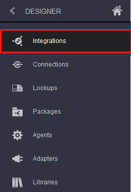
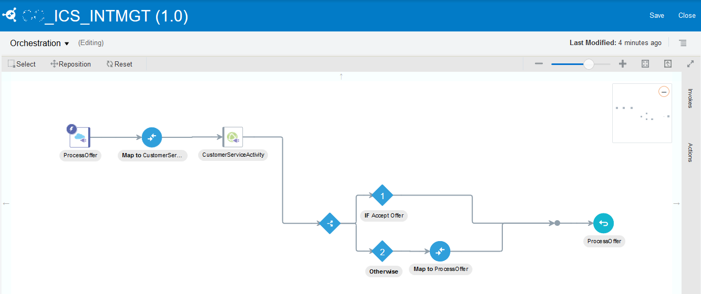
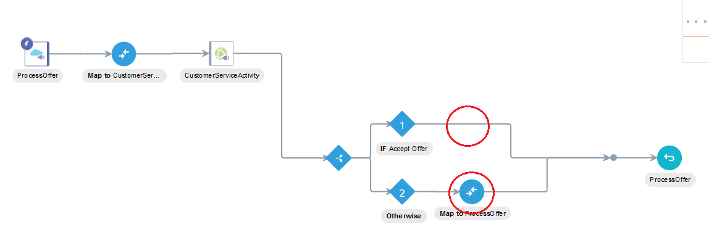
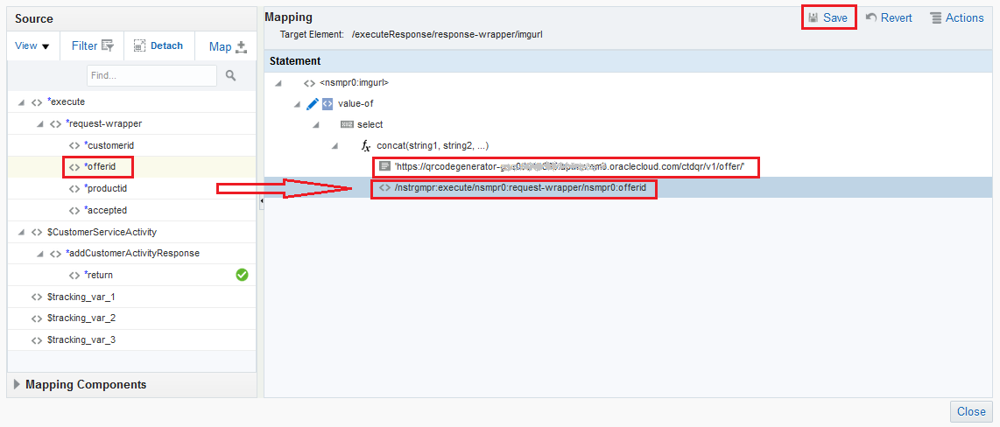
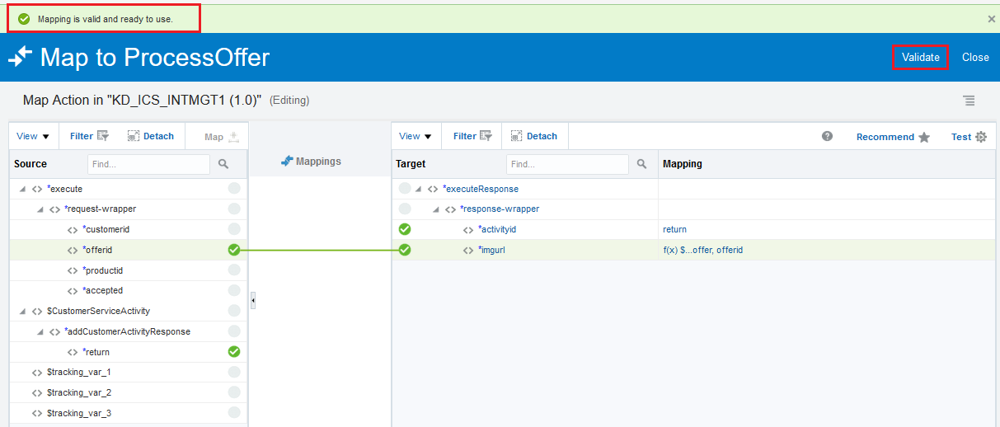
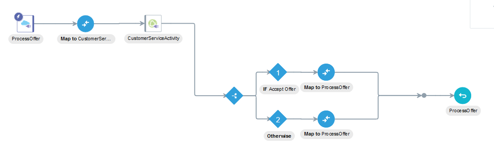
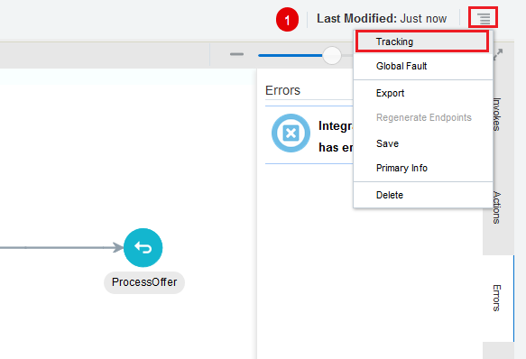
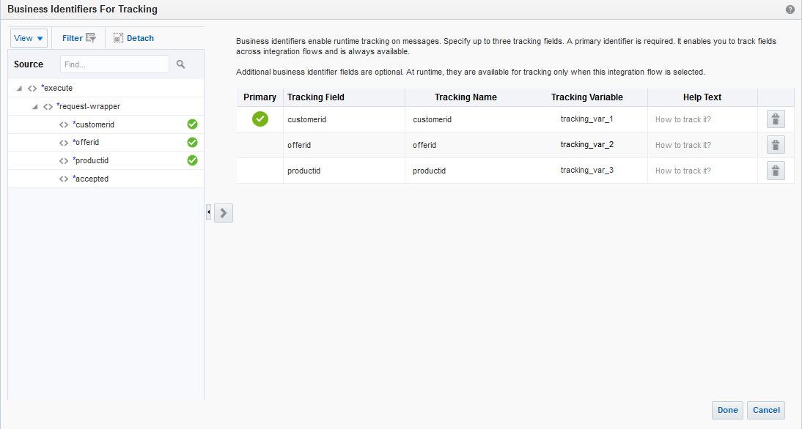
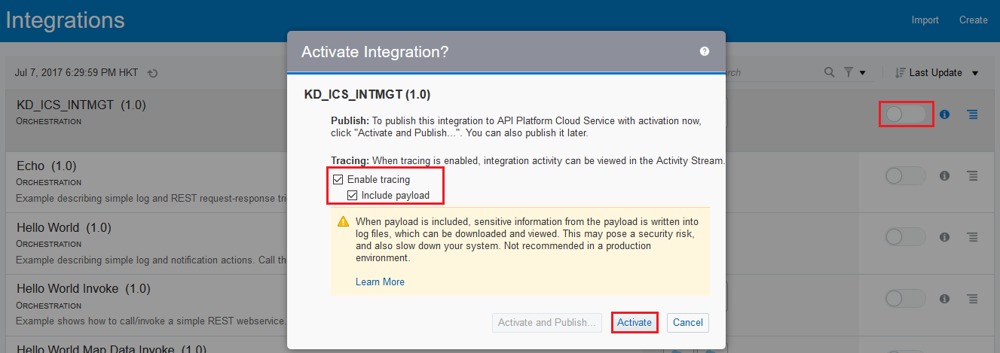
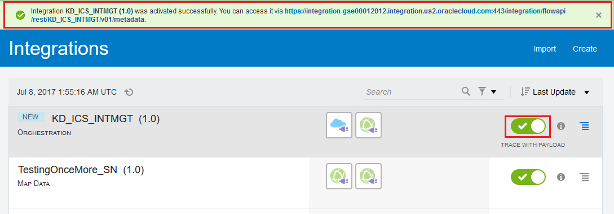

# ORACLE Cloud Test Drive #
-----
## 303: Complete an Integration - An Orchestration Integration Flow ##

### Introduction ###
This tutorial demonstrates how to:
- Complete an integration flow on Integration Cloud Service (ICS) 

### About the Exercise Today ###
In this exercise, we will:
- Explore ICS Integration flow with REST and SOAP endpoints, and complete the remaining data mapping along integration flow
- Using the web-based click, configure, drag and drop techniques to explore integration resources detail and define data mapping on ICS dashboard

### Prerequisites ###
- Oracle Public Cloud Service account including Integration Cloud Service
- SOAP and REST Connections in ICS already configured (302-IntegrationsLab.md)

#### Complete an 'Orchestration' Integration ####

1. Using the Navigation Pane, click the hamburger menu icon in upper left corner to show the navigation pane, and then click `Integrations`.

2. The **Integrations** summary page is shown.  
Locate the entity named **XXX_ICS_INTMGT (1.0)** from the list, click the hamburger menu icon on the right side and select `Edit`.

3. The integration orchestration editor of the previous imported integration flow **XXX_ICS_INTMGT (1.0)** is shown.

**** Section to add review only ****

34. Under *if* or *otherwise* condition, different response data will be returned. 

35. In order to handle proper response when customer *accept* an offer, we need to confirgure the missing **Map** of response data on the *if* path.  
Click `Actions` on the right side pane, then drag the `Map` and drop it onto the integration flow, between **IF Accept Offer** node and the join point of two switch lines, which appears with `+` icon like below.

36. Once the `Map` is properly dropped, the **Data Mapping** dialog window is shown.  
    Expand the **Source** in left pane, drag the `return` field under `$CustomerServiceActivity` -> `addCustomerActivityResponse`, and drop it onto `activityid` in right pane.  
	Click `imgurl` to proceed advance data mapping.
    

37. The **Build Mappings** window dialog is shown.  
    Expand **Mapping Components** under **Source** in left pane, and then expand `Functions` -> `String`.  
	Drag the function `fx concat` and drop it onto `- Drag and Drop or Type value here...` under **Mapping** in right pane.  
	Click `Save`.
	

38. Click on `string1`, enter the QR code URL without the offer id including ' ' sign, i.e. `'https://qrcodegenerator-<Your Application Container Cloud Identity Domain Hostname>/ctdqr/v1/offer/'` (Hostname obtained from 'Microservices' lab)  
    Next, expand `Source` from the left pane, drag the `offerid` field and drop it onto `string2`. A string is automatically inserted. \(This is the XSLT variable representation of 'offerid'\)  
	Click `Save`, and then click `Close` button at the bottom to return previous screen.

39. *Data Mapping* should be the same as below. Click `Validate` and and then click `Close`.

41. The *Process Offer* integration flow development is done.  

42. Click on the hamburger icon and then select `Tracking` at the top right corner.

43. The **Business Identifiers for Tracking** dialog window is shown.  
    Business identifier is required for runtime transaction tracking on messages, espeically when hundreds and thousands of messages running thru ICS.  
    Notice the tracking business identifiers: `customerid`, `offerid` and `productid` have already been mapped. The screen looks like below.  
	Click `Done` or `Cancel` button at the bottom on review completion of tracking setup to close the dialog, and then click `Save` and `Close` buttons respectively to go back to ICS dashboard main screen.

44. From the **Integrations** Summary page, click on the **Switch** button of your newly created `integration`, the `Activate Integration?` dialog window is shown.  
    Check `Enable tracing` and `Include payload` for testing later, although this is not recommended to turn on serving production traffic.  
	Click `Activate` button at the bottom.

45. Wait for a couple of minutes for the integration activation.  
    Once it is done, a green banner telling the integration was activated successfully and the result looks like below:

46. The integration service is now ready for testing.

[Procced to Next - 304: Testing the service and Monitoring with ICS Dashboards](304-IntegrationsLab.md)

or

[Back to Integrations Lab Home](README.md)
