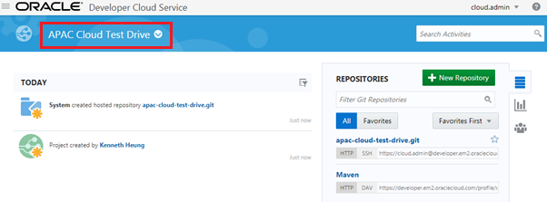
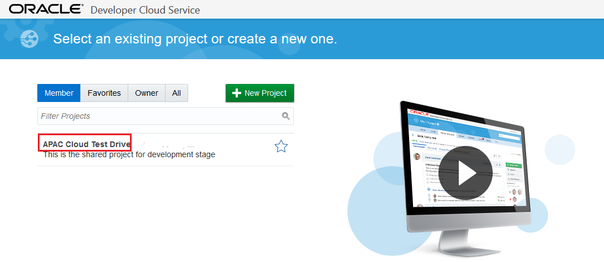

# ORACLE Cloud Test Drive #
-----
## 101: Create Oracle Developer Cloud Service Loyalty Management application project using initial GitHub repository ##

### Introduction ###
This tutorial demonstrates how to:
- Create Oracle Developer Cloud Service project using existing external Git repository - GitHub

### About the Exercise Today ###
In this exercise, we will:
- Create a new Developer Cloud Service Project for the Loyalty Management System
- Create a new Developer Cloud Service Git Repository to store the Loyalty Management Java Application Source Code
- Clone an external Git repository, which is stored in Github, to the Developer Cloud Service Git Repository create above

### Prerequisites ###
- Oracle Public Cloud Service account including Developer Cloud Service (Check with instructor if you don't have one)

----

#### Create Oracle Developer Cloud Service project ####

1. Sign in to [https://cloud.oracle.com/sign-in](https://cloud.oracle.com/sign-in) by provided **Developer Cloud Service \(DevCS\)** identity domain Id and credential. First select your datacenter then provide the identity domain and credentials. After a successful login you will see your Dashboard. Find the Developer Service tile and click the hamburger icon. In the dropdown menu click **Open Service Console**.

2. Log in to Oracle Developer Cloud Service and create a new project.

3. Enter the name of the project and set the desired properties.
	**Name:** `APAC Cloud Test Drive`
	**Description:** `APAC Cloud Test Drive project hub`

4. Click **Next** and select *Initial Repository* as template.

5. Click **Next** and on the Properties page select *Import existing repository*.
Enter or copy the *https://github.com/APACTestDrive/LoyaltyManagement.git* repository address.

6. Now click **Finish** to create the project and to clone the specified repository. You have now created a new Git repository with source code stored within the Developer Cloud Service that is based on an existing repository.

You have finished this lab section.

[Procced to Next - 102: Define Continuous Integration 'Build' and 'Deploy' Configuration in Oracle Developer Cloud Service](102-JavaAppsLab.md)

or

[Back to JavaAppsLab Home](README.md)
