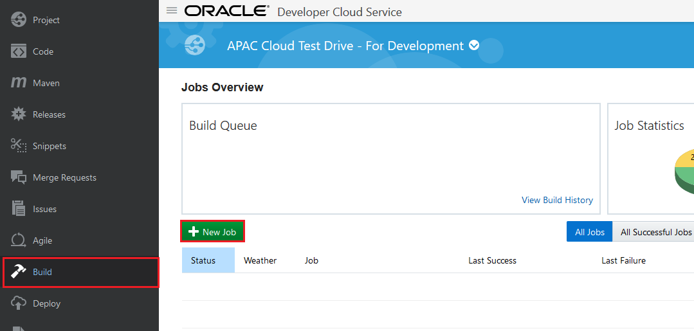
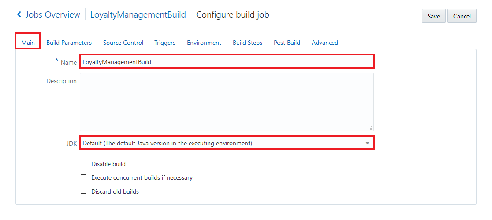
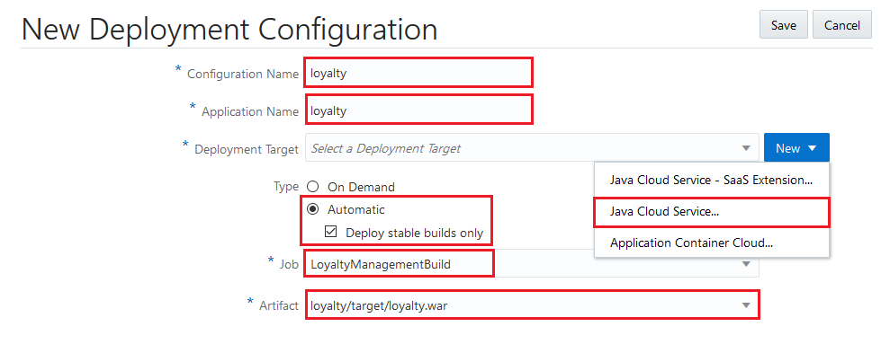
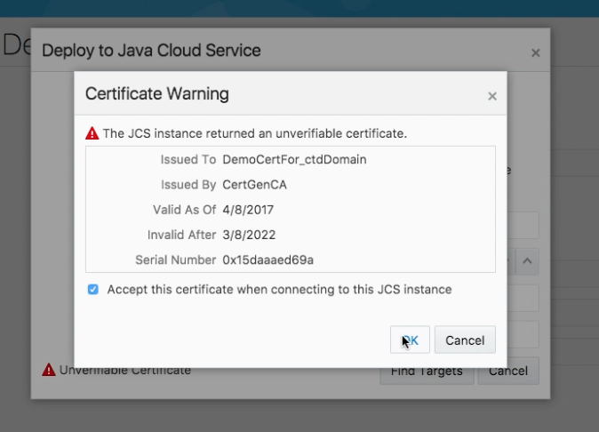
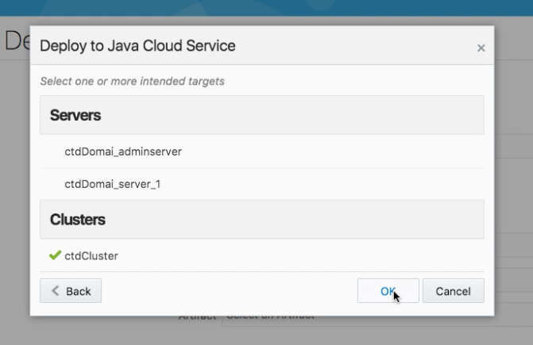
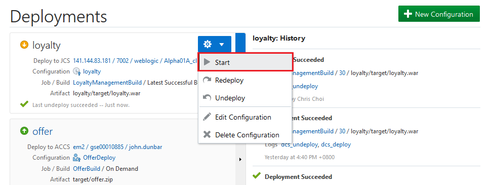
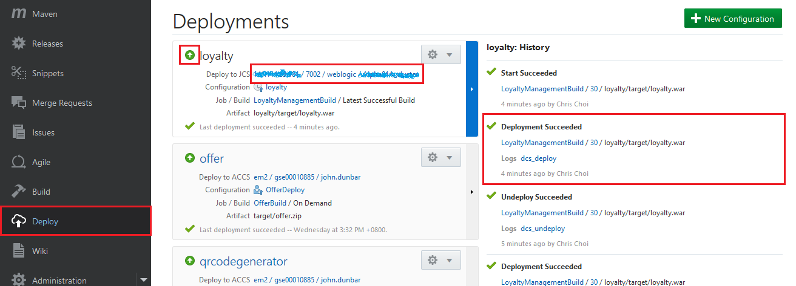
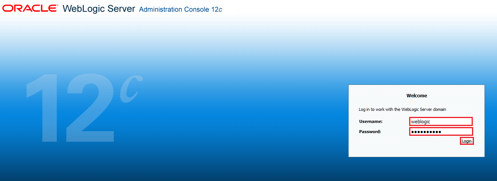

# ORACLE Cloud Test Drive #
-----
## 102: Define Continuous Integration 'Build' and 'Deploy' Configuration in Oracle Developer Cloud Service ##

### Introduction ###
This tutorial demonstrates how to:
- Deploy Loyalty Management application to Java Cloud Service using Oracle Developer Cloud Service 
The Loyalty Management application is a JEE web application built with simple JSP pages, for enabling marketing manager to create offer campaigns.  

### About the Exercise Today ###
In this exercise, we will:
- Configure Build Job for the Loyalty Management - A JEE application
- Configure Java Cloud Service - WebLogic Server deployment in Developer Cloud Service
- Build and Deploy Loyalty Management Application using Developer Cloud Service

### Prerequisites ###
+ Oracle Public Cloud Service account including Developer Cloud Service and Java Cloud Service
+ [Create Oracle Developer Cloud Service project for Loyalty Management JEE application](101-JavaAppsLab.md)

----

#### Configure build job for Loyalty Management application ###

1. Following from previous lab 101, once the project provisioning is ready let's create the build job to compile and package the Loyalty Management - JEE application to the desired format for Java Cloud Service.

2. Select **Build** item on the left side menu and click the **New Job** button.

3. Enter name *LoyaltyManagementBuild* for the new job. Select the *Create a free-style job* option and save.
On the Main configuration page of the newly created job make sure **Default (The default Java version in the executing environment)** is the selected JDK.

4. Change to the **Source Control** tab and select **Git**. 
In the git's properties section select the only one available Git repository which is provided in the list.
In the Branches section, add and select **master** option in the list. This is to make sure only **master** branch version will be used.
Leave the advanced settings default.

5. Click **Triggers** tab to configure *SCM polling*. Select **Based on SCM polling schedule**. This ensures if any files in the source code repository has changed then the build will be fired.

6. Change to **Build Steps** tab and add **Maven 3** build step. Enter **clean install** as Goals and **loyalty/pom.xml** to POM File field. (In case if Build Steps tab just shows **Loading...** for a long time, save the Build configuration then re-open and continue.)

7. Finally change to Post Build tab and check in the **Archive the artifacts** option. Enter **loyalty/target/\*.war** into **Files To Archive** field.

8. Click on **Save** to update the new job configurations. To check the build job click on **Build Now** on the job's detail page. Once the job is done check the archived artifacts. It should be the following: `loyalty.war`

Please note the build job contains an extra build step which packs the master loyalty management webapp source artifact into a JEE Web Application Archive (WAR) file loyalty.war. This archive is the desired format to deploy a Java Web application to JCS.

#### Configure Java Cloud service deployment ####

9. Now create deployment configuration which enable direct deployment to Java Cloud Service after a successful build job.
Change to **Deploy** page in DevCS and create **New Configuration** 

10. Set the following properties.

- **Configuration Name**: any name to identify deployment configuration - we use **loyalty**.
- **Application Name**: application name in JCS. This will determine the application's URL context path - we use **loyalty**.
- **Deployment Target**: click **New** and select Java Cloud Service and define connection properties such as **Version**, **Protocol**, **Host**, **HTTPS Port** and **credentials**.  
  [\(Find out the Java Cloud Service Host and HTTPS Port.\)](java.cloud.md).  
  Java Cloud Service - WebLogic Admin Username and Password, i.e. `weblogic` and `Welcome_1` respectively, or provided by instructor separately.
- **Type**: select **Automatic** which means auto deploy after a successful execution of the build job. Select your previously created job and its artifact to deploy.
- **Job**: The **LoyaltyManagementBuild** Build Step defined in early stage of this lab.
- **Arifact**: **loyalty/target/loyalty.war**, this is the only option available after **Job** is selected.

   
  If you see the certificate warning, **Check** `Accept this certificate when connecting to this JCS instance` and click [**OK**]

   
  **Check** `ctdCluster` and click [**OK**] to deploy the application to the Java Cloud Service cluster

11. Click **Save**. 

#### Build and deploy the Loyalty Management Application ####

12. To initiate a deployment to Java Cloud Service now there are two options. You can Start deployment process using the newly created Deployment configuration. Click gear icon and select **Start**.

13. Other option is to fire a new Build Job execution which will deploy artifact after a successfull build. Go back to **Build** page and click the wrench icon belongs to Loyalty Management application build job.

 

14. Both way deploys JEE application on Java Cloud Service. You can check the deployment result on the **Deploy** page. Once the deploy is ready (this may take a while) click the **Deploy to JCS** link.

15. This opens the WebLogic Server Administration Console. Login with provided WebLogic Admin Username and password, i.e. `weblogic` and `Welcome_1` respectively.

"WebLogic Console")

16. Once logged on, click **Deployments** on left navigation menu. You should see your Loyalty Management application **loyalty** in the Summary of Deployments list.

17. The Loyalty Management application URL should be in the format of:  
    `https://**<JCS WLS instance IP Address>**/loyalty/jsp/welcome.jsp`, the JCS WLS instance IP address is the same as **Deploy to JCS** target in DevCS at step 12.

18. There are many other options to trigger this deploy process. For example build can be triggered by source changes or can be scheduled to specific time of the day.  

You have finished this lab section.

[Procced to Next - 103: Continuous Integration & Delivery (CICD): Using Brackets, Commit and Push Code Changes to Oracle Developer Cloud Service](103-JavaAppsLab.md)

or

[Back to JavaAppsLab Home](README.md)
