# ORACLE Cloud Test Drive #
-----
## 103: Continuous Integration & Delivery (CICD): Using Brackets, Commit and Push Code Change to Oracle Developer Cloud Service ##

### Introduction ###
You can access Oracle Developer Cloud Service projects from Integrated Development Environments (IDEs) or text editors such as Brackets, Oracle Enterprise Pack for Eclipse (OEPE), Oracle JDeveloper, and NetBeans IDE. The Brackets can connect and exchange with Oracle Developer Cloud Service, which conveniently exposes the most common cloud development tasks from within the editor. 

This tutorial demonstrates how to:
- Perform a simple continuous integration and delivery using Oracle Developer Cloud Service with Brackets

### About the Exercise Today ###
In this exercise, we will:
- Connect Oracle Developer Cloud Service from Brackets, checkout and update project source code
- Commit and push updated source code from Brackets back to Developer Cloud Service
- Review the continuous integration and delivery result made by Developer Cloud Service

### Prerequisites ###
+ [Create Oracle Developer Cloud Service project for Loyalty Management JEE application and deployed to Java Cloud Service WebLogic Server Container](102-JavaAppsLab.md)
+ [Installed Brackets and Git extension](brackets.md)

----

#### Connect and Obtain Source Code from Developer Cloud Service ####

1. Start the Brackets Text Editor, in the `File` pull-down menu, choose `Open Folder`.

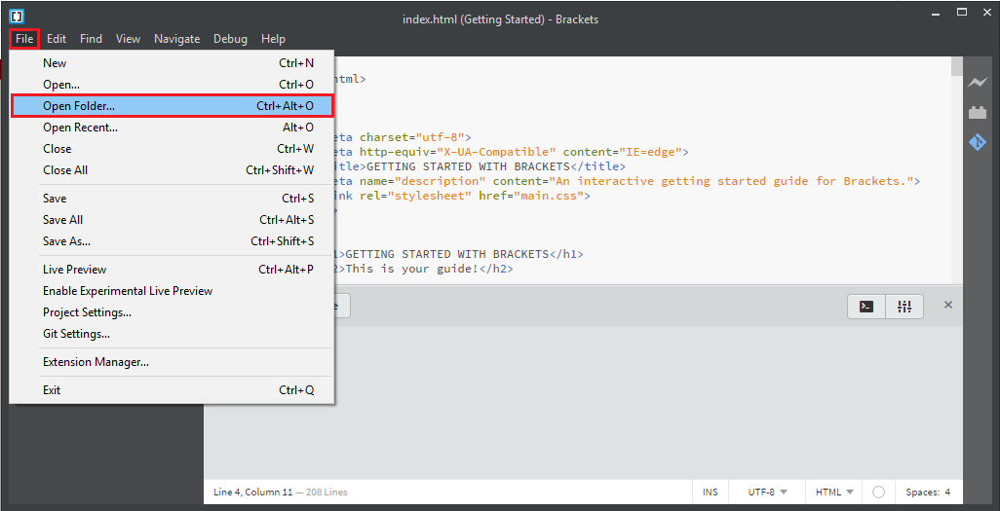

2. Navigate to select target destination directory to store JEE source code, for example: `D:\oracle`
   Create a `New Folder`, then name the new folder as `LoyaltyManagement`.  
   Keep the `LoyaltyManagement` folder selected and click `Select Folder` button at bottom.

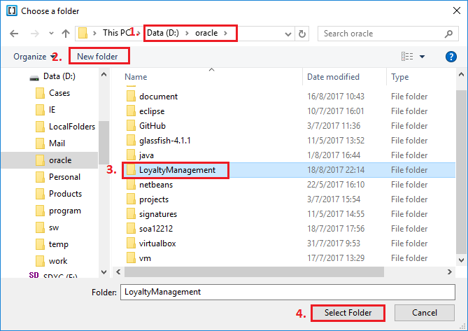

3. Back in Developer Cloud Service dashboard, in your **LoyaltyManagement** Git Repository. Click HTTP to display the Git HTTP URL, click the square `Copy` button on the right to copy the URL.

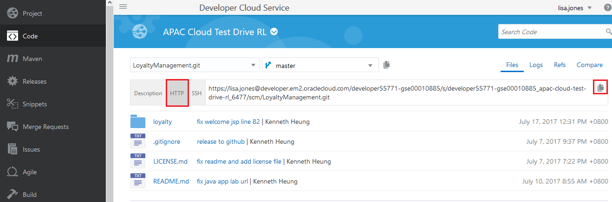

4. Back in the Bracket editor, click on GIT icon on the right hand side of the editor.

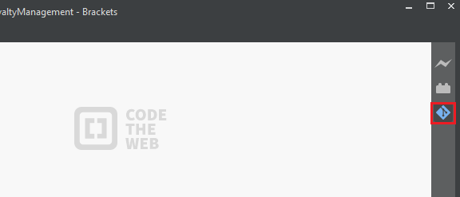

5. In the Git panel, click `Clone`.

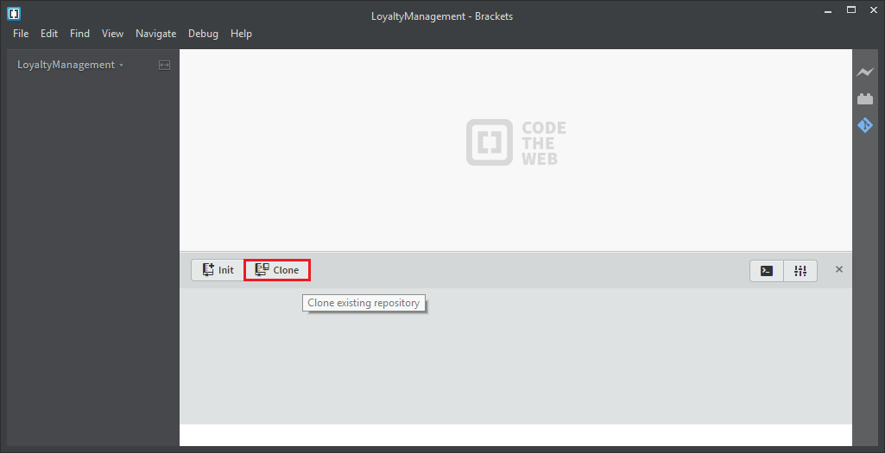

6. Paste the GIT URL that you copied from Developer Cloud Service. Username should be populated automatically. Enter the password and select `Save credentials to remote url`.  
Click `OK` button at the bottom.

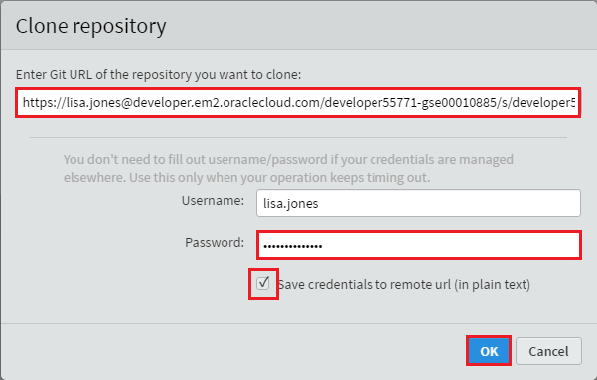

7. Wait for Brackets to clone your remote project to local folder.

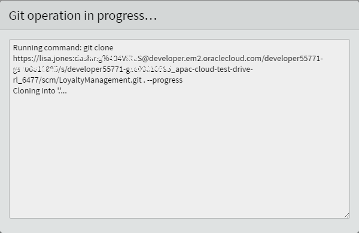

8. You now have a local copy of the Git Repository.

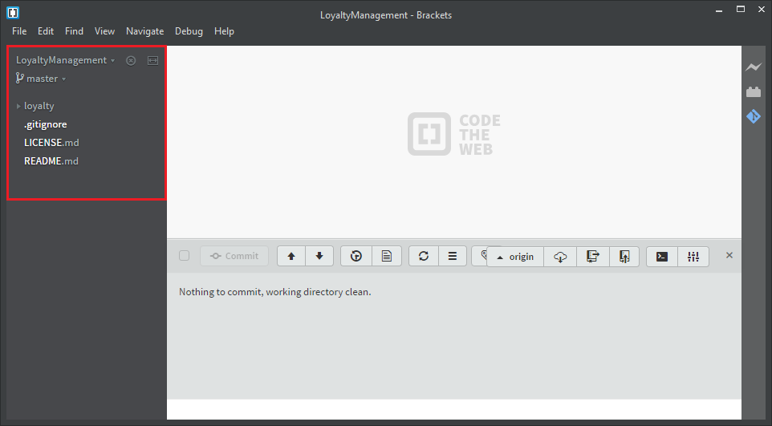

#### Commit and Push Code Changes ####

9. Expand the left nagivation tree and open `welcome.jsp` file (Under loyalty->src->main->webapp->jsp).  
On the main window, locate line 73 of welcome.jsp source code.

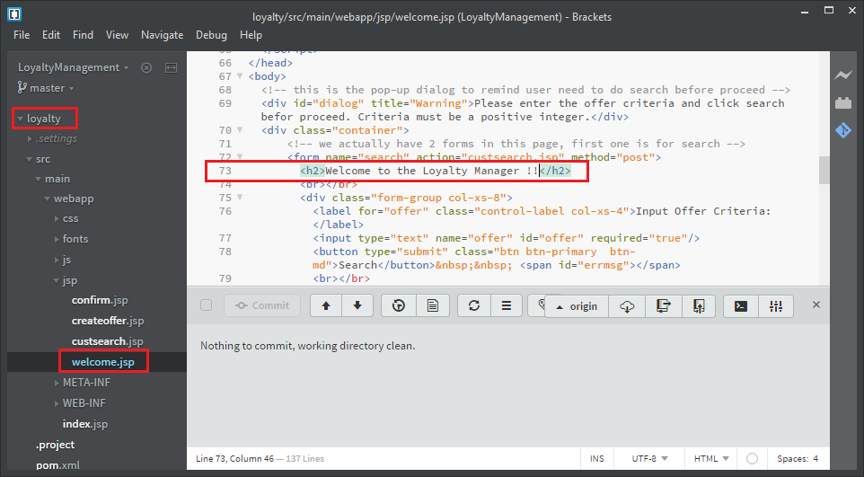

14. Modify the following part:

  	<h2>Welcome to the Loyalty Manager !!</h2>

To what you would like to see on the page. For example:

	<h2>APAC Test Drive - Welcome to the Loyalty Manager !!</h2>

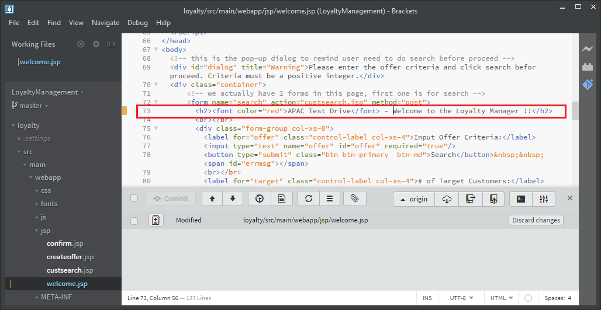

15. Save the file. (Press `Ctrl-S` or choose from pull-down menu `File` > `Save`)

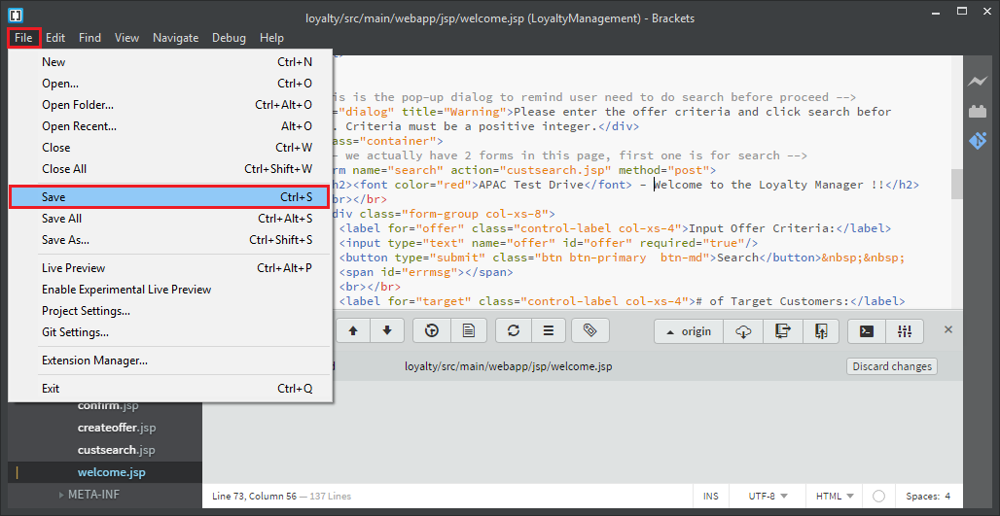

16. Check the box next to Commit to select all modified files - this means the checkbox below (welcome.jsp) will automatically be checked.  
Click `Commit` button.

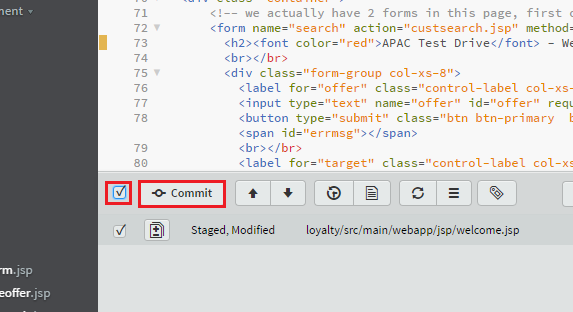

17. In the pop-up enter the comment: `Changed header` and then click `OK` button. This will commit the changes to your LOCAL GIT REPOSITORY.

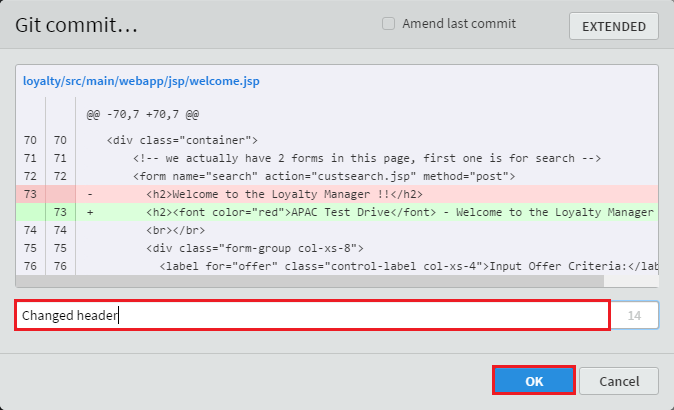

18. Click `Git Push` icon.

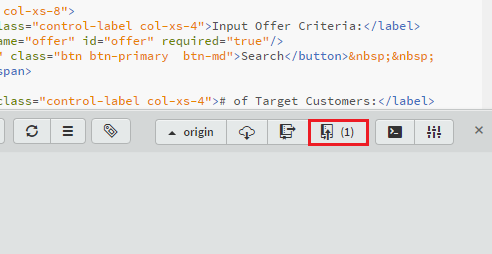

19. In the pop-up window, leave all defaults and click `OK` button at the bottom.

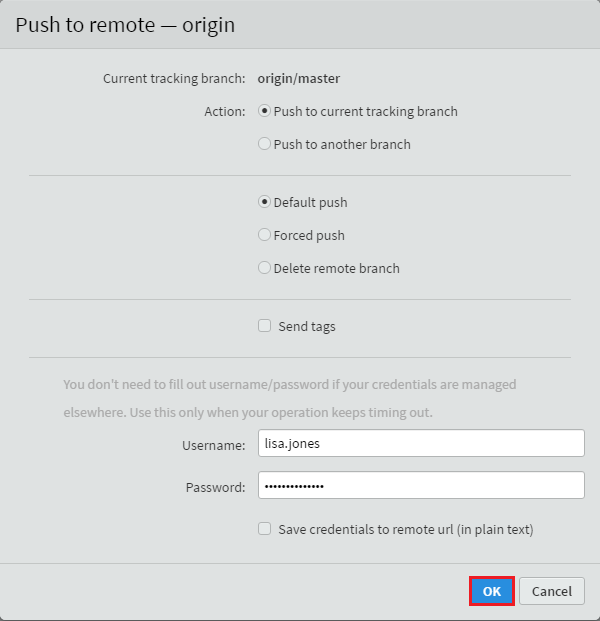

20. Once Git Push completes, click `OK` button.

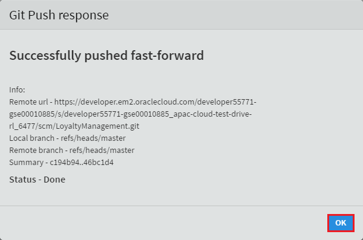

#### Continuous Integration & Delivery (CICD) ####

18. Now change back to the browser and check the Build page in the Oracle Developer Cloud Service project. You should see that a new build (in our case: *LoyaltyManagementBuild*) has been fired by the Git changes.

19. Once the job is done change to the tab to Deploy and you can see that a new deployment has been started too. If you remember the Deployment was configured to redeploy every time when a new successful build artifact is ready.

20. Now check the changes of the home page of the Loyalty Management application. You should see the changes (red text) on the application's home page.  
    The Loyalty Management application URL should be in the format of:  
	`https://**<JCS WLS instance IP Adress>**/loyalty/jsp/welcome.jsp`, the JCS WLS instance IP address is the same as **Deploy to JCS** target in DevCS.

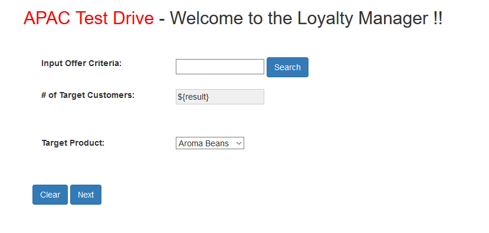

You have finished this lab section.

[Back to JavaAppsLab Home](README.md)
