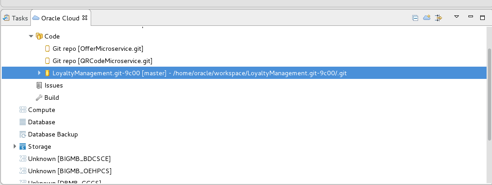
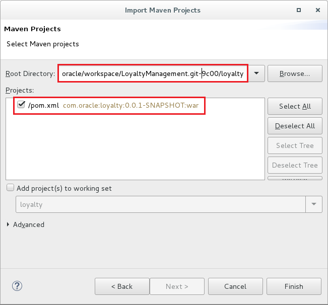
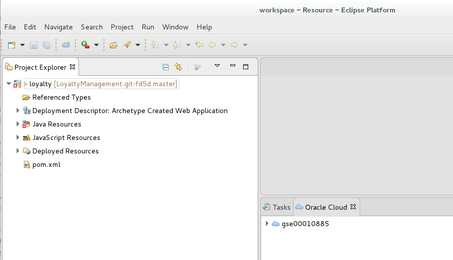
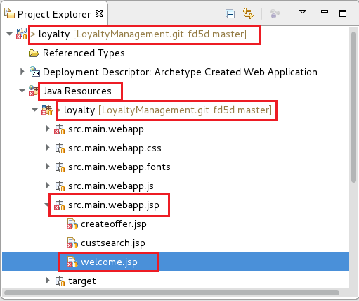
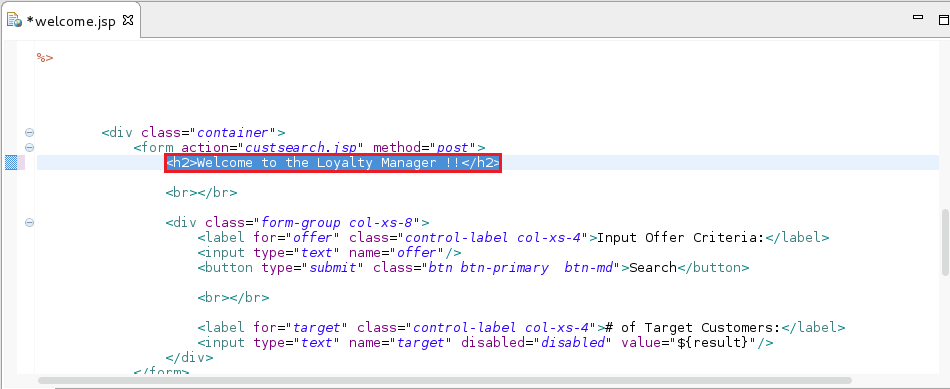
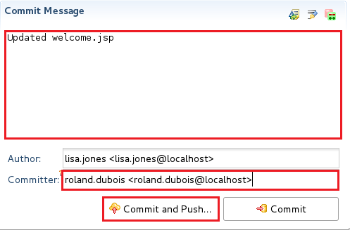
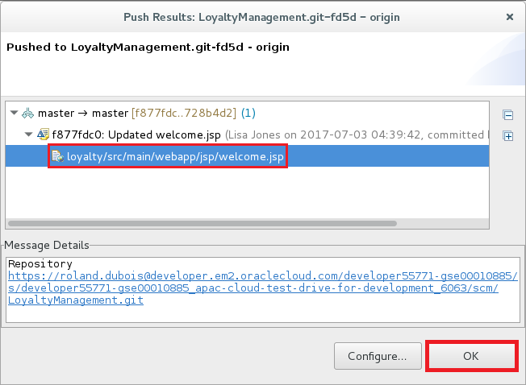

# ORACLE Cloud Test Drive #
-----
## 103: Continuous Integration & Delivery (CICD): Using Eclipse IDE, Commit and Push Code Change to Oracle Developer Cloud Service ##

### Introduction ###
You can access Oracle Developer Cloud Service projects from Integrated Development Environments (IDEs) such as Oracle Enterprise Pack for Eclipse (OEPE), Oracle JDeveloper, and NetBeans IDE. The Eclipse IDE and the Oracle Enterprise Pack for Eclipse (OEPE) includes integration for Oracle Developer Cloud Service, which conveniently exposes the most common Cloud development tasks from within the IDE. Oracle Developer Cloud Service integration with the IDE includes the following:
+ A dedicated Oracle Cloud view that displays Oracle Developer Cloud Service projects of which you are a member
+ Integration with Oracle Developer Cloud Service and the Mylyn Issues system
+ Source control system integration with the Oracle Developer Cloud Service Git repository

This tutorial demonstrates how to:
- Perform a simple continuous integration and delivery using Oracle Developer Cloud Service with Eclipse IDE 

### About the Exercise Today ###
In this exercise, we will:
- Connect Oracle Developer Cloud Service from Elipse IDE, checkout and update project source code
- Commit and push updated source code from Eclipse IDE back to Developer Cloud Service
- Review the continuous integration and delivery result made by Developer Cloud Service

### Prerequisites ###
+ [Create Oracle Developer Cloud Service project for Loyalty Management JEE application and deployed to Java Cloud Service WebLogic Server Container](102-JavaAppsLab.md)
+ Installed VirtulBox, Copied VM image from instructor and started the VM. [virtualbox.md]

**Using VirtualBox**  
Instructor should have provided you VirtualBox Installer and the Virtual Machine image which consists of Linux and Eclipse IDE pre-installed. [Click Here for VirtualBox detail](virtualbox.md)  

Alternatively, you can conduct the following lab exercise using the Oracle Enterprise Pack for Eclipse IDE (OEPE) running on your OS directly.  
You can download OEPE from [http://www.oracle.com/technetwork/developer-tools/eclipse/downloads/index.html](http://www.oracle.com/technetwork/developer-tools/eclipse/downloads/index.html).  
Notice the Oracle Enterprise Pack for Eclipse supported Eclipse Mars and Neon release only.  
If you are using your own Eclipse IDE [http://www.eclipse.org/](http://www.eclipse.org/), download and install the Oracle Cloud Tools plugin from the Eclipse IDE marketplace. In OEPE, the plugin is installed by default.  
\*Installation of the Eclipse IDE and Oracle Enterprise Pack are not included as part of lab exercise here. If you are interested, feel free to reach out instructor for more information.  
\*\*Recommend to use VirtualBox which saves your time.

----

#### Connect and Obtain Source Code from Developer Cloud Service ####

1. From your Virtual Machine (or your own OS), open OEPE (using desktop icon ) and set (leave the default, `home/oracle/workspace`) workspace location. Close the Welcome page. To open the *Oracle Cloud* view from the Window menu, click *Show View* and then *Other*.

2. From the list open *Oracle Cloud* and select *Oracle Cloud*.

3. If you are connecting to Oracle Developer Cloud Service for the first time, click the Connect link.

4. In the Oracle Cloud Service Connection dialog, enter the following:
+ **Identity Domain**: Enter the identity domain of Oracle Developer Cloud Service.
+ **Username** and **Password**: Enter the user name and password.
+ **Connection Name**: Enter a name for the service instance, if necessary. By default, the connection name is set to the identity domain name.

5. Provide a master password to store securely your credentials, so in the future you don't need to enter every time when you open OEPE. Don't forget to note the master password.

6. After your credentials have been validated, you are logged in to Oracle Developer Cloud Service and the Oracle Cloud view displays all projects that are assigned to you. Open the tree view myOracle Cloud (Or Your Cloud connection name) -> Developer -> LoyaltyManagement(DevCS project name) -> Code and there you can see the Git repository hosted on Oracle Developer Cloud Service.

7. To clone the Git repository to your machine double click or right click on the **Git repo [LoyaltyManagement.git]** -> Activate on the Git repository and clone will start.

8. After the successful clone your local copy will be available in your workspace.

9. To import a Maven based project right click on the Project Exporer area and will pop up the menu where you can select Import projects -> Import...

10. Select Existing Maven Projects and click Next.

11. Browse the location of the cloned repository in `/home/oracle/workspace/` folder and enter/select `LoyaltyManagement.git-\*xxxx/loyalty` (\*where xxxx is random string) subfolder. If the workspace location is the default it should look like similar to the following: `/home/oracle/workspace/LoyaltyManagement-xxxx/loyalty`
Please note, that you need to give one of the subfolder of the local repository.
Click Finish.

12. OEPE now starts to validate and build the project which can take few seconds. Finally you can see the imported project in the Project Explorer area.
*Ignore any error or warning from now as we are not going to build and test in the VM locally.

#### Change code and Stage Changes ####

13. The project hosted on Oracle Developer Cloud Service has build job which ensures that new application build and deployment to Java Cloud Service happens when any developer push code changes to Git repository.

In the Project Explorer area find the *loyalty* project and expand the navigation tree to locate and open the **Java Resources -> loyalty -> src.main.webapp.jsp -> welcome.jsp**

14. Modify the following part:

  	<h2>Welcome to the Loyalty Manager !!</h2>
	

To what you would like to see on the page. For example:

	<h2>Test Welcome to the Loyalty Manager !!MODIFIED IN OEPE.</h2>

15. Save the changes. To commit and push changes to Git right click on project and select Team -> Commit...

16. Git Staging view is displayed. First make sure the `welcome.jsp` is in the *Staged Changes* area. Type a commit message e.g. 'Updated welcome.jsp'. Optionally enter your name or cloud username and give a (valid or fake) email address in the following format as the screenshot shows. Click **Commit and Push...**

17. In the Push dialog leave the default branch and click OK.

#### Continuous Integration & Delivery (CICD) ####

18. Now change back to the browser and check the Build page in the Oracle Developer Cloud Service project. You should see that a new build (in our case: *LoyaltyManagementBuild*) has been fired by the Git changes.

19. Once the job is done change to the tab to Deploy and you can see that a new deployment has been started too. If you remember the Deployment was configured to redeploy every time when a new successful build artifact is ready.

20. Now check the changes of the home page of the Loyalty Management application. You should see the changes (red text) on the application's home page.  
    The Loyalty Management application URL should be in the format of:  
	`https://**<JCS WLS instance IP Adress>**/loyalty/jsp/welcome.jsp`, the JCS WLS instance IP address is the same as **Deploy to JCS** target in DevCS.

You have finished this lab section.

[Back to JavaAppsLab Home](README.md)
