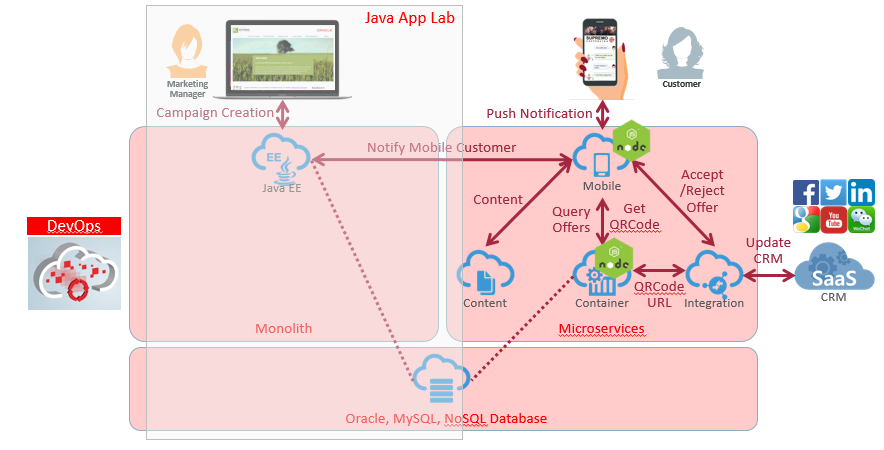
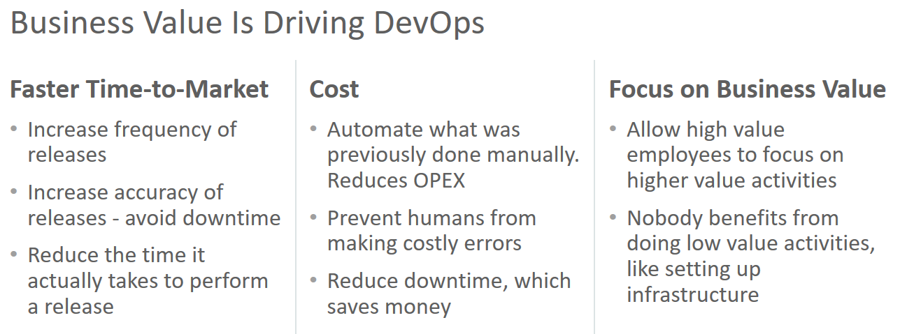

# ORACLE Cloud Test Drive #
-----
## 1. DevOps - Continuous Integration & Continuous Delivery of JEE by Oracle Developer Cloud Service ##

### Introduction ###
This lab is part of the APAC Cloud Test Drive and is the first lab about creating, building and deploying a JEE Application within an Agile project lifecycle.  
This section describes deploying and undeploying applications to an Oracle Java Cloud Service instance by using the WebLogic Server Administration Console.

#### About the Exercise Today ####

In this exercise, we will use Developer Cloud Service in the coming 1 hour to:
+ Obtain JEE application source code and deploy to WebLogic Server in Java Cloud Service
+ Walkthru a simple 'Continuous Integration & Delivery' starting from code change

**Lab Assumption**
+ The 'Loyalty Management' Application will be used by Marketing Manager to create campaign offer based on selected group of customers
+ You are an 'Application Architect' who owns this application, who recently made minor code amendment and provisioned the change
+ The Loyalty Management Database, tables and data are ready to be connected and consumed by the Application
+ WebLogic Server instance is provisioned in Java Cloud Service

Modern development teams aim to deliver software in shorter cycles with better quality. Agile development methodologies help address changing business requirements quickly and accelerate turnaround time for delivering working software to customers. The need to streamline software delivery through the development stages popularized techniques such as continuous integration and delivery automation. These techniques are frequently adopted to optimize the overall DevOps cycle.

**Oracle Developer Cloud Service (DevCS)** provides an integrated cloud-based platform that simplifies implementing these modern development and operation techniques. DevCS is a cloud-based software development Platform as a Service (PaaS) and a hosted environment for your application development infrastructure. It provides an open-source standards-based solution to manage the application development life cycle effectively through integration with Hudson, Git, Maven, issues, and wikis. Using Oracle Developer Cloud Service, you can commit your application source code to the Git repository on the Oracle Cloud, track assigned issues and defects online, share information using wiki pages, peer review the source code, and monitor project builds. After successful testing, you can deploy the project to Oracle Java Cloud Service - SaaS Extension, publicly available Oracle Java Cloud Service instances, Oracle Application Container Cloud Service instances, or to an on-premise production environment.

The key features of Oracle Developer Cloud Service include:
+ Project creation, configuration, and user management
+ Version control and source code management with Git
+ Storage of application dependencies and libraries with Maven
+ Continuous build integration with Hudson
+ Wiki for document collaboration
+ Issue tracking system to track tasks, defects, and features
+ Repository branch merge after code review
+ Deployment to Oracle Java Cloud Service - SaaS Extension, Oracle Java Cloud Service, and Oracle Application Container Cloud Service

Oracle Developer Cloud Service is available as a web interface accessible from a web browser and from Integrated Development Environments (IDEs) such as Brackets, Oracle Enterprise Pack for Eclipse (OEPE), Oracle JDeveloper, and NetBeans IDE.  
DevCS is comprised of various components including Git, Hudson, Maven, browser-based IDE, issue tracker, wiki, snippets, and code review.  
All components are available in a project, which is a collection of features and services provided by Oracle Developer Cloud Service.

### This tutorial demonstrates how to: ###
- Create Oracle Developer Cloud Service (DevCS) Loyalty Management Application Project using Initial [GitHub](https://github.com) repository
- Define Continuous Integration 'Build' and 'Deploy' Configuration in Oracle Developer Cloud Service
- Continuous Integration & Delivery (CICD): Using Brackets, Commit and Push Code Change to Oracle Developer Cloud Service

### Prerequisites ###

- The following lab requires Oracle Public Cloud account that will be supplied by instructor.  
- You will also need to install a lightweight IDE - [Brackets](http://brackets.io/). Brackets installer will be provided by instructor or you can download from [GitHub HERE](https://github.com/adobe/brackets/releases).  
- You need to have a Git Client. If you are already using Github Desktop, Eclipse or other IDE, you probably have Git already. Git installer will be provided by the instructor or you can download from [here](https://git-scm.com/downloads)
- *[Click HERE for Brackets installation detail](brackets.md)*
- *[Click HERE for Git installation details](gitclient.md)*

# Lab Exercise: #

## 101: Create Oracle Developer Cloud Service Loyalty Management application project using initial GitHub repository ##

[Click Here.](101-JavaAppsLab.md)

## 102: Define Continuous Integration 'Build' and 'Deploy' Configuration in Oracle Developer Cloud Service ##

[Click Here.](102-JavaAppsLab.md)

## 103: Continuous Integration & Delivery (CICD): Using Brackets, Commit and Push Code Change to Oracle Developer Cloud Service ##

[Click Here.](103-JavaAppsLab.md)

or

[Back to Cloud Test Drive Home](../README.md)
