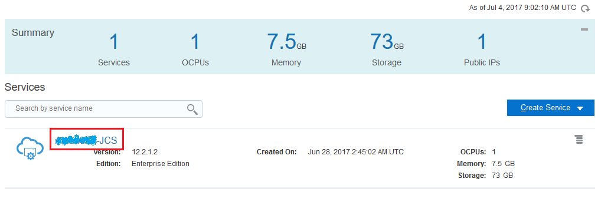
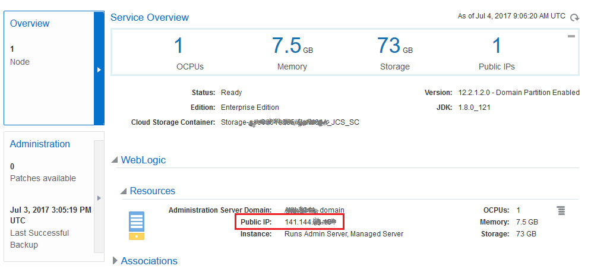

# ORACLE Cloud Test Drive #
-----
## Obtain IP Address of WebLogic Server instance in Java Cloud Service ##

1. [Sign in](sign.in.to.oracle.cloud.md) to [https://cloud.oracle.com/sign-in](https://cloud.oracle.com/sign-in) by provided Java Cloud Service \(JCS\) identity domain Id and credential. Using the dashboard open the Java Cloud Service Console.

2. Click on JCS instance name. 

3. The JCS WebLogic IP Address is shown at the 'Resources' section -> 'Public IP:' like below.

[Back to JavaAppLab Home](README.md)
