# ORACLE Cloud Test Drive #
-----
## Installation and Usage of Oracle VM VirtualBox for Cloud Test Drive ##

VirtualBox is a cross-platform virtualization application. What does that mean? For one thing, it installs on your existing Intel or AMD-based computers, whether they are running Windows, Mac, Linux or Solaris operating systems. Secondly, it extends the capabilities of your existing computer so that it can run multiple operating systems (inside multiple virtual machines) at the same time. So, for example, you can run Windows and Linux on your Mac, run Windows Server 2008 on your Linux server, run Linux on your Windows PC, and so on, all alongside your existing applications. You can install and run as many virtual machines as you like -- the only practical limits are disk space and memory.  
VirtualBox is deceptively simple yet also very powerful. It can run everywhere from small embedded systems or desktop class machines all the way up to datacenter deployments and even Cloud environments.  
The following screenshot shows you how VirtualBox, installed on a Mac computer, is running Windows 8 in a virtual machine window:

### Prerequisites ###
This lab guide assumes the following:
- Internet access available (to download installer and extension pack, check or copy files from instructor)
- Use Microsoft Windows as host operating system https://www.virtualbox.org/manual/ch01.html#hostossupport
- A copy of *Open Virtualization Format (.ova)* VM file

#### Installation of Oracle VM VirtualBox ####

1. Go to [VirtualBox Welcome Page](https://www.virtualbox.org/) and click `Download VirtualBox X.X` button at the middle.

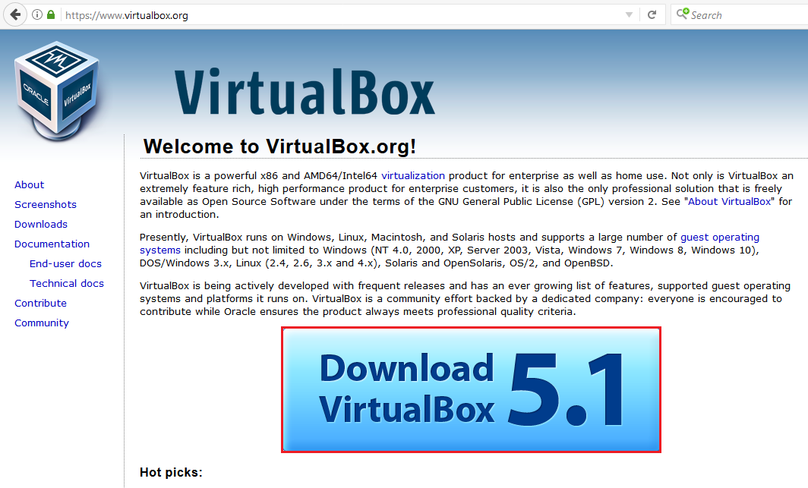

2. From the download page, select your operating system installer download link under *VirtualBox X.X.XX platform packages*.  
   This guideline uses `Windows hosts` as example.

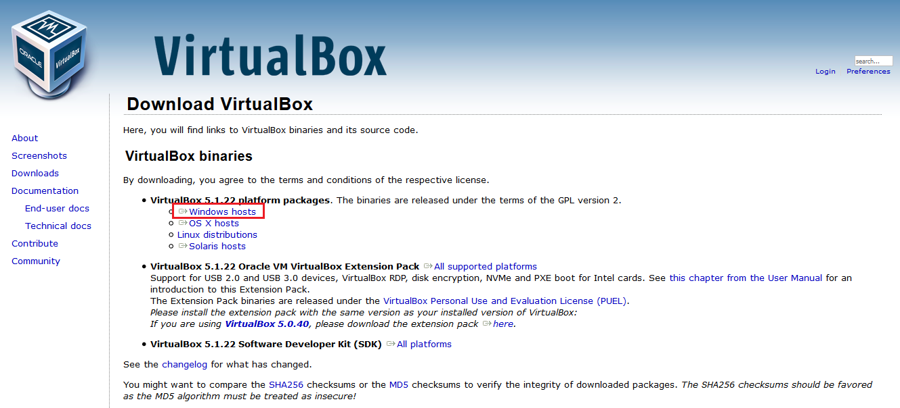

3. On pop-up, click `Save File` and `OK` to save the VirtualBox installer to your destinated location.

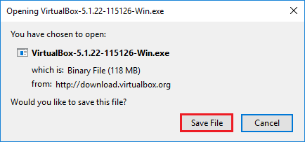

4. Launch the VirtualBox installer executable from your saved destination.

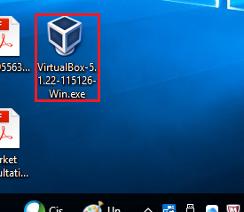

5. Click `Next` on installer launched.

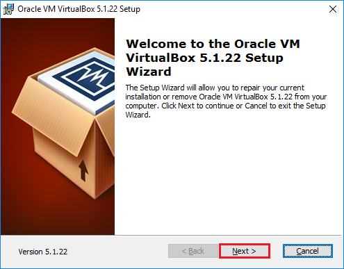

6. On **Custom Setup** page, browser and select VirtualBox destination folder for installation, then click `Next`.

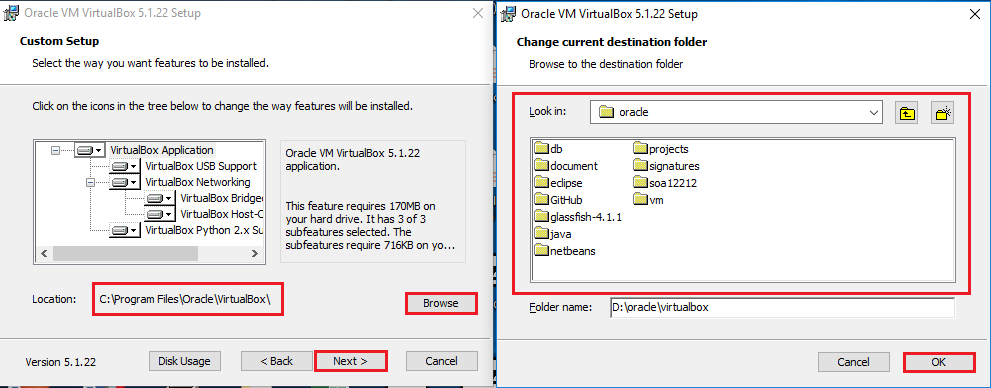

7. Check the required options and click `Next`.

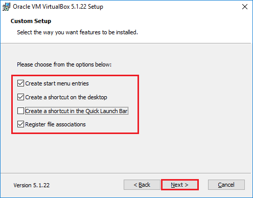

8. On `Warning: Network Interfaces` page, click `Next`.

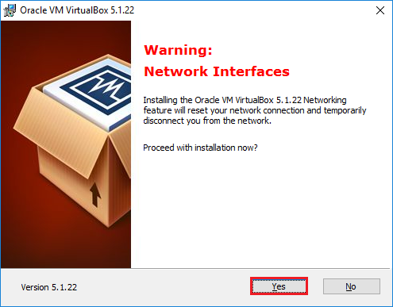

9. Click `Install` to proceed installation process.

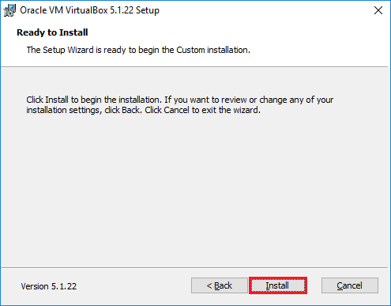

10. Wait a couple of minutes for the installation complete.

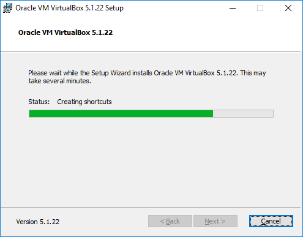

11. Check the `Start Oracle VM VirtualBox X.X.XX after installation` option and then click `Finish`.

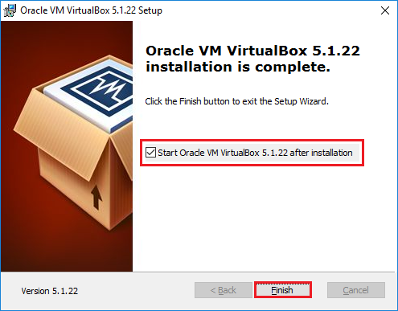

12. The **Oracle VM VirtualBox Manager** window start.

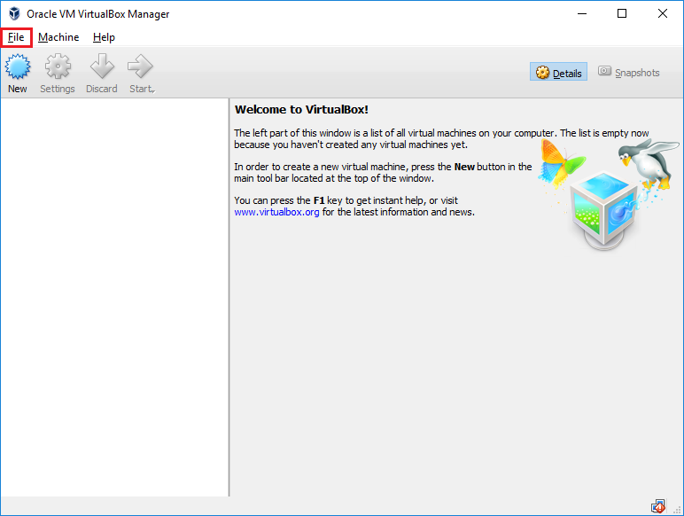

#### Usage of Oracle VM VirtualBox ####

13. Click `File` from top menu bar, and then select `Import Appliance...`.

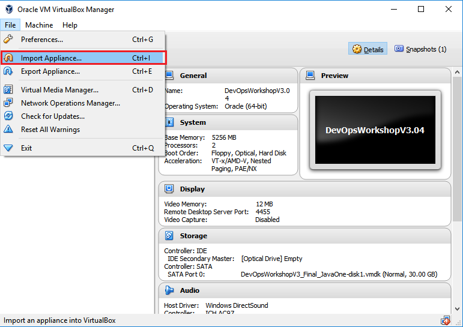

14. Click the folder icon. 

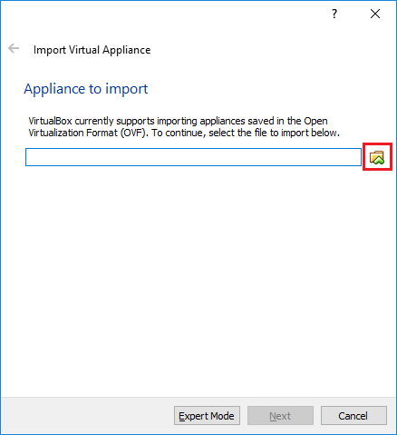

15. Browser and select the *Open Virtualization Format (.ova)* VM file which was provided by instructor.

16. On Appliance settings, keep the default values, then click `Import`.

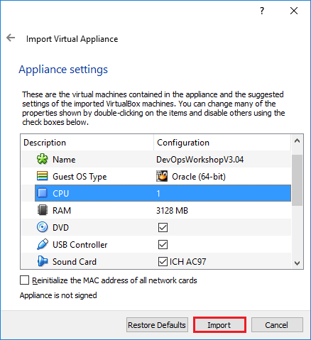

17. Wait a couple of minutes for the VirtualBox Manager to import .ova file into VM locally.

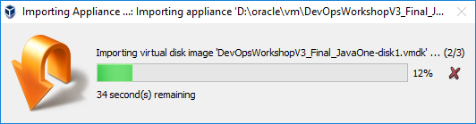

18. On completion of VM import, a new entry named **DevOpsWorkshopV3.04** is shown on the VM list in VirtualBox Manager.

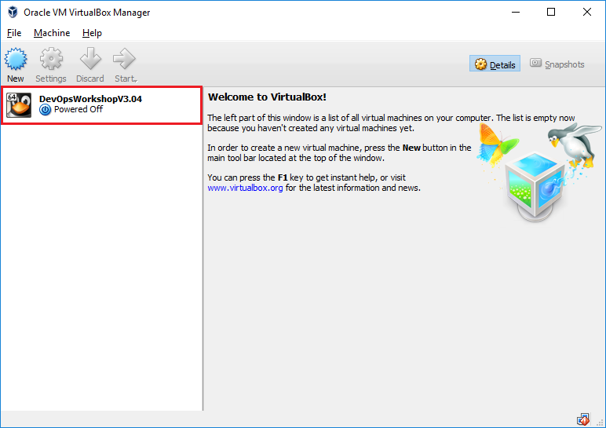

19. Back to [VirtualBox Download Page](https://www.virtualbox.org/wiki/Downloads), click `All supported platforms` link next to **VirtualBox X.X.XX Oracle VM VirtualBox Extension Pack.

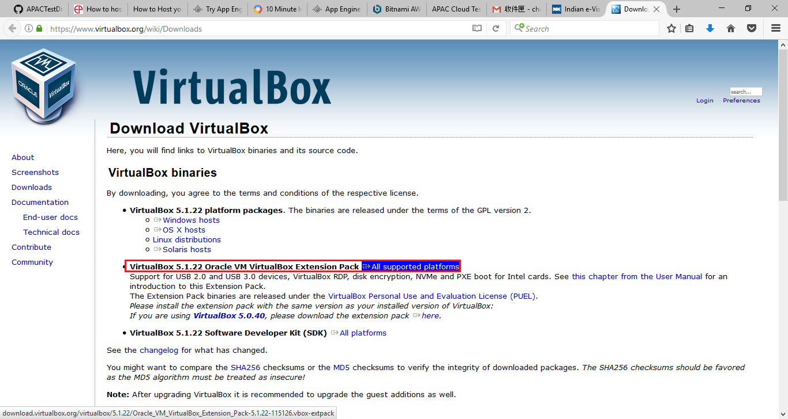

20. Save the Oracle VM VirtualBox extension pack to your destinated location.

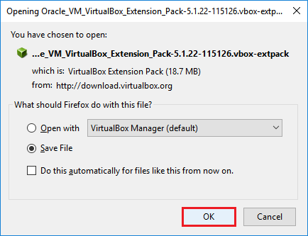

21. Double click or launch the extension pack.

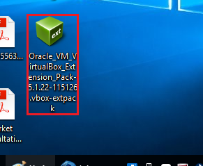

22. This will bring up the VM VirtualBox Manager with extension pack installation dialog.  
    Click `Install` button in the pop-up window.

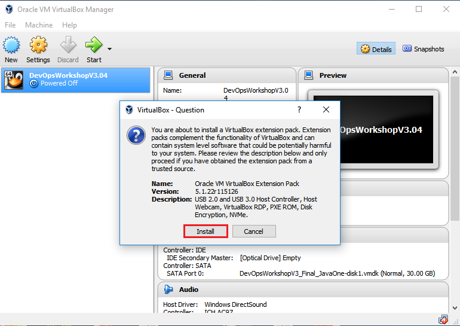

23. Scroll to the end of *VirtualBox License* and click `I Agree` button at bottom of winodw. (read optionally)

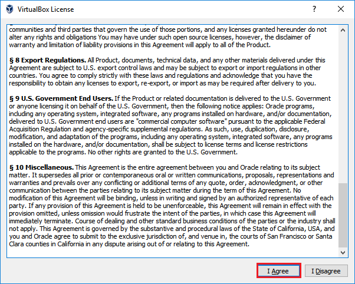

24. **Oracle VM VirtualBox Extension Pack** installation is done, click `OK`.

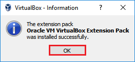

25. Now, everything required for running VM is ready, select the new VM **DevOpsWorkshopV3.04** and click `Start` button.

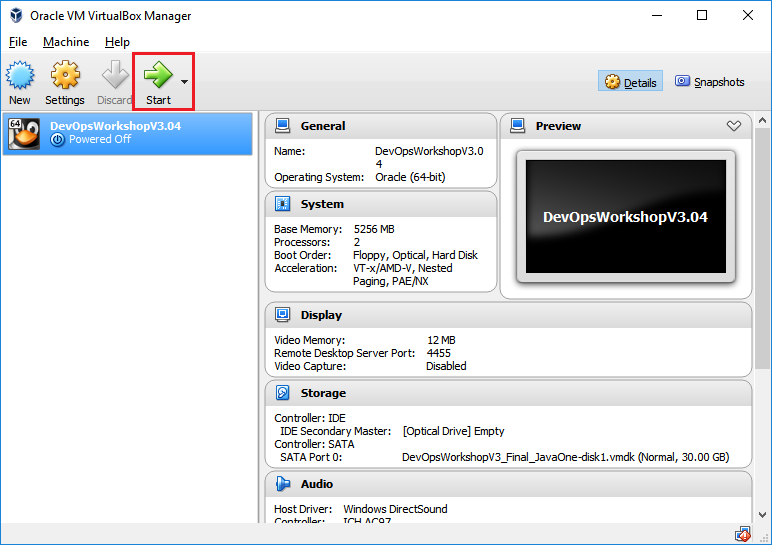

26. A new window hosting the VM content is shown upon VM started.  
    Keep the default option: **Oracle Linux Server 7.2, with Unbreakable Enterprise Kernel 3.8.13-118.9->**

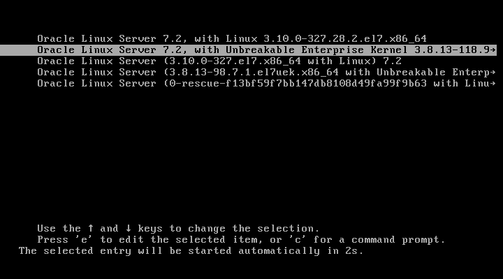

27. Wait a couple of minutes for the Oracle Linux inside the VM startup, finally, the Linux desktop shall be shown.  
    You will use the **Eclipse** and *brackets* desktop icons in lab exercises today.

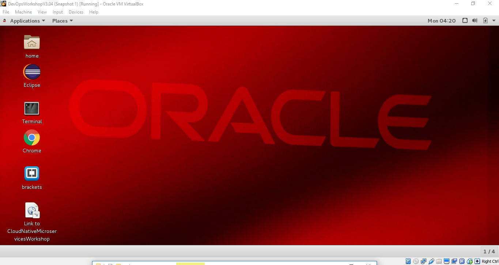

28. You have finished installation and usage of Oracle VM VirtualBox.

[Back to JavaAppLab Home](README.md)
