# ORACLE Cloud Test Drive #
-----
## 401: Set up Push Notification and Test Push Notification to mobile app ##

### Introduction ###
You can use the Notifications service (part of MCS platform APIs) to send notifications to users of the apps registered in a mobile backend. Once you have the mobile backend set up for notifications, the process of sending the notifications is the same for both iOS, Android, and Windows apps. You set up notifications by obtaining the appropriate vendor certificates and registering them with the app's mobile backend. In addition, you include some code in the app itself to enable it to receive notifications. The notifications themselves can be sent via a third-party server or be triggered by logic in a custom API.

### About the Exercise Today ###
In this exercise, we will:
- Set Cafe Supremo application up with Google. (Android Only)
- Create a notifications profile and register the Cafe Supremo app
- Prepare the Cafe Supremo application to receive notifications
- Test Notification

### Prerequisites ###
- Cafe Supremo application binary (Will be provided by instructor)
- Android device to install Cafe Supremo application
- Your Google account

----

#### Set Cafe Supremo application up with Google ####
To enable Notifications from the Google Network side, you need to have a project ID, Google Firebase Cloud Messaging (GCM) enabled, and an API key.

1. Use your google account to login to firebase https://console.firebase.google.com/ 

2. Click on “Add project” to add a project 
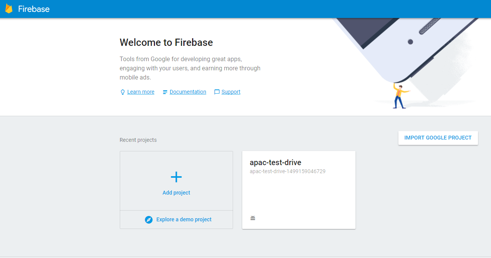

3. Enter a name (i.e. `apac-test-drive-01` or `(Provided by intructor)`) and select your region and confirm with “CREATE PROJECT” button.
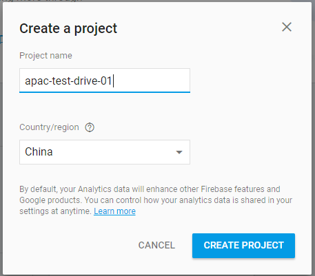

4. You will be brought to the project overview page. Select “Add Firebase to your Android app”.
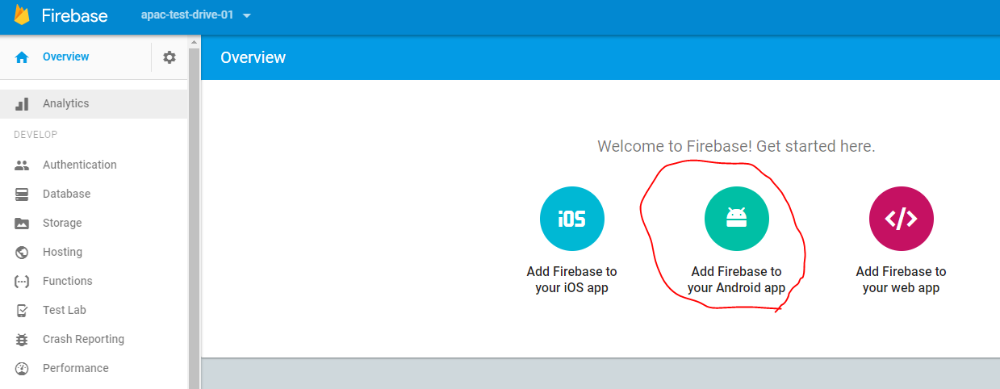

5. Enter the package name(i.e. `com.oraclecorp.internal.ent3.apacTestDrv` or `(Provided by intructor)`) of Cafe Supremo app and click on “REGISTER APP”.
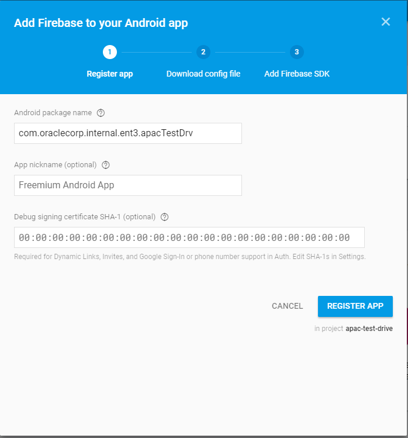

6. You can download the google-services.json, but we will not be using it so just click on “Skip to the console”.

7. Open settings of the app.
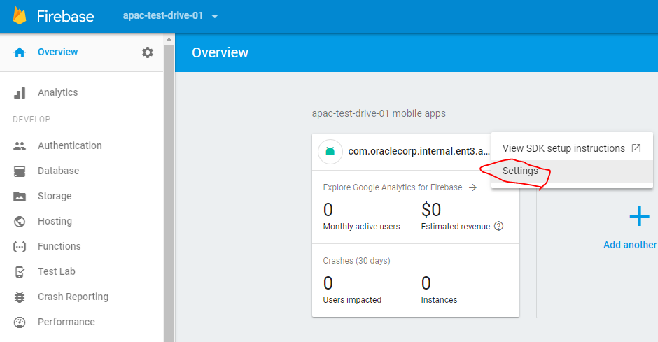

8. Switch to “CLOUD MESSAGING” and you will find your API Key(as in Server key) and Sender ID. Please take a note on **API Key** and **Sender ID** for later use. You will use them to configurate the profile of your mobile app in the MCS console.

#### Create a notifications profile and register the Cafe Supremo app ####
Next you go back to MCS to associate google credentials with Cafe Supremo mobile application.

1. Create a client (Register the app in MCS as a client) to receive notifications.
- Navigate through “Applications” -> “Mobile Backends”, select your mobilebackend, and click on “Open” to open your MBE.
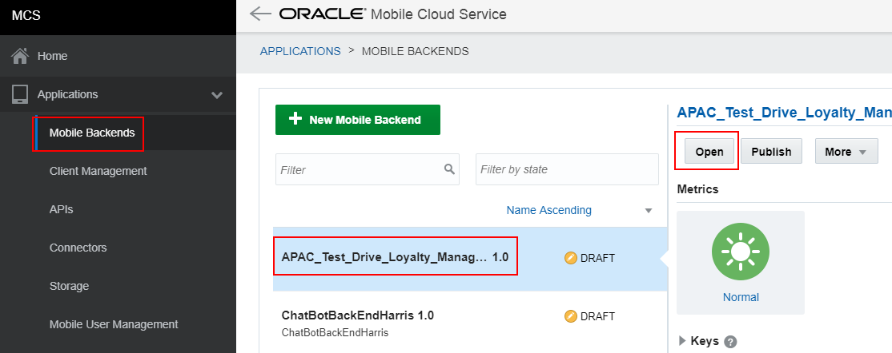

- Switch to “Clients” tab and click on “New Client”.
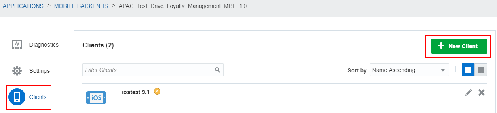

-Enter the information as in shown in the picture, change `01` to your assigned postfix by instructor. Click on “Create”. This will bring you to the client settings screen.

2. Create and select a profile to store google credentials.
- On the client settings screen, write down your “Application Key” and choose “Profiles”.
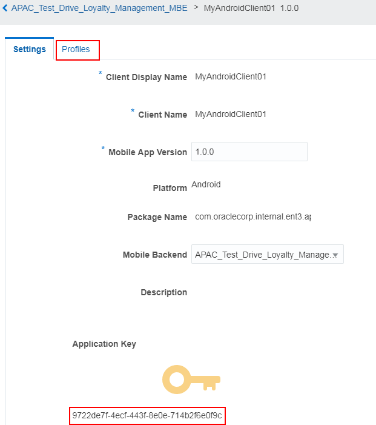

- Click on “New Profile”.

- Enter your **API Key** and **Sender ID** that you took a note in the previous section. (Set Cafe Supremo application up with Google) and clieck on “Create”
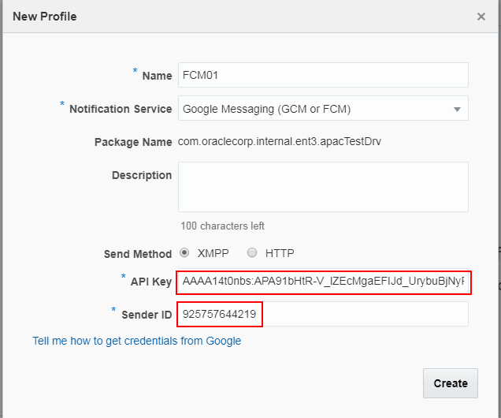

- Click on “Select Profile”.
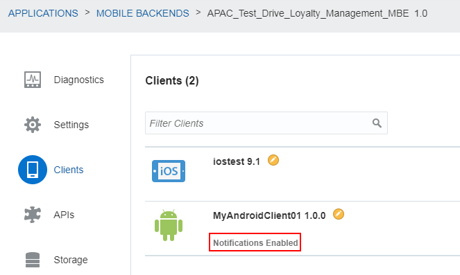

#### Prepare the Cafe Supremo application to receive notifications ####
To make you mobile application get push notificaitons, you need to add some codes or change the metafile (e.g.: main/AndroidManifest.xml file). In this lab, we provide a pre-built mobile application called "Cafe Supremo" for your use to get push notificaitons. So let's kip this one.

#### Test Notification ####
- Switch to “Notifications” tab and click on the icon below “4 TEST”.

- Click on "Manage Devices".

- You shall see devcies that has been registered to this mobile backend. Click on “Close” and go back to the “Test” screen.
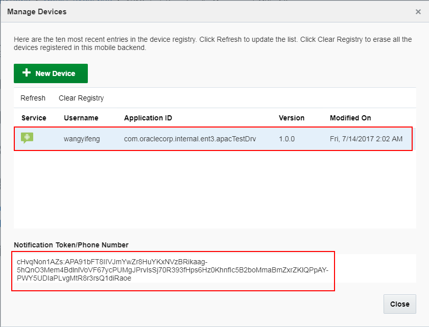

- Enter a notification `You can use your points to buy products! – 10001` with send option `Now` and click on “Send”. Note you will be getting errors if no devices registered yet.

- If you have one device registered, you shall see a success message pop up on top of the page and the notification shall appear in the notification area of your device.

[Procced to Next - 402: Develop Custom APIs and Custom Code to extend moobile services](402-MobileLab.md)

or

[Back to Mobile Serivce and Application Home](README.md)

