# ORACLE Cloud Test Drive #
-----
## 401: 导入MBE包并为外部服务配置连接器 ##

### Introduction ###

连接器允许您声明性地创建API，以简化对后端系统（如企业中间件）和Web服务的使用的访问和标准化。 Oracle MCS提供了不同类型的连接器，以简化与不同类型的后端系统（包括REST连接器，SOAP连接器，Oracle集成云服务（ICS）连接器和Oracle Fusion Application连接器）的集成。 在本实验中，您将使用REST连接器来集成在微服务和集成实验室中创建的三个REST服务。

一旦创建了连接器，就可以将其用于自定义API（例如，稍后将创建的Loyalty Mgmt APi），并将其暴露给移动应用程序。

### 关于本实验 ###
在这个实验中有3个连接器被创建，其中2个与ACCS上的微服务集成以查询报价并生成QR码，而最后一个连接器与ICS上的服务集成以接受或拒绝报价并更新现有的CRM。

要创建上述3个连接器，您将：:
- 导入包含3个连接器的MBE软件包，以及稍后将验证和配置的自定义API和移动后端r.
- 配置连接器以使用正确的URL和凭证与后端服务集成.
- 以“Process Offer”连接器为例，测试并验证连接器的结果

### 先决条件 ###
- 完成“微服务”和“集成”实验室，分别在ACCS和ICS上提供服务.

#### 导入MBE包 ####

1. 通过访问文档中的移动云服务（MCS）身份域ID和凭证登录到Mobile Cloud Service。 您应该使用管理员用户签署移动云服务，并使用移动用户签署到Cafe Supremo移动应用程序.

2. 在仪表板屏幕中，点击“移动环境服务”.
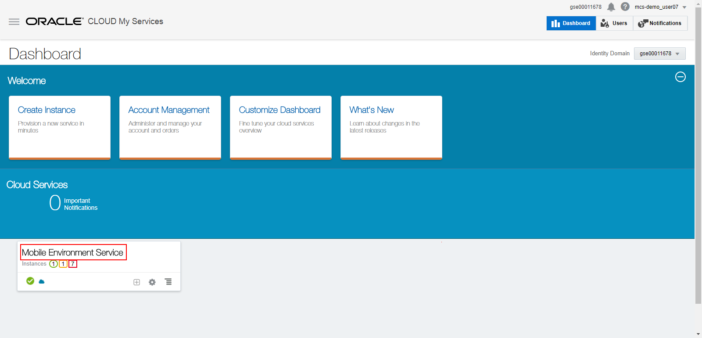

3. 在服务详细信息屏幕上，单击“服务实例URL”链接访问MCS门户.

4. 在MCS Portal中，点击位于服务介绍页面左上角的汉堡包图标。 从导航窗格中，选择“应用程序” - >“包”，然后单击“新导入”绿色按钮.
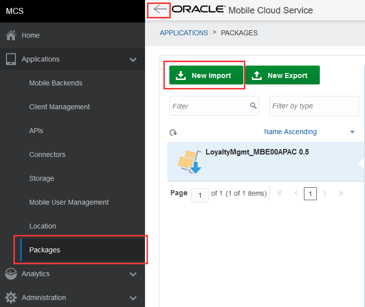

5. 点击“选择一个包文件”，并选择正确的后缀分配给你的MBE包文件“package-LoyaltyMgmt_MBE0X.zip”.
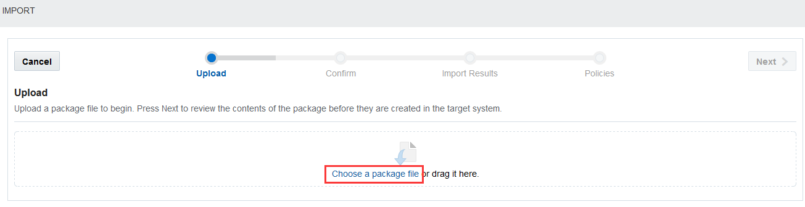

6. 文件上传完成后，点击“下一步”.
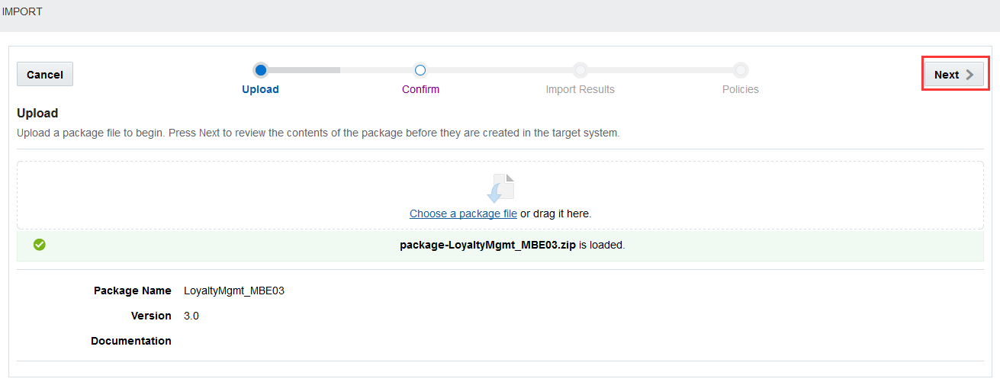

7. 7.	在“确认”步骤中，显示包的内容。 该软件包应该包括Mobile Backend'LoyaltyMgmt_MBE0X'，客户'MyAndroidClient0X'，API'LoyaltyMgmt0X'，API实现'LoyaltyMgmt03'，以及3个连接器'GenerateQRCode0X'，'ProcessOffer0X'和'QueryOffers03'。 确保每个要导入的对象中的后缀都是正确的。 点击下一步

8. 在“导入结果”步骤中，验证所有对象都已成功导入，但用户领域“Default”已经存在。 点击下一步'。
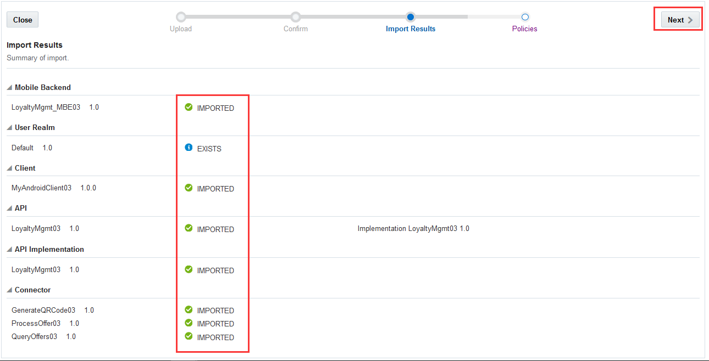

9. 在“策略”步骤中，选择策略“* .connector / GenerateQRCode0X（1.0）.Connector_Endpoint”，然后单击“编辑”.
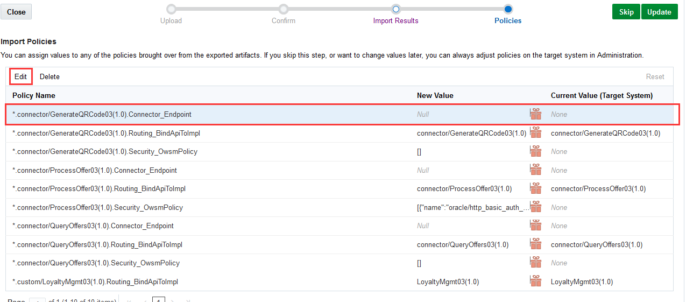

10.将自定义值设置为部署在ACCS上的QR码服务的主机URL，例如 `https://qrcodegenerator-<ACCS_DOMAIN_NAME>.apaas.<DATACENTER>.oraclecloud.com`. 点击“保存”.
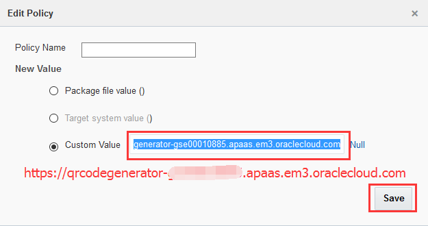

11. 回到“策略”步骤，选择策略'* .connector / QueryOffers0X（1.0）.Connector_Endpoint'并点击'编辑'.

12. 将自定义值设置为部署在ACCS上的要约服务的主机URL，例如 `https://offer-<ACCS_DOMAIN_NAME>.apaas.<DATACENTER>.oraclecloud.com`. 点击“保存”
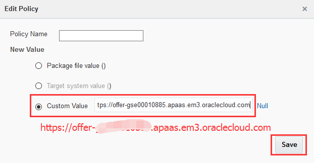

13. 回到“策略”步骤，选择策略'* .connector / ProcessOffer0X（1.0）.Connector_Endpoint'并点击'编辑'.
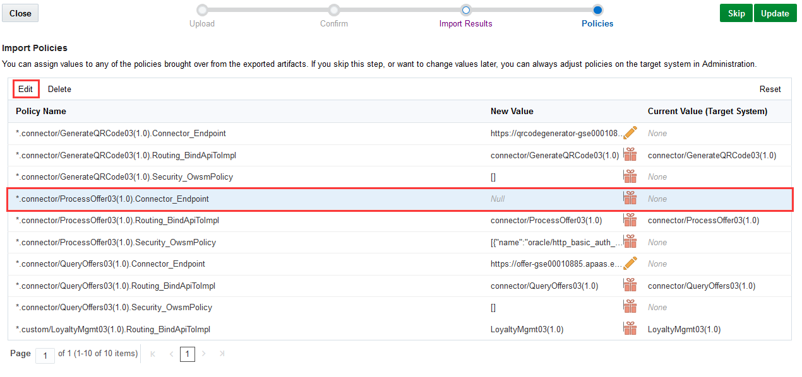

14. 将自定义值设置为部署在ICS上的“Process Offer”服务的完整服务网址，例如. `https://integration-<ICS_DOMAIN_NAME>.integration.<DATACENTER>.oraclecloud.com/integration/flowapi/rest/C0X_ICS_INTMGT/v01/processoffer`. 点击“保存”.
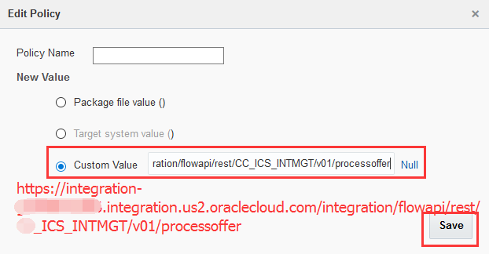

15. 返回到“策略”步骤，验证是否已成功为所有三个连接器端点策略设置了新值，然后单击“更新”完成导入包。
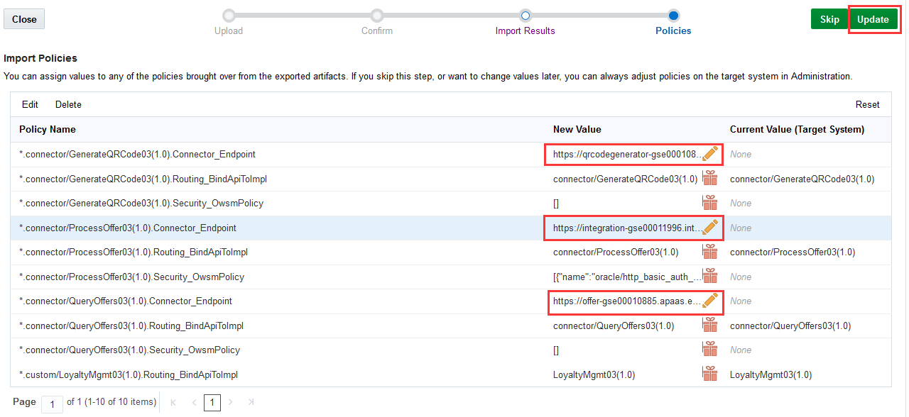

#### 配置凭证以访问ICS上的“Process Offer”服务 ####
部署在ICS上的“Process Offer”服务被配置为在“集成”实验室中使用“基本身份验证”。 要与“Process Offer”服务集成，您应该在MCS上配置ICS凭证，以便MCS上的连接器有权访问ICS上的“Process Offer”。

1. 在导航窗格上，选择“应用程序” - >“连接器”。 输入“0X”（0X是分配给您的后缀）来搜索由您创建的连接器。 选择“Process Offer 0X”（0X是分配给你的后缀）并点击“打开”。
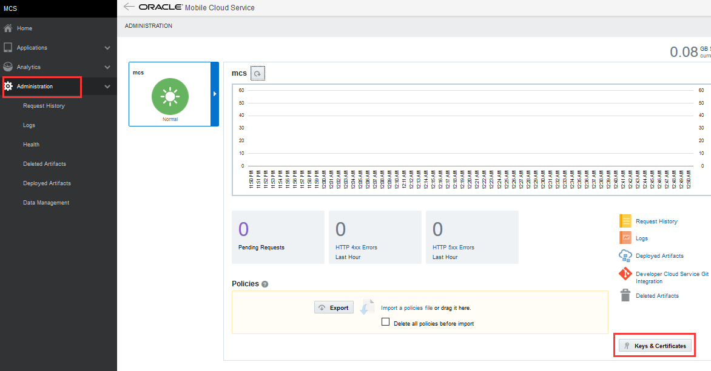

2. 在“常规”步骤中，确保“API名称”设置为“ProcessOffer0X”（0X是分配给您的后缀），然后单击“下一步”。
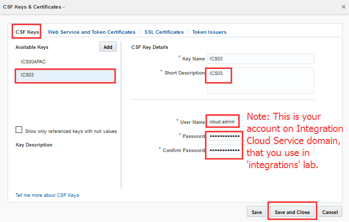

#### Test the connector 'Process Offer' ####

Once the connectors have been imported and configured completely, you can test the connector. In this lab, you will test the connector 'Process Offer'.

1. On the navigation pane, select “Applications” -> “Connectors”. Enter "0X" (0X is the postfix assigned to you) to search for the connectors created by you. Select "Process Offer 0X" (0X is the postfix assigned to you) and click on "Open".
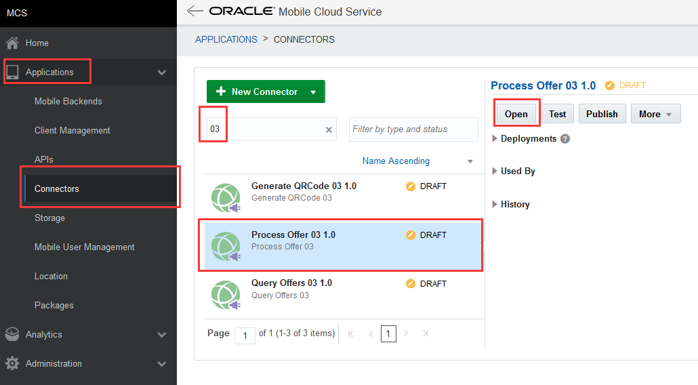

2. In 'General' step, make sure that the 'API Name' is set as 'ProcessOffer0X' (0X is the postfix assigned to you), and click 'Next'.
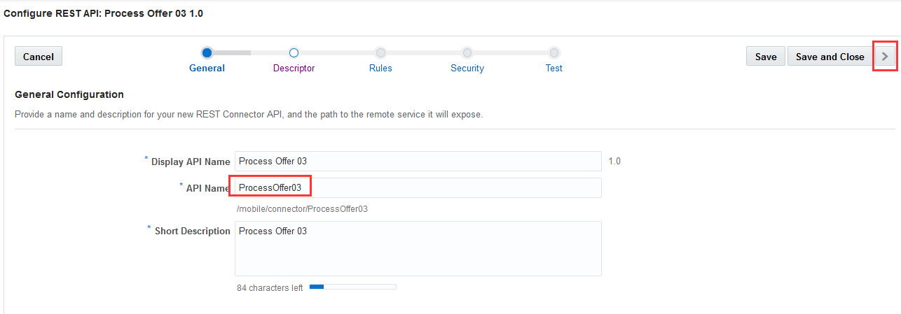

3. In 'Descriptor' step, make sure that the 'Remote URL' is set to the full service URL of the 'Process Offer' service on ICS, e.g. `https://integration-<ICS_DOMAIN_NAME>.integration.us2.oraclecloud.com/integration/flowapi/rest/C0X_ICS_INTMGT/v01/processoffer`. Click 'Next'.
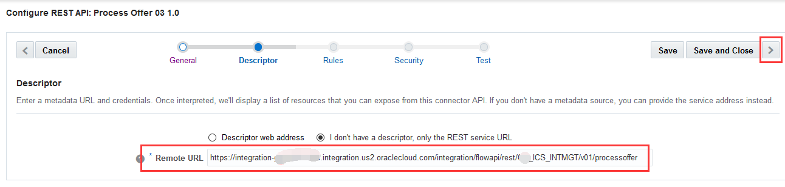

4. In 'Rules' step, click 'Next' as no rule is used. 

5. In 'Security' step, make sure that security policy "oracle/http_basic_auth_over_ssl_client_policy" is selected, and the csf-key is set to 'ICS0X' (0X is the postfix assigned to you). Click 'Next'.
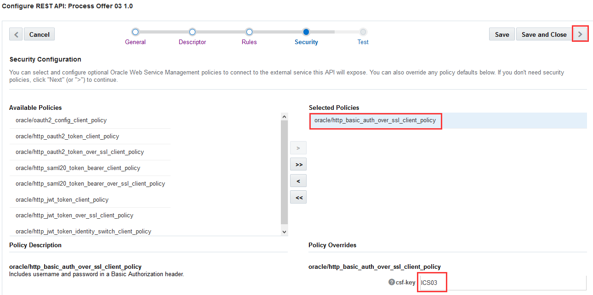

6. Click 'Yes' to save.

   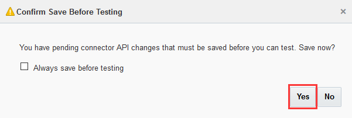

7. In 'Test' step, select `POST` as the HTTP method, enter `{"customerid": 66890169,  "offerid": 10001,  "productid": 20001,  "accepted": false}` into the "HTTP Body".
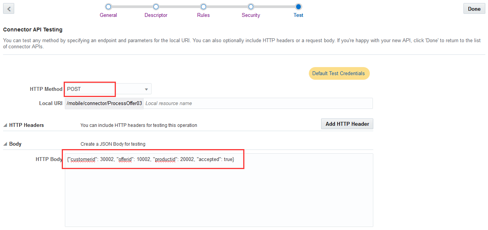

8. Select your mobile backend (e.g.: `LoyaltyMgmt_MBE0X`) you created from the dropdown list in the “Authentication” section, and click on “Test Endpoint”.
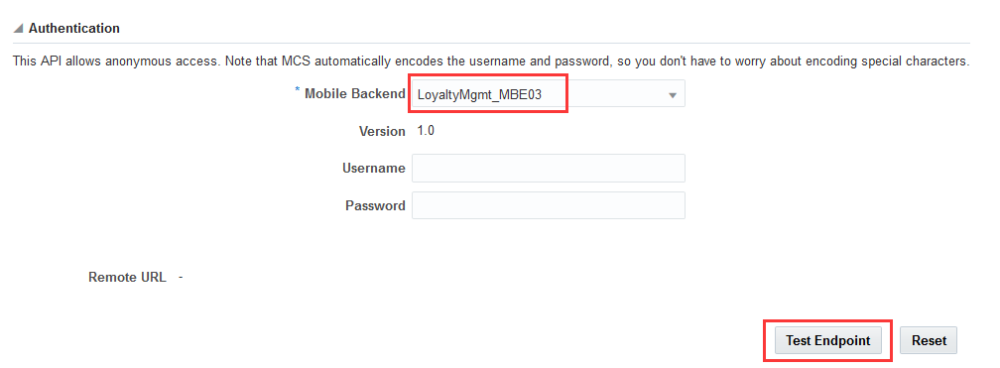

9. You shall see an HTTP 200 OK response at the bottom of the page and it is all set.
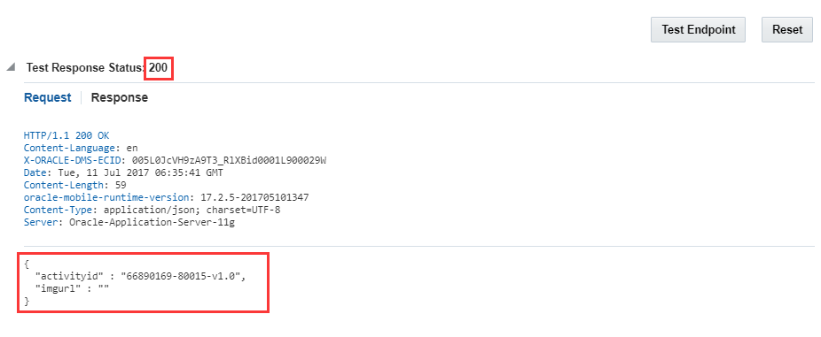

You have finished this lab successfully.

[Procced to Next - 402: Verify and test custom APIs and implementation](402-MobileLab.md)

or

[Back to Mobile Service and Application Home](README.md)
