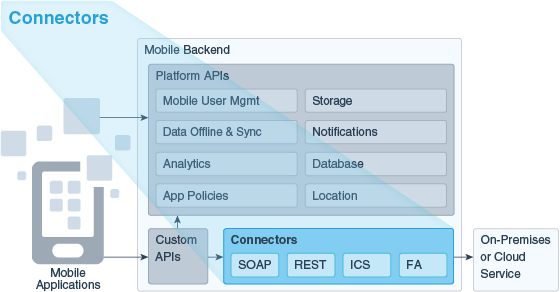
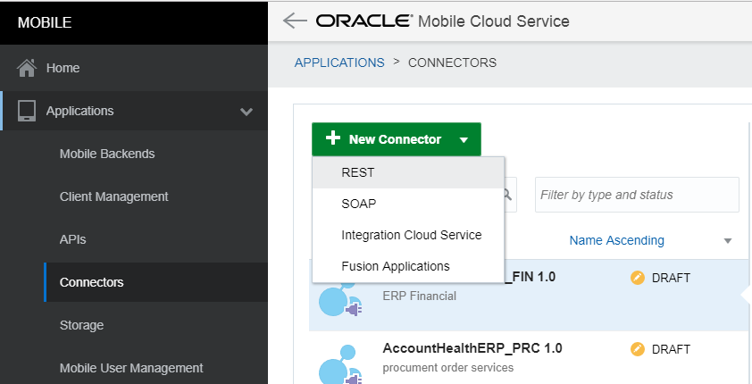
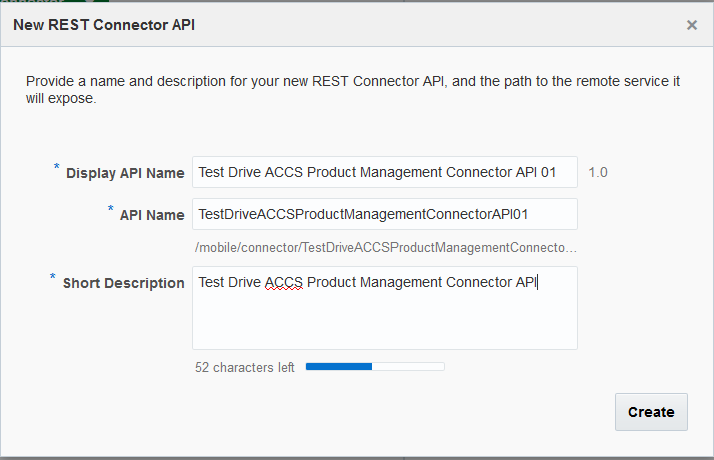
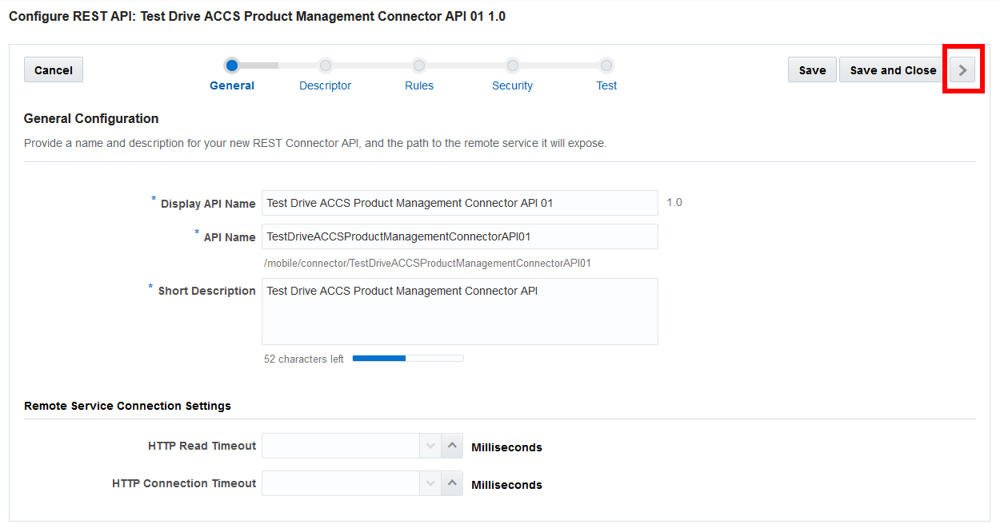
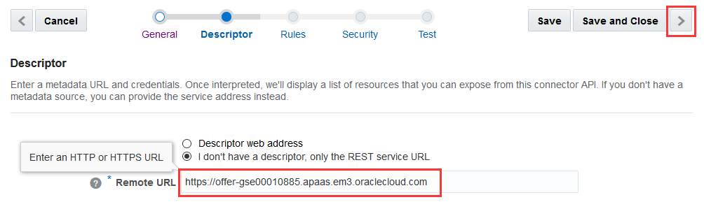
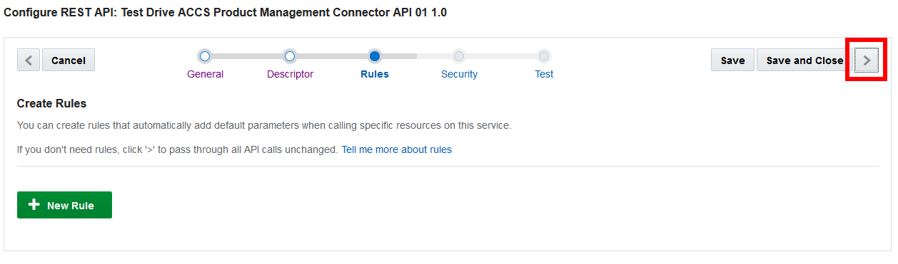
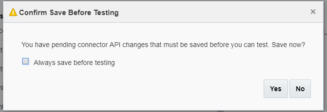
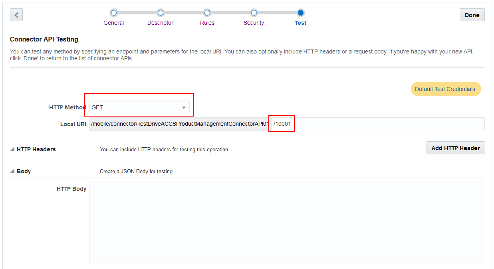
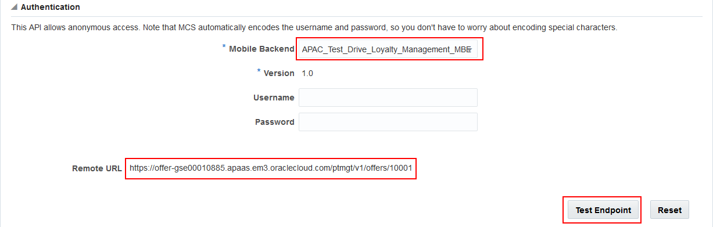
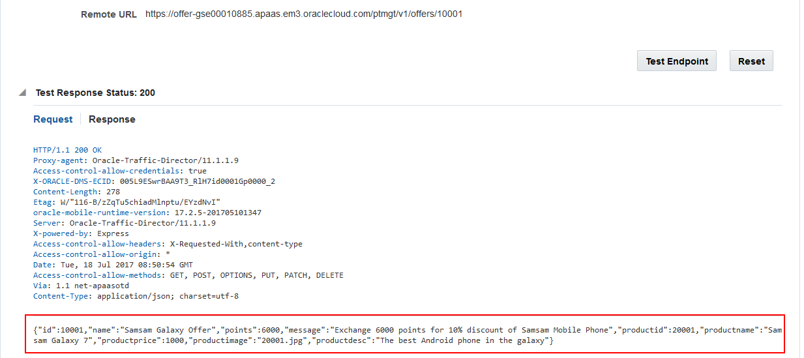

# ORACLE Cloud Test Drive #
-----
## 402: Create Connectors for external services ##

### Introduction ###

Connectors allow you to declaratively create APIs that simplify access to and standardize use of backend systems (such as enterprise middleware) and web services. Connector types are available for REST web services, SOAP web services, the Oracle Integration Cloud Service (ICS), and Oracle Cloud applications based on Fusion Applications (FA). For this lab, we are going to use the connectors for the REST web services to integrate ACCS and ICS.

Once you create a connector API to access the service, you can use it in custom APIs (e.g. Loyalty Management API), which you can then call from your mobile applications using standard REST calls.

### About the Exercise Today ###
There are 3 Connector APIs for offer information query, QR code creation and offer result (e.g. reject or accept) update from external systems like ACCS (Application Container Cloud Service) and ICS (Integration Cloud Service) that we need to access in this lab.

For the above 3 Connector APIs, we will guide you through creating the "Product Management" API Connector to get offer information using an ACCS microservice and the rest 2 have already been created for you to use in the MCS instance.

### Prerequisites ###
- Loyalty management MBE created in the previous lab.

----
#### Create "Product Management" API Connector to get offer information ####
In this lab, we will create a connector API to integrate ACCS microservice for offer information. **[Note]** A connector API is for the custom APIs. It means a connector API doesn't have direct interactions with mobile applications. Mobile applications only interact with custom APIs and custom APIs will use the connector API to interact external services and systems.

1. On the navigation pane, select “Applications” -> “Connectors”. Click on the “+ New Connector” green button and select “REST” from the dropdown list.

2. Enter `Test Drive ACCS Product Management Connector API 0X`(0X is the sequence number assigned to you by instructor. - e.g.: 01) as the "Display API Name" and short description for this connector. The API name should be changed manually to `TestDriveACCSPtMgtConnectorAPI0X` in order to match the value used in Lab 403. Note that the “API Name” will be used in custom API implementation coding thus is must meet JavaScript variable naming standards. Click on “Create” on the bottom right when you are done. 

3. Review the name/description on the general screen and click on the “Next Step” button (“>” on the top right) to move to the next screen.

4. Enter the URL (e.g.: `https://offer-gse00010885.apaas.em3.oraclecloud.com`. This is the endpoint CREATED by you in the Microservice Lab.) to the REST API into the “Remote URL” textbox. Click on “Next Step”.

5. We won’t set any rules here, so just click on “Next Step”.

6. MCS supports a wide range of security policies for you to use. For the lab, to make it simple, no security policy setting is required. Just click on “Next Step”.

7. Click on “Save” when prompt for confirmation.

8. Now your connector is ready and you can test it. Select `GET` as the HTTP method, enter `/ptmgt/v1/offers/10001` into the “Local resource name” following the “Local URI”.

9. Select your MBE (e.g.: `LoyaltyMgmt_MBE01`) you created from the dropdown list in the “Authentication” section and you will find the actual URL that is getting called at the end in the “Remote URL” field. Click on “Test Endpoint”.

10. You shall see an HTTP 200 OK response at the bottom of the page and it is all set.

---

You have finished this lab successfully.

[Procced to Next - 403: Develop Custom APIs and Custom Code to extend mobile services](403-MobileLab.md)

or

[Back to Mobile Service and Application Home](README.md)
