# ORACLE Cloud Test Drive #
-----
## 402: Verify and test custom APIs and implementation ##

### Introduction ###
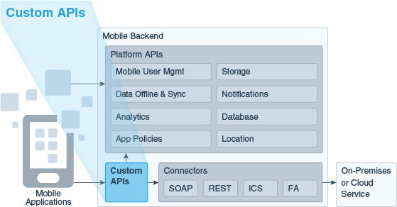

You can create custom REST APIs to build up a library of services that can be used by your mobile applications. Custom APIs are particularly useful for aggregating data from other sources, adding any relevant business logic, and returning results in a mobile-friendly way for mobile applications.
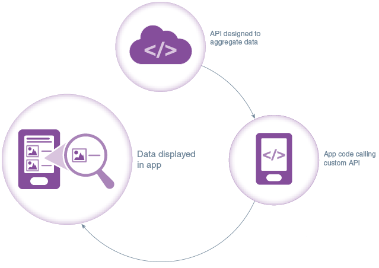

### About the Exercise Today ###
In the previous lab, you have created 3 connectors to integrate with external services, including the microservices on ACCS to query offers and generate QR code, and the service on ICS to accept or reject offer and update the existing CRM. As you might remember, those connectors are not directly exposed to mobile applications. Once you create connectors to access the services, you can use them in custom APIs (e.g. LoyaltyMgmt API), which you can then call from your mobile applications or external systems using standard REST calls. Custom API 'LoyaltyMgmt0X' in included in the MBE package and has been imported into MCS already in previous lab.

In this lab, you will:
- Verify the definition of the custom API
- Test the custom API

### Prerequisites ###
- The MBE Package has been imported successfully in previous lab (Lab 401)
- The 3 Connectors have been configured correctly in previous lab (Lab 401)

----
#### Verify the definition of the custom API for loyalty management ####
In this lab, you will check the endpoints, security setting and implementation of the custom API for loyalty management, that you imported with the MBE package in previous lab. 

1. On the navigation pane, select “Applications” -> “APIs”. Enter "0X" (0X is the postfix assigned to you) to search for the custom API created by you. Select "LoyaltyMgmt 0X" (0X is the postfix assigned to you) and click on "Open".
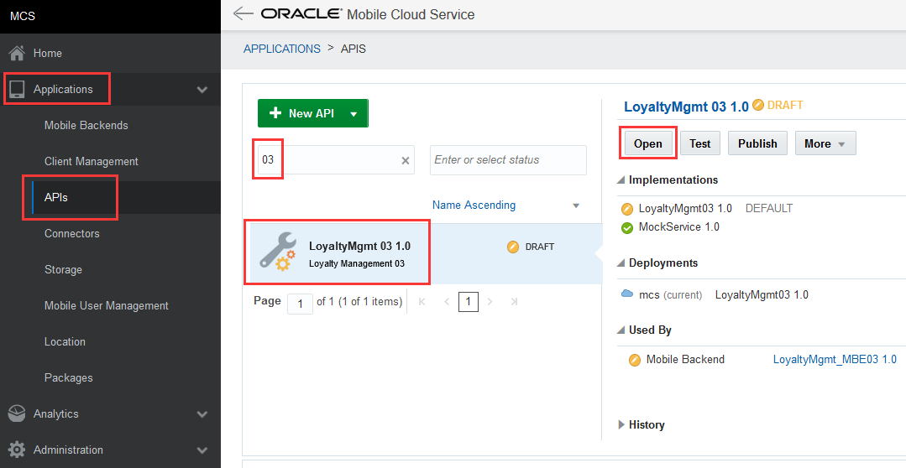

2. Make sure that the value of the "API Name" is "LoyaltyMgmt0X" (0X is the postfix assigned to you).
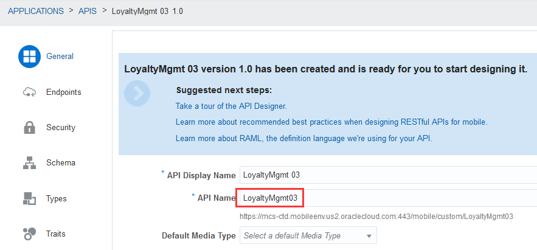

3. Copy the values of "API Name" and replace the value of the property "API" in the "Mobile_App_Settings_Sample.json" file.  Save the file for later use.
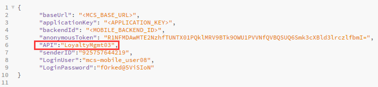

4. Switch to the “Endpoints” tab, a list of endpoints defined in this custom API are shown. Switch to 'Compact Mode' by clicking on the 'Compact Mode' button. You can check all the list of endpoints in compact mode.
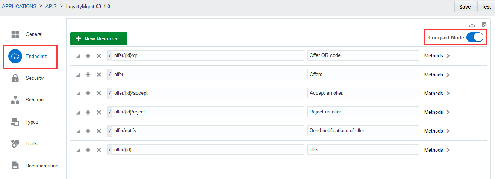

5. For your information: Now you have defined all endpoints for the Loyalty Management Custom API. The below is the list of endpoints for your reference.

    | Resource Path     | Display Name          | Method | Request Type     | Response Media Type |
    | ----------------- | --------------------- | ------ | ---------------- | ------------------- |
    | offer/{id}/qr	    | Offer QR code         | GET    | N/A	        | image/png           |
    | offer	            | Offers	            | GET    | N/A	        | application/json    |
    | offer/{id}/accept | Accept an offer       | POST   | application/json | application/json    |
    | offer/{id}/reject | Reject an offer       | POST   | application/json | application/json    |
    | offer/notify      | Send noti. of offer   | POST   | application/json | application/json    |
    | offer/{id}        | Get Offer Details     | GET    | N/A	        | application/json    |

6. You can define security policies to allow users and roles to access this API. In this lab, we allow anonymous access to this API. Switch to the “Security” tab, make sure the 'Login Required' option is switched off, so the API allows anonymous access.

   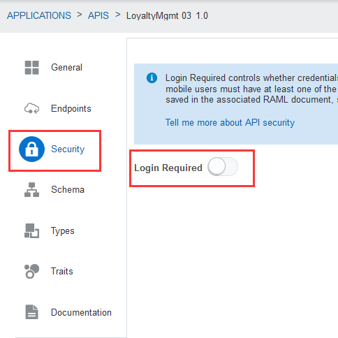

7. After the custom API has been defined, a mock service will be generated automatically to allow mobile developers to start using the API, without waiting for service developer to complete implementing the service. In this lab, the API implementation has been imported together with the MBE package. Switch to the “Implementation” tab, click to expand the "Dependencies for LoyaltyMgmt0X". Make sure that the implementation called "LoyaltyMgmt0X" is set to 'Default', and you can find connectors "GenerateQRCode0X", "QueryOffers0X" and "ProcessOffer0X" in the dependency list (0X is the postfix assigned to you).
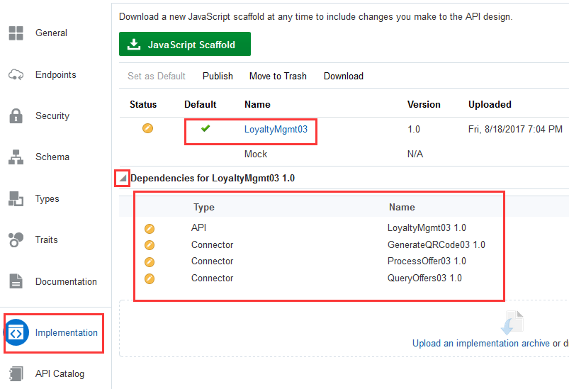

----
#### Test the custom API for the Loyalty Management ####
Now that you have completed verifying the definition and implementation of the custom API, you can move on to test it.

1. Click on the 'Test' button on the top right of the custom API screen.
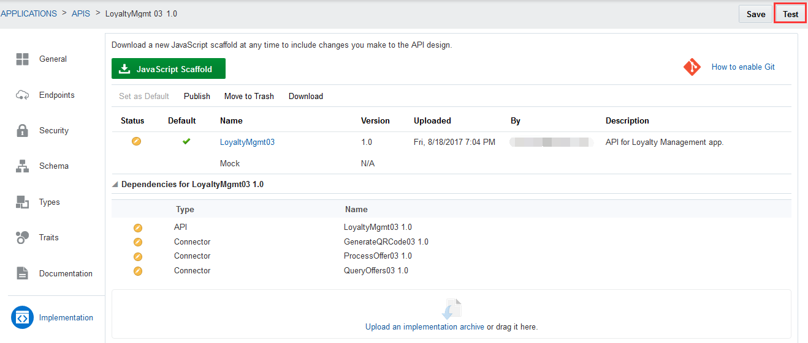

2. In the API test console, the list of endpoints available for this API is shown. Take the service "Get offer QR code" as an example, click on "Get offer QR code" in the endpoint list on the left.
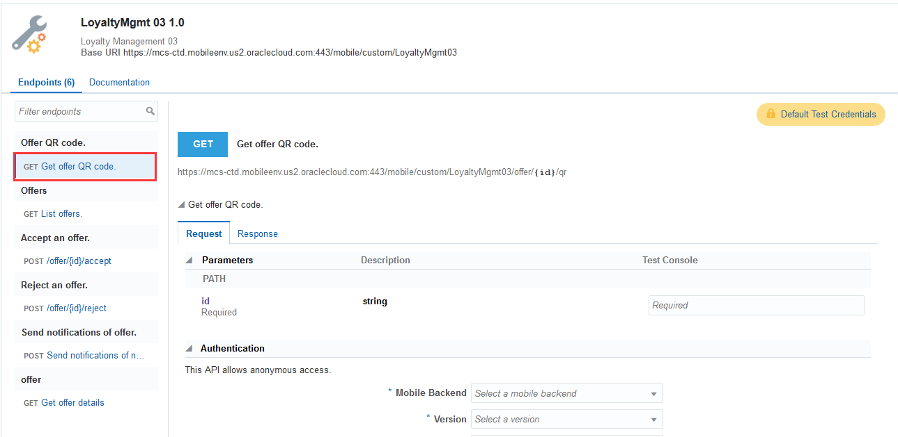

3. Set "id" parameter with value `10001` and select `LoyaltyMgmt_MBE0X` (0X is the postfix assigned to you) in the "Mobile Backend" dropdown list, keep "Authentication Method" as `Default`. Click on "Test Endpoint" button to test the service.
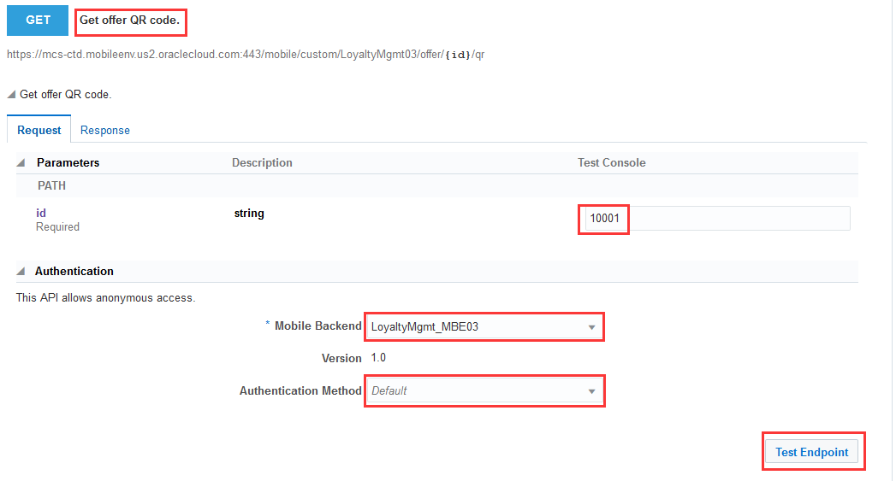

4. You should get an response with response code "200" and content type "image/png". This is the QR code image returned by the "Generate QR Code" service that you deployed on ACCS.
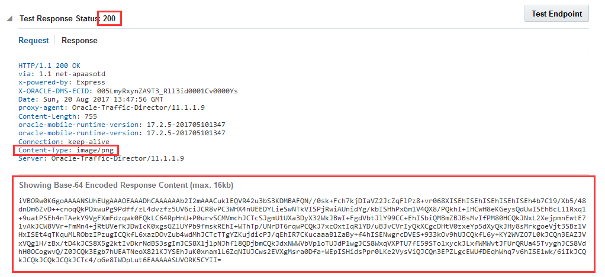

You have finished this lab successfully.

[Procced to Next - 403: Set up Push Notification and configure the mobile app](403-MobileLab.md)

or

[Back to Mobile Service and Application Home](README.md)
