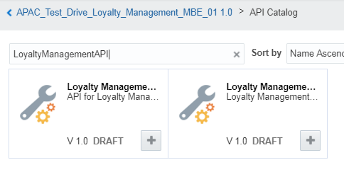

# ORACLE Cloud Test Drive #
-----
## 403: Develop Custom APIs and Custom Code to extend mobile services ##

### Introduction ###


You can create custom REST APIs to build up a library of services that can be used by your mobile applications. Custom APIs are particularly useful for aggregating data from other sources, adding any relevant business logic, and returning results in a mobile-friendly way for mobile applications.


### About the Exercise Today ###
In the previous lab, we've created 3 connector APIs to integrate with external services for offer information query, QR code creation and offer result update. As you might remember, those connector APIs are not directly exposed to mobile applications. Once you create  connector APIs to access the services, you can use them in custom APIs (e.g. Loyalty Managment API), which you can then call from your mobile applications or external systems using standard REST calls. So, in this lab, we will create a custom API for 3 connector APIs.

In this exercise, we will:
- Create the custom API and define its endpoints for loyalty management. We need the custom API with several endpoints for offer information query, QR code creation and offer result (e.g. reject or accept) update.
- Associate the APIs with the loyalty management MBE.
- Test the Customer API for loyalty management

### Prerequisites ###
- Loyalty management MBE created in the previous lab. (400 lab)
- 3 Connector APIs we created in the previous lab (402 lab)
- A RAML file for the custome API with some of endpoints for your use. It can be downloaded from [this link](../common/assets/mobile/) for your use in the lab. Go to the link, downloada a file called `loyaltymanagementapi.raml`, and save it to your local PC.
- Chrome Postman to test custom APIs
- Any text file editor

----
#### Create the custom API and define its endpoints for loyalty management ####
In this lab, you will create a custom API for loayalty managment. In fact, we need to define serveral endpoints for the custome API for offer information query, QR code creation and offer result update. Creating endpoints are the same jobs. For your convenience, we will create our own custom API using a RAML file for other endpoints and then manually create one additional endpoint. So, here you will create one endpoint for the query of the specific offer information. 

1. From the navigation pane, select “Applications” -> “APIs”, click on “+ New API” and select “API” from the dropdown list.


2. Click on “Upload a RAML document” link and choose the RAML file (`loyaltymanagementapi.raml`) you download.


3. When uploaded successfully, enter name and description and click on “Create” as below:
    + **API Display Name**: `Loyalty Management 0X` (0X is the sequence number assigned to you by instructor. - e.g.: 01)
    + **API Name**: `LoyaltyManagement0X` 
    + **API Short Description**: `Custom API for Loyalty Management 0X`
Click on “Create” on the bottom right.


4. Define additional endpoint for the Loyalty Management API
   - Now the custom API just created is automatically open for you. Switch to the “Endpoints” tab to define the additional endpoint.


   - Adding resource: Click on “+ New Resource”.


   - The new resource is added to the bottom of the existing endpoints page. Scroll down to the end.


   - Enter `offer/{id}` as the “Resource Path” and `Offer` as the “Display Name” and click on “Methods”. This endpoint (a URI resource) is for getting the specific offer information by offer ID.


    - Adding method: you can see that {id} entered in previous step has be recognized as a URI Resource Path Parameter “id”. Click on “+ Add Method” and select “GET”.


    - Enter `Get offer details` as the “Description” and `Get offer details` as the “Display Name” for the method. Click on “Responses” link at the bottom.


    - Adding sample response: MCS will use the below sample body to create a mockup implementation for this endpoint method. This is the one of good features to enable parallel development of mobile application without external services. In the "Example" text area, paste the following code:
	```
	{
		"id": 10001,
		"name": "Our new aroma roast",
		"points": 10000,
		"message": "Try special brew today and enjoy 10% off with 10,000 points",
		"productid": 20001,
		"productname": "Aroma Beans",
		"productprice": 21,
		"productimage": "20001.jpg",
		"productdesc": "Blend of incomparable Balance of sweetness, aroma and body. Composed of 50% Arabica and 50% Robusta."
	}
	```
    - Scroll to the top of the page and click on “Save”. 


    - For your information: Now we have created all endpoints for the Loayaly Management Custom APIThe below is the list of endpoints for your reference.

    | Resource Path     | Display Name          | Method | Request Type     | Response Media Type |
    | ----------------- | --------------------- | ------ | ---------------- | ------------------- |
    | offer/{id}/qr	| Offer QR code         | GET    | N/A	            | image/png           |
    | offer		| Offers	        | GET    | N/A	            | application/json    |
    | offer/{id}/accept | Accept an offer       | POST   | application/json | application/json    |
    | offer/{id}/reject | Reject an offer       | POST   | application/json | application/json    |
    | offer/notify      | Send noti. of offer   | POST   | application/json | application/json    |

5. 


4. Security Settings: You need to assign a role to access the API. Before that, the API is not accessible by anyone.
On page level navigation pane, select “Security”. Click in the Roles box and select the “Default” role. Scroll to the top and click “Save”.


---
#### Associate the APIs with the loyalty management MBE ####
Before you can deploy the custom API, it has to be associated with the mobile backend(e.g.: APAC_Test_Drive_Loyalty_Management_MBE01) you created in the previous lab. The mobile backend provides the security context for accessing the API, including the users that have permissions. In this lab, we will assign the complete custom API for "LoyaltyManagementAPI" that we provide.

1. Navigate to the MBE(e.g.: APAC_Test_Drive_Loyalty_Management_MBE01) you created, and turn to the “APIs” tab. Click “Select APIs”.


2. Enter `LoyaltymanagementAPI` and click one “+” icon to select the one without any suffix, which is the one we’ve provided. This is for the application that provided for the lab to use.



3. You will see it got added to the right 


4. Please see the result as below:


5. [Optional] Follow the same instruction to add the API (e.g.: LoyaltyManagement01) you’ve just created so that you can test it.

---
#### Test the Customer API for loyalty management ####

Now you can test your custom API. 

1. Finding your base URI and endpoint URI(e.g.: `https://mcs-gse00011678.mobileenv.us2.oraclecloud.com/mobile/custom/LoyaltyManagementAPI/offer`), let’s take `Get offer details` endpoint as an example.


2. [Install Postman and use Chrome to access.](https://chrome.google.com/webstore/detail/postman/fhbjgbiflinjbdggehcddcbncdddomop) and launch Postman to test `Get offer details` API.


3. Change the endpoint URI parameter placeholder with `10001`, as is shown below then choose `Basic Auth` from Authourization type dropdown list.


4. Enter MCS username and password (MCS credential in the Access Document). and click on “Update Request”.


5. Click on “Headers” and you can see the “Authorization” header has been generated for you based on your settings in the “Authorization” tab.


6. Add 2 headers, one is `Oracle-Mobile-Backend-ID`, value is the actual MBE id that you can find in the settings tab of your MBE. The other one is `Accept`:`application/json`. 


7. Click on “Send” and you shall see the response at the bottom of the page as below.


You have finished this lab successfully.

[Procced to Next - 404: Track customer behaviors](404-MobileLab.md)

or

[Back to Mobile Serivce and Application Home](README.md)


