# ORACLE Cloud Test Drive #
-----
## 403: 设置推送通知并配置移动应用程序 ##

### 介绍 ###
您可以使用通知服务（MCS平台API的一部分）将通知发送给在移动后端注册的应用程序的用户。 将移动后端设置为通知后，发送通知的过程对于iOS，Android和Windows应用程序都是相同的。 您通过获取适当的供应商证书并将其注册到应用程序的移动后端来设置通知。 另外，您可以在移动应用程序中编写自己的代码来处理推送通知。 MCS还可以将推送通知服务暴露给其他应用程序，以便应用程序 用于活动管理的Java应用程序可以通过调用MCS公开的推送通知服务向最终用户发送推送通知.
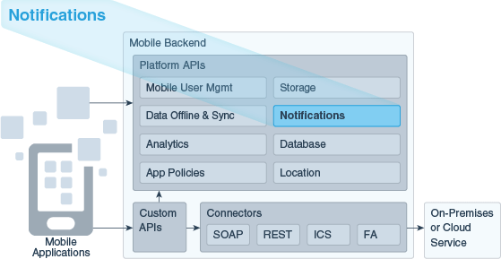

### 关于该练习 ###
在这个练习中，我们将:
- 创建通知配置文件
- 配置移动应用程序以使用您的移动后端
- 测试通知

### 先决条件 ###
- 在Android设备上安装了Cafe Supremo应用程序

----
#### 创建通知配置文件 ####
通知配置文件定义推送通知提供程序发送推送通知所需的一个或多个证书。 在本实验中，您将创建一个通知配置文件并将其与客户端应用程序（Cafe Supremo移动应用程序）相关联，以便MCS可以向Cafe Supremo移动应用程序发送推送通知。

1. 在导航窗格中，选择“应用程序” - >“移动后端”。 输入“0X”（0X是分配给您的后缀）来搜索您导入的移动后端。 选择“LoyaltyMgmt_MBE0X”（0X是分配给你的后缀）并点击“打开”。
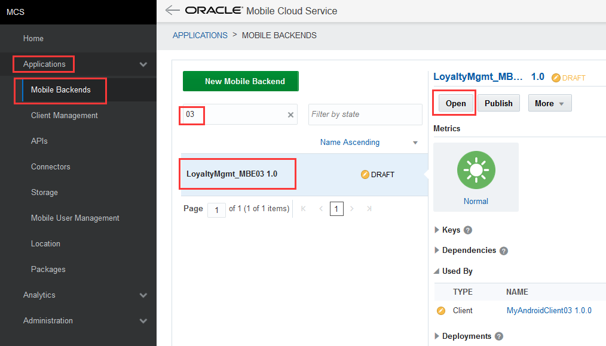

2. 切换到“客户”选项卡，您应该看到一个名为“MyAndroidClient0X”的客户端（0X是分配给您的后缀）由您导入。 没有与客户端关联的通知配置文件。 点击客户端“MyAndroidClient0X”。
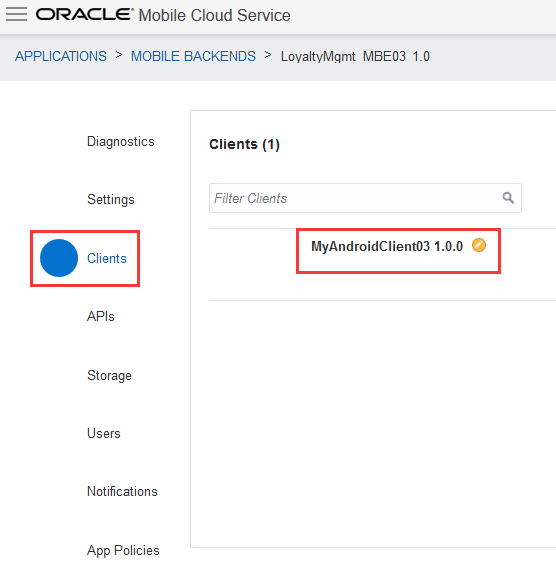

3. 显示客户端的设置。 向下滚动查看客户端的“应用程序密钥”。
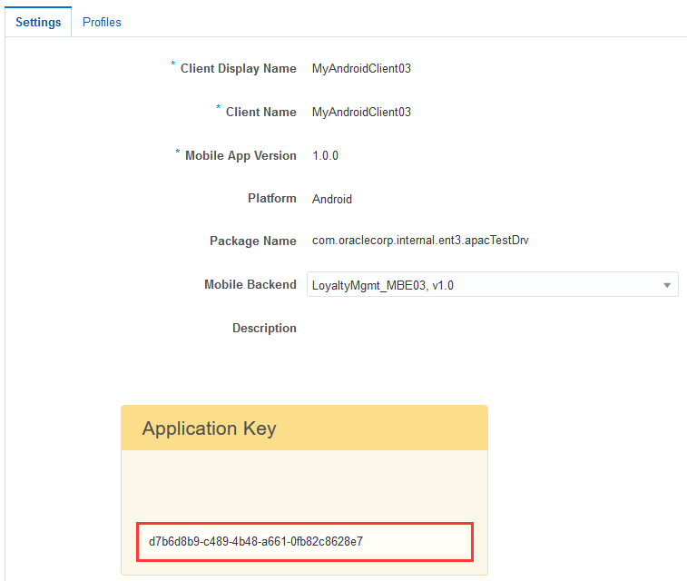

4. 复制“应用程序密钥”的值并替换“Mobile_App_Settings_Sample.json”文件中的属性“applicationKey”的值。 保存文件供以后使用。
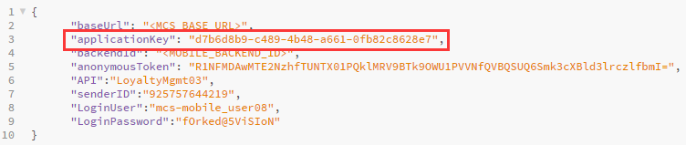

5. 切换到“MyAndroidClient0X”客户端的“配置文件”选项卡，然后单击“新建配置文件”按钮来创建通知配置文件。
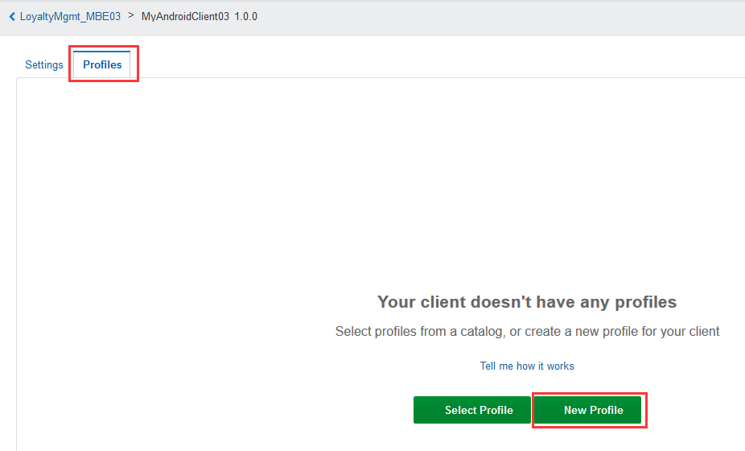

6.输入FCM0X（0X改变分配给您的后缀，例如：03）作为名称，粘贴 `AAAA14t0nbs:APA91bHtR-V_lZEcMgaEFIJd_UrybuBjNyPG4N0ZoA33UqbZ9CywL_e2FnIfoS9lvPV5gut3Mm_ZMoex7PE1-YL-7ACaP3CnrDYpl8Qq3_jfsO3HMJYS-Mzr_X-xWpgdqWswVHsSUgDX` as the "API Key" and `925757644219` as the Sender ID. Keep `Google Messaging (GCM or FCM)` as the "Notification Service" and `XMPP` as the "Send Method", and click on “Create”. (These are the keys that are generated from Google.)

   

7. The notification profile has been created and associated with the your client "MyAndroidClient0X". Click on the link "< LoyaltyMgmt_MBE0X" in the navigation bar to navigate back to the mobile backend.
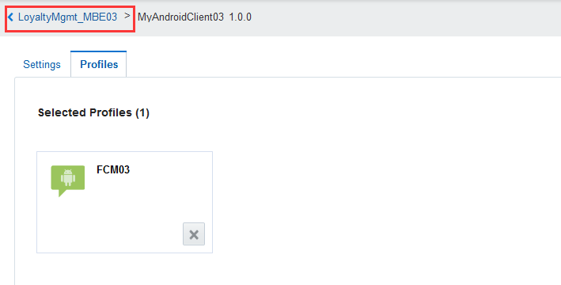

8. Verify that your client is "Notification Enabled".

---
#### Configure the mobile app to work with your Mobile Backend ####
You mobile app should be configured to work with your mobile backend before you can run any testing on the app. You will use the file **Mobile_App_Settings_Sample.json** to collect the settings that is needed to configure the mobile app.

1. Switch to the "Settings" tab of your mobile backend, and find the values of "Mobile Backend ID", "Anonymous Key" and "Base URL" in the mobile backend settings.
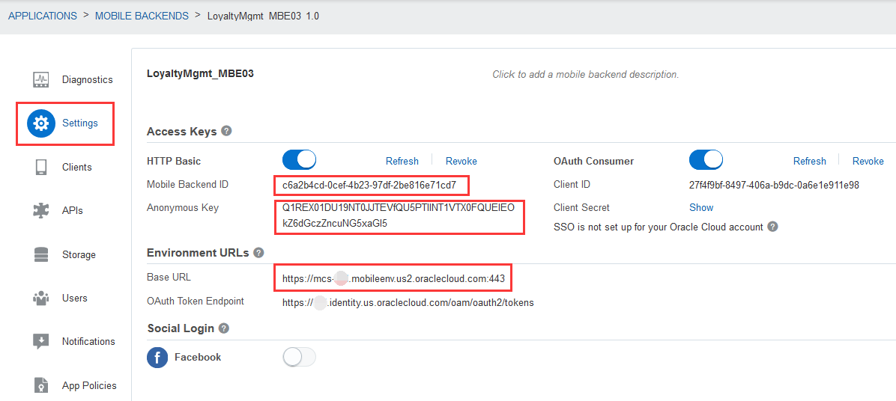

2. Copy the values from the mobile backend settings and replace the value of the target property in the "Mobile_App_Settings_Sample.json" file.  You should copy and replace the following properties.

| From Property in MBE Settings | To Property in JSON File |
|-------------------------------|--------------------------|
| Mobile Backend ID             | backendId                |
| Anonymous Key                 | anonymousToken           |
| Base URL                      | baseUrl                  |

3. Copy the values of the mobile user name and password to replace the values of the "LoginUser" and "LoginPassword" property in the "Mobile_App_Settings_Sample.json" file.  This allows the Cafe Supremo mobile app to set the "LoginUser" and "LoginPassword" as default user name and password in the login form of the mobile app. Finally your "Mobile_App_Settings_Sample.json" file should be like this.
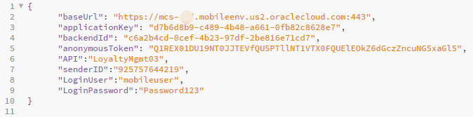

4. The Cafe Supremo mobile app allows reading new settings by scanning a QR code. You will generate a QR code with the settings in the "Mobile_App_Settings_Sample.json" file, and scan the QR code from the mobile app. 

5. From your web browser, go to `http://www.qr-code-generator.com/`, click on `Text` button and the **Free text** text area is shown.

6. Copy the settings in **your own** "Mobile_App_Settings_Sample.json" file and paste it into the **Free text** text area, then click `Create QR code` button. A QR code image will be generated on the right hand side of window.

7. From your mobile device, open the app 'Cafe Supremo'.

   

8. **DO NOT LOGIN.**  Click on the hamburger menu on top left corner, and click "Settings".

   

9. On Settings page opened, click `Read Settings from QRCode` button at middle.

   

10. When the QR scanner running, face your mobile device towards the QR code image you created in step 6. You may need to adjust the distance between your mobile device and your screen until the scanner camera can recognize the QR image.

   

11. On successful QR code scanning, all settings in your JSON file will be automatically filled into the mobile app Setting page like below. Click `Save settings and logout` button. You will then be returned to home screen.

   

12. The "Username" and "Password" in the login form have been pre-filled as what you have in the settings in your JSON file. If the user name and password are correct, click `Login` button to login. Otherwise, you can type in the user name and password manually.

   

13. Upon successful login, the welcome page is shown. Your mobile device is now ready to receive push notification of campaign offer.

   

---
#### Test Notification ####
1. Switch to “Notifications” tab in your mobile backend and click on the icon below “4 TEST”.

   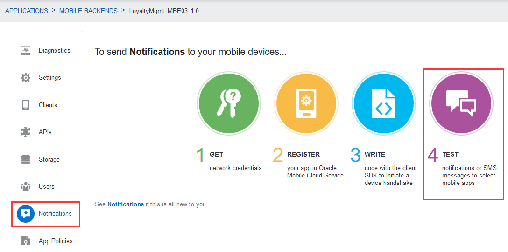

2. Click on "Manage Devices".

   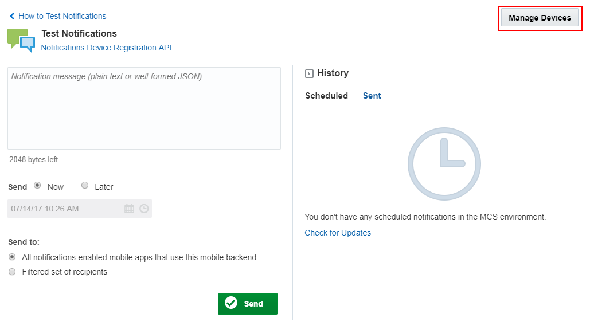

3. You shall see devices that has been registered to this mobile backend. Click on “Close” and go back to the “Test” screen.

   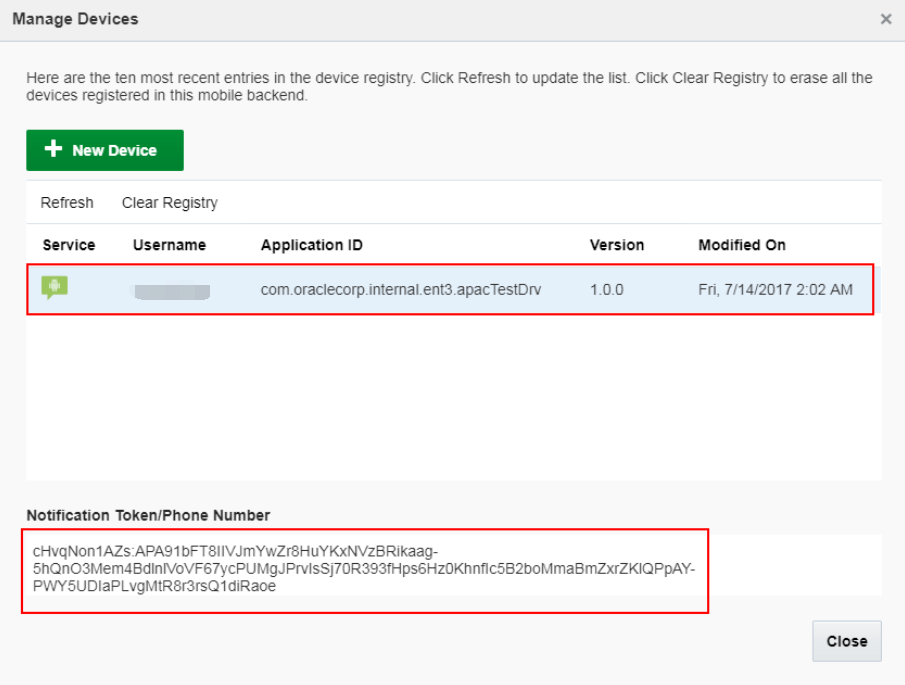

4. Before sending the notification, make sure your "Cafe Supremo" mobile app is running in the **Background** on your Android device.

5. Enter a notification `You can use your points to buy products! – 10001` with send option `Now` and click on “Send”. Note you will be getting errors if no devices registered yet.

   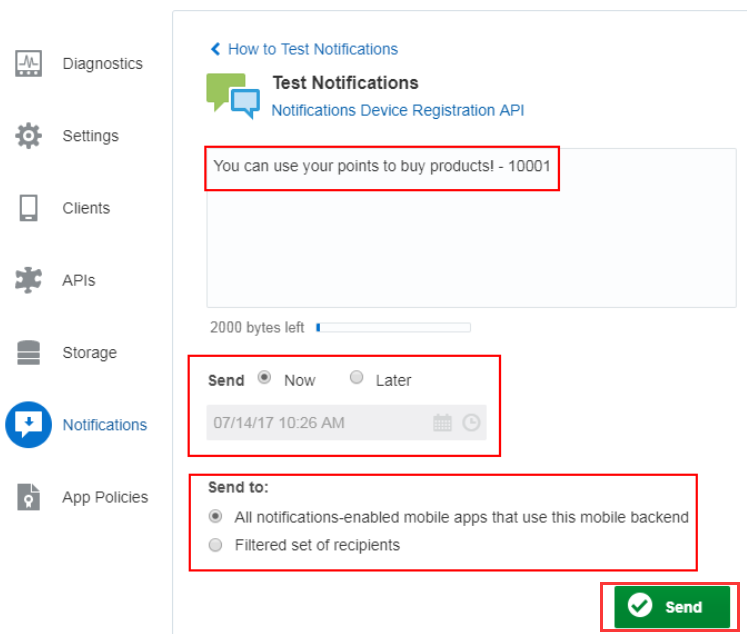

6. If you have at least one device registered, you shall see a success message pop up on top of the page and the notification shall appear in the notification area of your device.

   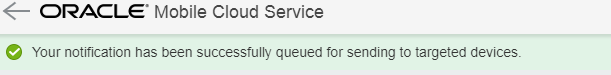

   

[Procced to Next - 404: Track customer behaviors (Optional)](404-MobileLab.md)

or

[Back to Mobile Service and Application Home](README.md)
