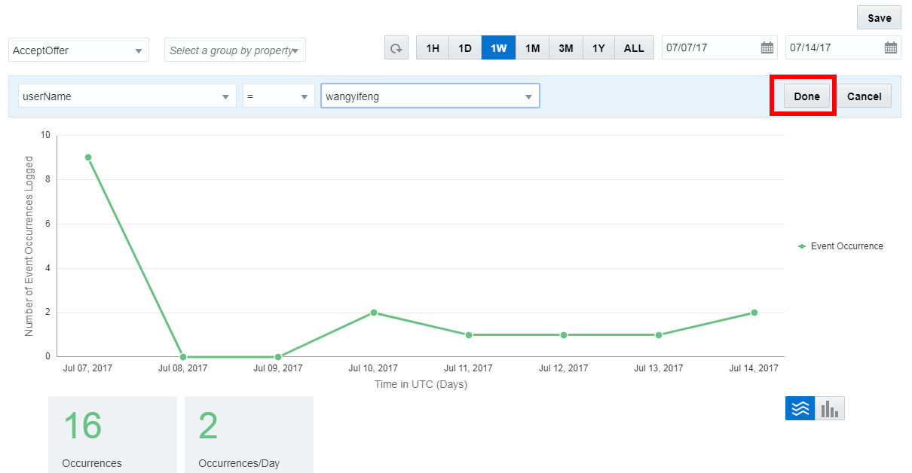
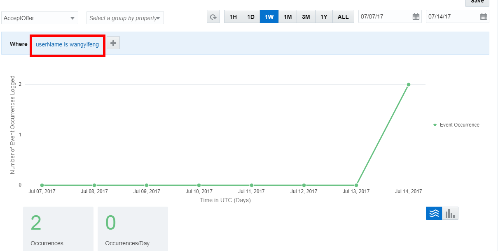
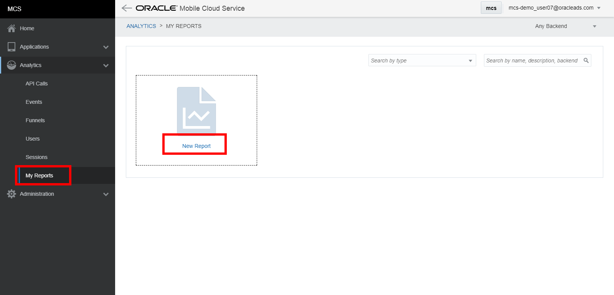

# ORACLE Cloud Test Drive #
-----
## 404: Track customer behaviors [Optional] ##

### Introduction ###


Oracle Mobile Cloud Service (MCS) provides an Analytics API to help you measure patterns in application performance and usage. As a business development manager or mobile program manager, you can use analytics to find out how to improve your applications.

MCS creates analytics reports from events, which describe how users interact with the mobile application. A mobile application developer can track the mobile app’s entire usage by raising events in the mobile application code. In this lab, we will see how to track events like "AcceptOffer" and "RejectOffer". Mobile backends receive events from the REST calls made from mobile applications. A mobile application makes a single call, which includes a JSON payload that describes the events along with such contextual information like a user’s location, the start and end of a user session, and details about the user’s mobile device. You can craft the payload yourself if you use straight REST calls, or use the mobile client SDK to construct one for you.


### About the Exercise Today ###
In this exercise, we will:
- See the snippet of mobile application's source code to raise events
- See how to check raised events in MCS (Mobile Cloud Service)

### Prerequisites ###
- Loyalty management MBE created in the previous lab.
- Cafe Supremo Mobile Application installation on your Android device

----

#### How to raise events from mobile applications ####
In this lab, you will not code for mobile application to create events. However, we'd like to give some ideas of how you can develop mobile application to create custom events. Oracle provides Event APIs as part of client SDK to create events upon offer accept/reject to raise events. The name of events could be any string you like, and you can add your custom attributes into the “properties” field which will be visible in the report creation wizard in MCS. Please refer to the below snippet of mobile client code to get an idea of how you can raise events from mobile applications.

    ```
    service.post('/mobile/custom/LoyaltyMgmt0X/offer/:id/accept', function (req, res) {
        var events = [];
        events.push({
            name: 'context',
            type: 'system',
            timestamp: timestamp()
        });
        events.push({
            name: 'AcceptOffer',
            type: 'custom',
            component: 'Offers',
            timestamp: timestamp(),
            properties: {
                userName: "jimSmith",
                  offerId: "10001"
            }
        });
        req.oracleMobile.analytics.postEvent(events)
    });

    service.post('/mobile/custom/LoyaltyMgmt0X/offer/:id/reject', function (req, res) {
        var events = [];
        events.push({
            name: 'context',
            type: 'system',
            timestamp: timestamp()
        });
        events.push({
            name: 'RejectOffer',
            type: 'custom',
            component: 'Offers',
            timestamp: timestamp(),
            properties: {
                userName: "jimSmith",
                  offerId: "10001"
            }
        });
        req.oracleMobile.analytics.postEvent(events).then(function () {
            var rejectReq = {
                "offerid": req.params.id,
                "productid": req.body.productid,
                "accepted": false
            };
            processoffer(rejectReq, req, res);
        });
    });

    ```

---
#### How to check raised events in MCS ####
While MCS displays data gathered from all of the mobile backends by default, you can use the mobile and environment menus to isolate the activity for a particular mobile backend within a specific environment. MCS shows reports for all versions of a selected mobile backend, or API. Let's see how you can check raised events from mobile applications.

1. Navigate through “Analytics” -> “Events”, click on the “Select an event” dropdown list. When the Events are created via Events API as in previous step, you will see the events in the list. Select “AcceptOffer”.


2. Now, you can see the reports for API Calls Count let you view the traffic for one, or many, APIs for a selected period of time. The report includes both successful and failed calls.


3. You can also see the report for the select API ("AcceptOffer") by using filters like custom properties you defined in mobile applications as below:
    - Click "+" button to select a filter for your report.
    

    - Select the "userName".
    

    - Choose the mobile user name for your report.
    

    - Click the "Done".
    

    - Now you can see the "AcceptOffer" event raised by the user you selected.
    

4. Create reports based on Events and filter: You can keep an eye on the usage and health of your mobile applications on an ongoing basis by creating a suite of custom reports that you can run whenever you want. MCS enables you to create these reports by saving any filter definitions that you apply to the event, user, session, platform, and funnel reports. Click "My Reports" to see the reports you created.



Congratulation! You have finished this lab section.

[Back to Mobile Service and Application Home](README.md)
