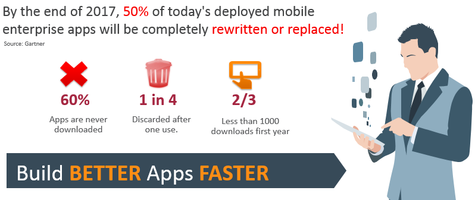

# ORACLE Cloud Test Drive #

## Introduction ##
We have huge reliance on mobile services for our daily life. Due to this trend, enterprises are eager to build more and more mobile applications for better customer experiences, operational excellences and higher business values in their businesses. Therefore, we can say that Mobile is the key of Digital Transofmration. And mobile application development in businesses is much more of a reality – Let's see what are the challenges of mobile application development in terms of business and technical view.

### Business Challenges in Mobile ###
There are some of major business challenges in mobile development. As you can see in the below picture, Gartner predicts half the apps deployed today will be replaced or rewritten by next year. Overall, more than half are never downloaded. And even if downloaded, 25% are deleted after one use! It’s not easy to have successful mobile applications. Which is why we need to build better apps faster in order to keep pace with mobile demands.

Source: Gartner Presentation, The Current and Future State of mobility, Van L. Baker, Jason Wong, August 2015

### Technical Challegnes in Mobile ###
As well as Business Challenges, enterprises have some of difficulties in developing mobile applications. To develop mobile applications, we need to have the expertise in:
+ Developing to and supporting multiple platforms (Android, iOS, Windows, etc.)
+ Prepare environments for dev, test and production
+ How to monitor an analyze mobile services
+ Security and identity protocols and policies to different backends
+ Integration with a variety of backends
+ What tools do you use to build them?

## Oracle Mobile Solution Strategy ##
To overcome the above challenges, Oracle encourages developers to use any of the popular tools available – whether it’s native development with iOS and Android, to 3rd party and open frameworks like Ionic, Angular, Sencha, and Xamarin. We call it "Mobile Client Agnostic". We also incorporate mobile services that offer data sync, storage, location services, messaging. Access to local services, like camera, contacts, GPS, etc. There’s also a trend towards low code, no code development -  Oracle also supports this trendy tool called MAX (Mobile Application Accelerator) as part of MCS.

In summary, Oracle provides end to end solution to give you overcoming notable business and technical challenges.

### Oracle Mobile Services ###
Here you can see which mobile services are ready for you through just accessing Oracle MCS (Mobile Cloud Service) as below:
+ Out of the box mobile services (Platform APIs): We are providing prebuilt, tested and optimized mobile services like analytics, push notification, offline data synchronization, location, object storage, database, app ploicies, API management, integration management, security and user management, and more features like intelligent bot coming. 
+ In addition to the Platform APIs, you can develop custom APIs and code to extend your mobile services. (e.g. SNS integration, Google Map integration, external system integration, etc.) In other words, mobile applicatons can call custom APIs as wells as platform APIs to interact various data sources.
+ For client IDE for mobile applications, we can support any IDE as well as Oracle MAX (Low code development), JET (JavaScript-based Hybrid App Dev.) and MAF (Java-based Hybrid App Dev.)

If you want to know about more details on the above mobile services, please refer to [the following link](https://docs.oracle.com/en/cloud/paas/mobile-cloud/index.html).

### About the Exercise Today ###
The hard part of mobile development is integration and managing all server-side services. In this exercise, you will see how easily you can enable/develop mobile services like push notification, API creation and integrations with exteranl services to implement a mobile application called "Cafe Supremo" for loyalty managment using Oracle MCS (Mobile Cloud Service). 

For the mobile application for loyalty management, you can make it all work and play nicely together using platform APIs (out of box mobile services) and custom APIs for external integraitons by doing the below jobs through this lab.
- Provide a server-side container for groupings of APIs and other resources that you create to support a specific set of applications by just creating a MBE (Mobile Back End).
- Set up Push Notification to send offer information to the user of the Cafe Supremo mobile application and test Push Notification. In the lab, we are going to support Android to shorten the lab time even though Oracle MCS can support iOS and Windows, too. 
-Create connectors for customer APIs to integrate external services like QR code creaton and offer information query provided by ACCS as microservices.
- Create custom REST APIs and code to build up a library of services for Cafe Supremo mobile application, java application to get offer request, microservices to get QR code, etc. 
- Track customer behaviors like "Offer Accept by users" using custom analytics report.

### Prerequisites ###
- Bring your Android phone.
- Need to install an mobile application called "Cafe Supremo" on you Android phone. The mobile application will be supplied by your instructor. 

# Lab Exercise: #
Let's explore the Mobile Service and Application Lab. Please click the below link to start your lab.

## 400: Create MBE (Mobile Back End) for mobile applications ##

[Click Here.](400-MobileLab.md)

## 401: Set up Push Notification and Test Push Notification to mobile app ##

[Click Here.](401-MobileLab.md)

## 402: Create a connector for external services ##

[Click Here.](402-MobileLab.md)

## 403: Develop Custom APIs and Custom Code to extend mobile services ##

[Click Here.](403-MobileLab.md)

## 404: Track customer behaviors ##

[Click Here.](404-MobileLab.md)

or

[Back to Cloud Test Drive Home](../README.md)

