# ORACLE Cloud Test Drive #
-----
## 402: Create Connectors for external services ##

### Introduction ###

Connectors allow you to declaratively create APIs that simplify access to and standardize use of backend systems (such as enterprise middleware) and web services. Connector types are available for REST web services, SOAP web services, the Oracle Integration Cloud Service (ICS), and Oracle Cloud applications based on Fusion Applications (FA). For this lab, we are going to use the connectors for the REST web services to integrate ACCS and ICS.

Once you create a connector API to access the service, you can use it in custom APIs (e.g. Loyalty Management API), which you can then call from your mobile applications using standard REST calls.

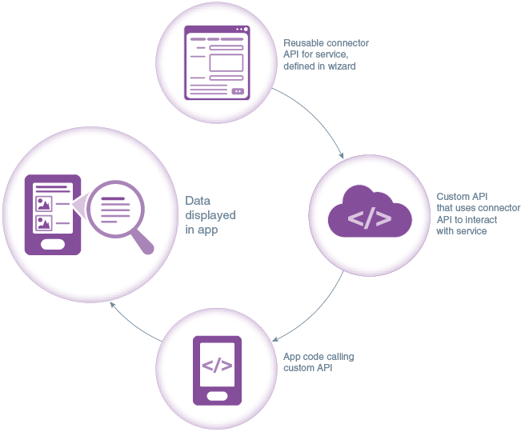

### About the Exercise Today ###
There are 3 Connector APIs for offer information query, QR code creation and offer result (e.g. reject or accept) update from external systems like ACCS (Application Container Cloud Service) and ICS (Integration Cloud Service) that we need to access in this lab.

To create the above 3 Connector APIs, we will:
- Create "Product Management" API Connector to get offer information using an ACCS microservice
- Create "QR Code" API Connector to generate QR codes using an ACCS microservice
- Create "Process Offer" API Connector to update offer result using an ICS microservice

### Prerequisites ###
- Loyalty management MBE created in the previous lab.

#### Create "Product Management" API Connector to get offer information ####
In this lab, we will create a connector API to integrate ACCS microservice for offer information. **[Note]** A connector API is for the custom APIs. It means a connector API doesn't have direct interactions with mobile applications. Mobile applications only interact with custom APIs and custom APIs will use the connector API to interact external services and systems.

1. On the navigation pane, select “Applications” -> “Connectors”. Click on the “+ New Connector” green button and select “REST” from the dropdown list.

2. 2. Enter `Test Drive ACCS PtMgt Connector API 0X`(0X is the sequence number assigned to you by instructor. - e.g.: 01) as the name and short description for this connector. The API name will be automatically generated for you while you type in the Display API Name. Note that the “API Name” will be used in custom API implementation coding thus is must meet JavaScript variable naming standards. Click on “Create” on the bottom right when you are done.
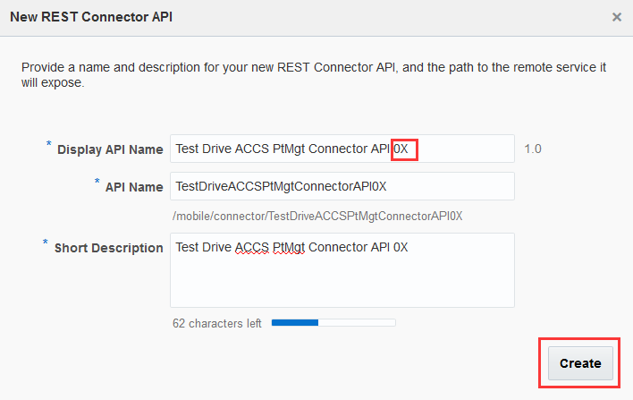

3. Review the name/description on the general screen and click on the “Next Step” button (“>” on the top right) to move to the next screen.

4. Enter the URL (e.g.: `https://offer-<YOUR_ACCS_DOMAIN_NAME>.apaas.em3.oraclecloud.com`. This is the endpoint CREATED by you in the Microservice Lab.) to the REST API into the “Remote URL” textbox. Click on “Next Step”.

5. We won’t set any rules here, so just click on “Next Step”.

6. MCS supports a wide range of security policies for you to use. For the lab, to make it simple, no security policy setting is required. Just click on “Next Step”.
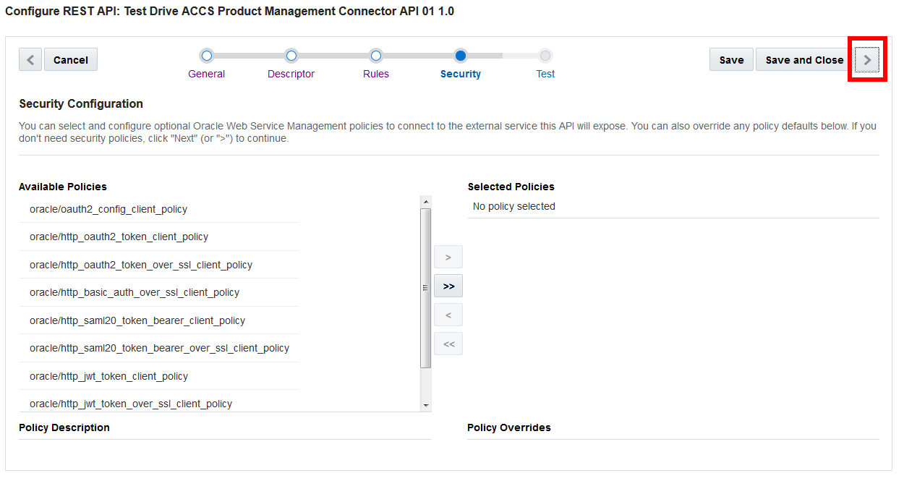

7. Click on “Save” when prompt for confirmation.

8. Now your connector is ready and you can test it. Select `GET` as the HTTP method, enter `/ptmgt/v1/offers/10001` into the “Local resource name” following the “Local URI”.

9. Select your MBE(e.g.: LoyaltyMgmt_MBE01) you created from the dropdown list in the “Authentication” section and you will find the actual url that is getting called at the end in the “Remote URL” field. Click on “Test Endpoint”.

10. You shall see an HTTP 200 OK response at the bottom of the page and it is all set.
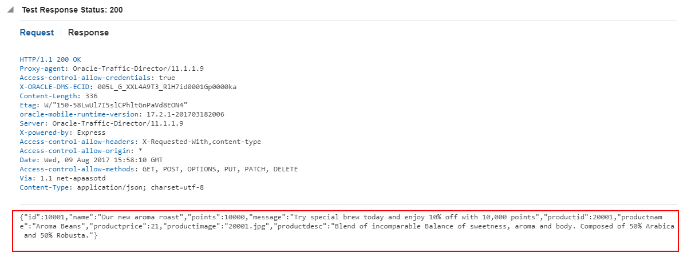

---
#### Create "QR Code" API Connector to generate QR codes ####
In this lab, we will create a connector API to integrate ACCS microservice for QR code generation. The whole process is almost same to the above.

1. On the navigation pane, select “Applications” -> “Connectors”. Click on the “+ New Connector” green button and select “REST” from the dropdown list.

2. Enter `Test Drive ACCS CtdQR ConnectorAPI 0X`(0X is the sequence number assigned to you by instructor. - e.g.: 01) as a name for this connector. The API name will be automatically generated for you while you type in the Display API Name. Note that the “API Name” will be used in custom API implementation coding thus is must meet JavaScript variable naming standards. Click on “Create” on the bottom right when you are done.

3. Review the name/description on the general screen and click on the “Next Step” button (“>” on the top right) to move to the next screen.

4. Enter the URL (e.g: `https://qrcodegenerator-<YOUR_ACCS_DOMAIN_NAME>.apaas.em3.oraclecloud.com`. This is the endpoint CREATED by you in the Microservice Lab.) to the REST API into the “Remote URL” textbox. Click on “Next Step”.

5. We won’t set any rules here, so just click on “Next Step”.

6. MCS supports a wide range of security policies for you to use. For the lab, to make it simple, no security policy setting is required. Just click on “Next Step”.
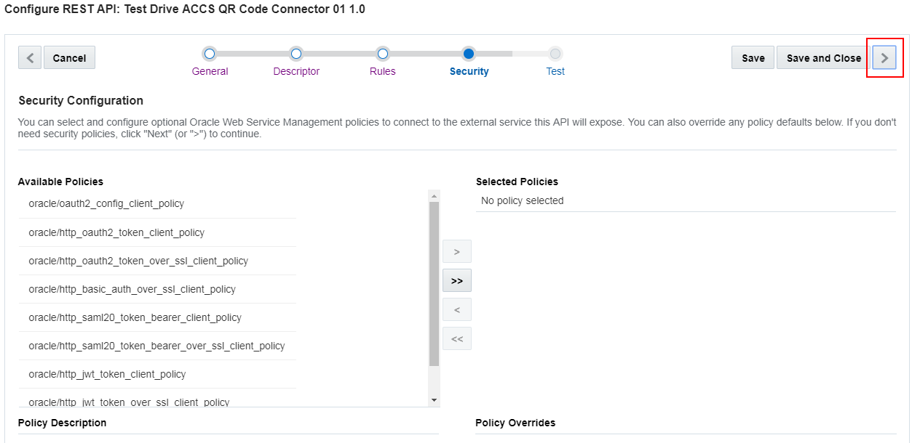

7. Click on “Save” when prompt for confirmation.

8. Now your connector is ready and you can test it. Select `GET` as the HTTP method, enter `/ctdqr/v1/offer/10001` into the “Local resource name” following the “Local URI”.
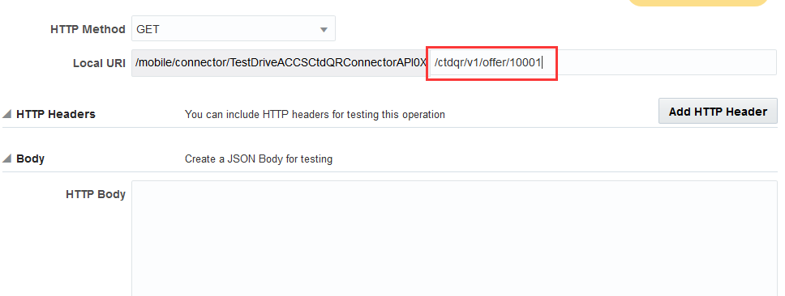

9. Select your MBE(e.g.: `LoyaltyMgmt_MBE01`) you created from the dropdown list in the “Authentication” section and you will find the actual url that is getting called at the end in the “Remote URL” field. Click on “Test Endpoint”.
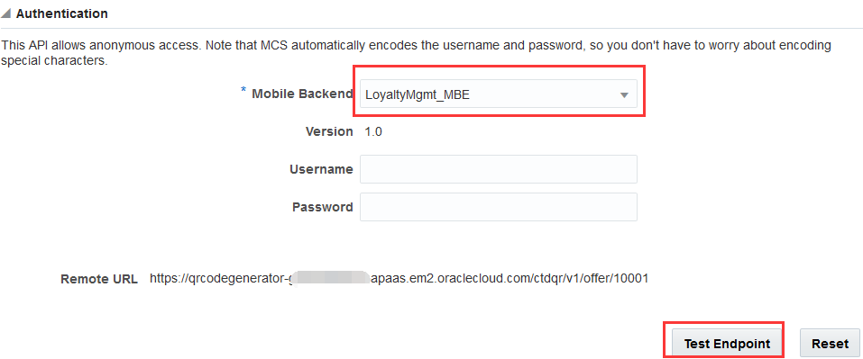

10. You shall see an HTTP 200 OK response at the bottom of the page and it is all set.
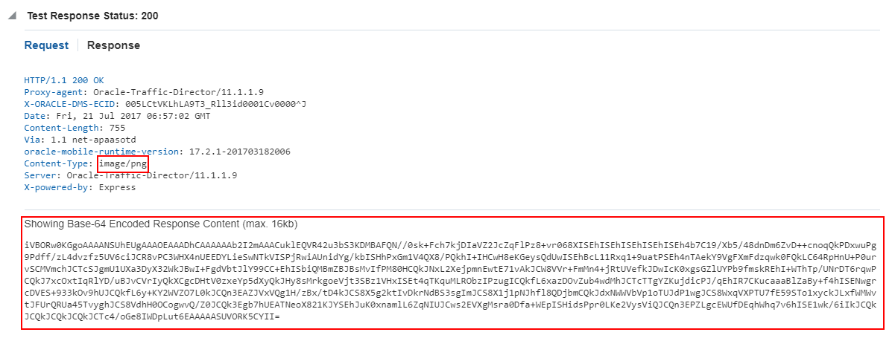

----
#### Create "Process Offer" Connector API to update offer result ####
In this lab, we will create a connector API to integrate ICS microservice for updating offer result. The whole process is almost same to the above.

1. On the navigation pane, select “Applications” -> “Connectors”. Click on the “+ New Connector” green button and select “REST” from the dropdown list.

2. Enter `Test Drive ICS Connector API 0X`(0X is the sequence number assigned to you by instructor. - e.g.: 01) as a name for this connector. The API name will be automatically generated for you while you type in the Display API Name. Note that the “API Name” will be used in custom API implementation coding thus is must meet JavaScript variable naming standards. Click on “Create” on the bottom right when you are done.

3. Review the name/description on the general screen and click on the “Next Step” button (“>” on the top right) to move to the next screen.

4. Enter the URL (e.g: `https://integration-<YOUR_ICS_DOMAIN_NAME>.integration.us2.oraclecloud.com/integration/flowapi/rest/<YOUR_INTEGRATION_NAME>/v01/processoffer`. This is the endpoint CREATED by you in the Integrations Lab.) to the REST API into the “Remote URL” textbox. Click on “Next Step”.
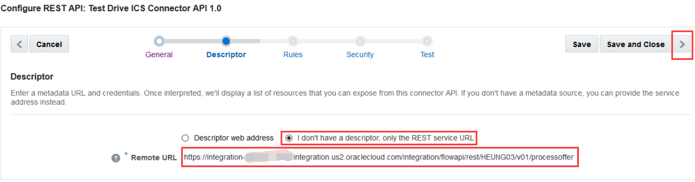

5. We won’t set any rules here, so just click on “Next Step”.
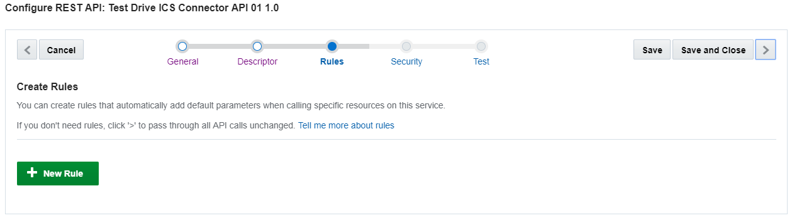

6. MCS supports a wide range of security policies for you to use. For the lab, we will use http basic authentication for security policy setting. Select “oracle/http_basic_auth_over_ssl_client_policy” from “Available Policies” on the left and use the “>” button in the middle to move it to “Selected Policies” on the right.
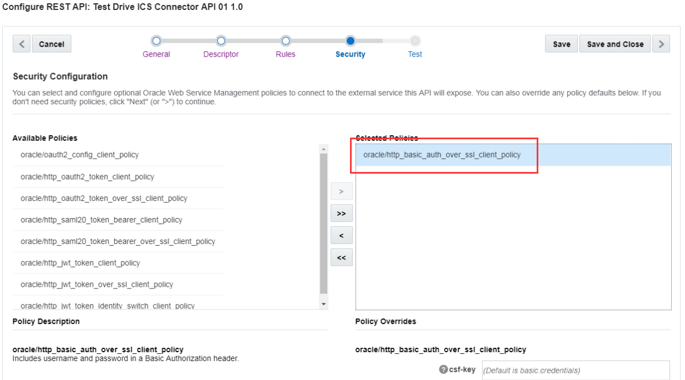

7. Open CSF-Key dialog for security policy setting: MCS uses the Credential Store Framework (CSF) to manage credentials in a secure form. CSF lets you store, retrieve, update, and delete credentials for a web service and other apps. CSF keys are credentials that certify the authority of users and system components that are used during authentication and authorization. A CSF key uses basic authentication (user name and password) to generate a unique key value.

8. Add CSF-Key: On the popup, click on “Add” and create your own csf-key, enter unique value (e.g.: `ICS_GSE 0X`, 0X is the sequence number assigned to you by instructor. - e.g.: 01) as the "Key Name". Enter "User Name" and "Password". (Thery are provided in the Access Document or by the instructor), and click “Save”. 

9. Select CSF-Key you created: Then click “Select” and it will bring you back to the main screen. 

10. Your newly created csf-key will appear in the csf-key textbox. Click on “Next Step” to move to the next.
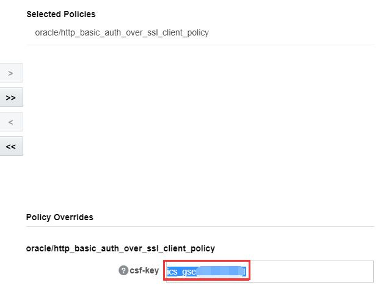

11. Click on “Save” when prompt for confirmation.

12. Now your connector is ready and you can test it. Select `POST` as the HTTP method, enter `{"customerid": 66890169,  "offerid": 10001,  "productid": 20001,  "accepted": false}` into the "HTTP Body". Select your mobile backend (e.g.: `LoyaltyMgmt_MBE01`) you created from the dropdown list in the “Authentication” section, and click on “Test Endpoint”.
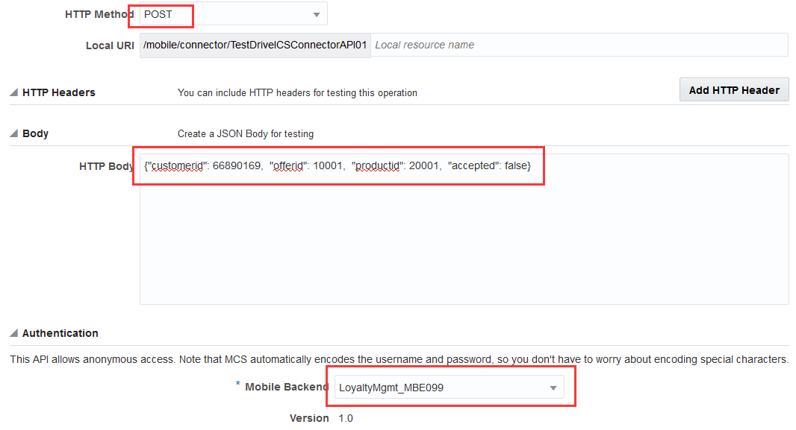

13. You shall see an HTTP 200 OK response at the bottom of the page and it is all set.

You have finished this lab successfully.

[Procced to Next - 403: Develop Custom APIs and Custom Code to extend mobile services](403-MobileLab.md)

or

[Back to Mobile Service and Application Home](README.md)
