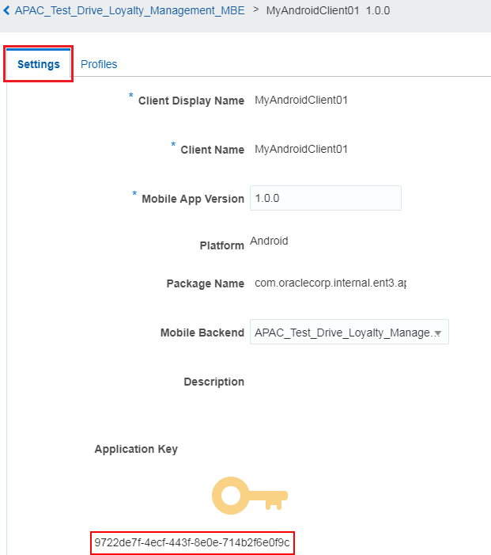
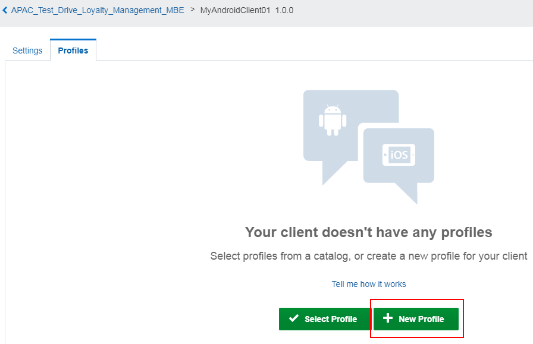
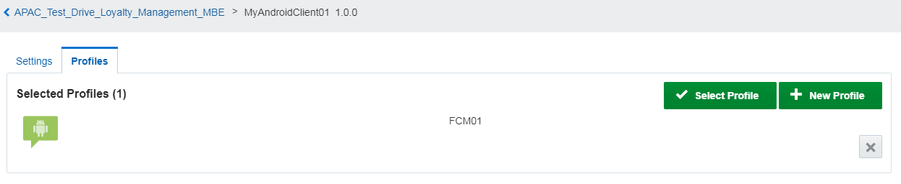
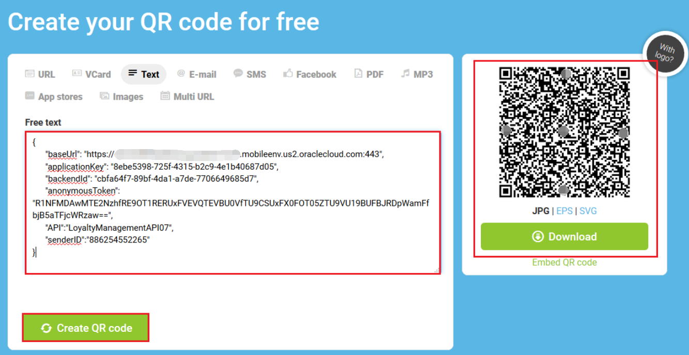
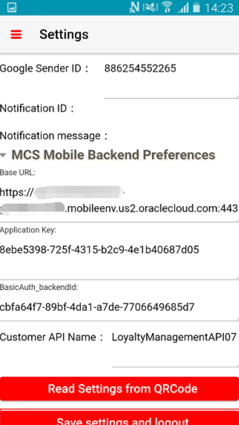
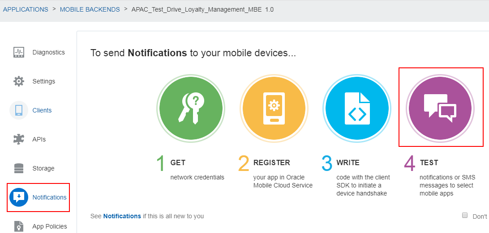
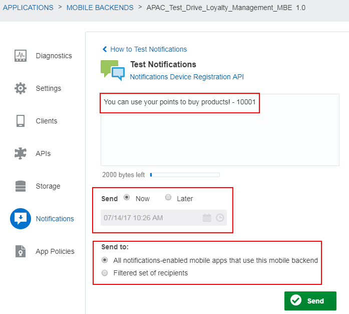

# ORACLE Cloud Test Drive #
-----
## 404: Set up Push Notification and Test Push Notification to mobile app ##

### Introduction ###
You can use the Notifications service (part of MCS platform APIs) to send notifications to users of the apps registered in a mobile backend. Once you have the mobile backend set up for notifications, the process of sending the notifications is the same for both iOS, Android, and Windows apps. You set up notifications by obtaining the appropriate vendor certificates and registering them with the app's mobile backend. In addition, you include some code in the app itself to enable it to receive notifications. The notifications themselves can be sent via a third-party server or be triggered by logic in a custom API.


### About the Exercise Today ###
In this exercise, we will:
- Create a notifications profile and register the Cafe Supremo app
- Prepare the Cafe Supremo application to receive notifications
- Test Notification

### Prerequisites ###
- Cafe Supremo application binary (Will be provided by instructor)
- Android device to install Cafe Supremo application

----
#### Create a notifications profile and register the Cafe Supremo app ####
In this lab, you will create a notifications profile and register the client application (Cafe Supremo mobile application) to associate google credentials.

1. Create a client (Register the app in MCS as a client) to receive notifications.
    - Navigate through “Applications” -> “Mobile Backends”, select your mobile backend, and click on “Open” to open your MBE.


   - Switch to “Clients” tab and click on “New Client”.


   - Enter `MyAndroidClient0X` (change `0X` to your assigned postfix by instructor, e.g: 01) as the "Client Display Name", `1.0.0` as the "App Version", and `com.oraclecorp.internal.ent3.apacTestDrv` as the "Package Name". Click on “Create”. This will bring you to the client settings screen.


2. On the "Settings" screen, **Copy the values of "Application Key" and replace the value of properties called "applicationKey" in the "Mobile_App_Settings_Sample.json" file from Lab 401 with the copied value.**  Save the JSON file for later use.

```
{
      "baseUrl": "https://mcs-<YOUR_MCS_DOMAIN_NAME>.mobileenv.us2.oraclecloud.com:443",
      "applicationKey": "9722de7f-4ecf-443f-8e0e-714b2f6e0f9c",
            --> Replce the value inside double quotes with the value of "Application Key" in you JSON file.
      "backendId": "4a9d0d32-8aad-48fb-b803-5315459dce9f",
      "anonymousToken": "R1NFMDAwMTE2NzhfTUNTX01PQklMRV9BTk9OWU1PVVNfQVBQSUQ6Smk3cXBld3lrczlfbmI=",
      "API":"LoyaltyManagementAPI01",
      "senderID":"925757644219"
}

```




3. Create a profile to store google credentials like API Key and Sender ID.

   - Select the "Profiles" tab and click on "New Profile" to create a profile.




   - Enter `FCM0X` (change `0X` to your assigned postfix by instructor, e.g: 01) as the "Name. Paste `AAAA14t0nbs:APA91bHtR-V_lZEcMgaEFIJd_UrybuBjNyPG4N0ZoA33UqbZ9CywL_e2FnIfoS9lvPV5gut3Mm_ZMoex7PE1-YL-7ACaP3CnrDYpl8Qq3_jfsO3HMJYS-Mzr_X-xWpgdqWswVHsSUgDX` as the "API Key" and `925757644219` as the Sender ID. (We generated them for Cafe Supremo mobile application from Google.), and click on “Create”.


   - Click on “Select Profile”.



   - Now your client is ready. Navigate to "Applications" -> "Mobile Backends" and select your MBE. On the client setting screen, you can see your mobile client with Notifications Enabled.


---
#### Prepare the Cafe Supremo application to receive notifications ####

1. Before running notification test, you were told to prepare a file called **Mobile_App_Settings_Sample.json** like below format:    
```
{
      "baseUrl": "https://mcs-<YOUR_MCS_DOMAIN_NAME>.mobileenv.us2.oraclecloud.com:443",
      "applicationKey": "9722de7f-4ecf-443f-8e0e-714b2f6e0f9c",
      "backendId": "4a9d0d32-8aad-48fb-b803-5315459dce9f",
      "anonymousToken": "R1NFMDAwMTE2NzhfTUNTX01PQklMRV9BTk9OWU1PVVNfQVBQSUQ6Smk3cXBld3lrczlfbmI=",
      "API":"LoyaltyManagementAPI0X",
      "senderID":"925757644219"
}
```
We will use it shortly.

2. From your web browser, go to `http://www.qr-code-generator.com/`, click on `Text` button and the **Free text** text area is shown.


3. Copy **your own** JSON file content from step 2 above, paste it into the **Free text** text area, then click `Create QR code` button. A QR code image will be generated on the right hand side of window.




You can keep this browser open, or save the image for later use.

4. From your mobile device, open the app 'Cafe Supremo'.


5. Once app started and login page shown, click on the hamburger menu on top left corner.


6. On expanded menu, click `Settings`


7. On Settings page opened, click `Read Settings from QRCode` button at middle.


8. When the QR scanner running, face your mobile device towards the QR code image (from step 4).  
You may need to adjust the distance between your mobile device and your screen until the scanner camera can recognize the QR image.


9. On successful QR scanning, all property settings in your JSON file will be automatically filled into the mobile app Setting page like below. (You may need to expand `MCS Mobile Backend Preferences`)



Click `Save settings and logout` button. You will then be returned to home screen.

10. Enter the mobile app **Username** and **Password** provided by instructor, then click `Login` button.


11. Upon successful login, the welcome page is shown. Your mobile device is now ready to receive push notification of campaign offer.


---
#### Test Notification ####
1. Switch to “Notifications” tab and click on the icon below “4 TEST”.




2. Click on "Manage Devices".


3. You shall see devices that has been registered to this mobile backend. Click on “Close” and go back to the “Test” screen.


4. Enter a notification `You can use your points to buy products! – 10001` with send option `Now` and click on “Send”. Note you will be getting errors if no devices registered yet.




5. If you have one device registered, you shall see a success message pop up on top of the page and the notification shall appear in the notification area of your device.


[Procced to Next - 405: Track customer behaviors](405-MobileLab.md)

or

[Back to Mobile Service and Application Home](README.md)
