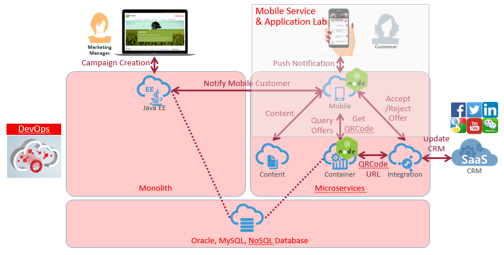
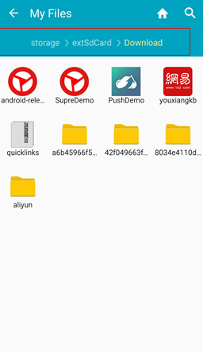

# ORACLE Cloud Test Drive #

## Introduction ##
We have huge reliance on mobile services for our daily life. Due to this trend, enterprises are eager to build more and more mobile applications for better customer experiences, operational excellences and higher business values in their businesses. Therefore, we can say that Mobile is the key of Digital Transformation. And mobile application development in businesses is much more of a reality – Let's see what challenges of mobile application development in terms of business and technical view are.

### Technical Challenges in Mobile ###
As well as Business Challenges, enterprises have some of difficulties in developing mobile applications. To develop mobile applications, we need to have the expertise in:
+ Developing to and supporting multiple platforms (Android, iOS, Windows, etc.)
+ Prepare environments for dev, test and production
+ How to monitor and analyze mobile services
+ Security and identity protocols and policies to different backends
+ Integration with a variety of backends
+ What tools do you use to build them?

## Oracle Mobile Solution Strategy ##
To overcome the above challenges, Oracle encourages developers to use any of the popular tools available – whether it’s native development with iOS and Android, to 3rd party and open frameworks like Ionic, Angular, Sencha, and Xamarin. We call it "Mobile Client Agnostic". Oracle also incorporate mobile services that offer data sync, storage, location services, messaging, access to local services like camera, contacts, GPS, etc. There’s a trend towards low code, no code development - Oracle supports this trendy tool called MAX (Mobile Application Accelerator) as part of Mobile Cloud Service (MCS).

In summary, Oracle provides end to end solution to give you overcoming notable business and technical challenges.

### Oracle Mobile Services ###
Here you can see which mobile services are ready for you through just accessing Oracle MCS (Mobile Cloud Service) as below:
+ Out of the box mobile services (Platform APIs): We are providing prebuilt, tested and optimized mobile services like analytics, push notification, offline data synchronization, location, object storage, database, app polices, API management, integration management, security and user management, and more features like intelligent bot are coming.
+ In addition to the Platform APIs, you can develop custom APIs and code to extend your mobile services. (e.g.: SNS integration, Google Map integration, external system integration, etc.) In other words, mobile applications can call custom APIs as wells as platform APIs to interact various data sources.
+ For client IDEs to develop mobile applications, we can support any IDE as well as mobile frameworks like Oracle MAX (Low code development), JET (JavaScript-based Hybrid App Dev.) and MAF (Java-based Hybrid App Dev.)

If you want to know about more details on the above mobile services, please refer to [the following link](https://docs.oracle.com/en/cloud/paas/mobile-cloud/index.html).

### About the Exercise Today ###
The hard part of mobile development is integration and managing all server-side services. In this exercise, you will see how easily you can enable/develop mobile services like push notification, API creation and integrations with external services to implement a mobile application called "Cafe Supremo" for loyalty management using Oracle MCS (Mobile Cloud Service).

For the loyalty management mobile application, you can make it all work and play nicely together using platform APIs (out of box mobile services) and custom APIs for external integrations by doing the below jobs through this lab.
- Provide a server-side container for groupings of APIs and other resources that you create to support a specific set of applications by just creating a MBE (Mobile Back End).
- Create connectors for custom APIs to integrate external services like QR code creation and offer information query provided by ACCS as microservices.
- Create custom REST APIs and code to build up a library of services for Cafe Supremo mobile application, java application to get offer request, microservices to get QR code, etc.
- Set up Push Notification to send offer information to the user of the Cafe Supremo mobile application and test Push Notification. In the lab, we are going to support Android to shorten the lab time even though Oracle MCS can support iOS and Windows, too.
- Track customer behaviors like "Offer Accept by users" using custom analytics report. **[Note]** this section is optional. If time is not available, you can skip this part.

### Prerequisites ###
- Bring your Android phone.
- During this lab, you need to paste some key values you will create into a JSON file. 
Please download a JSON file called "Mobile_App_Settings_Sample.json". It can be downloaded by right clicking on [this link](../../common/assets/mobile/Mobile_App_Settings_Sample.json) and select "Save link as..." for your use in the lab. When you fill out all the information like "baseUrl", "applicationKey", "backendId" and "anonymousToken", you will create a QR code using [a QR code generator](http://www.qr-code-generator.com/). For now, save it to your local PC.
- A mobile application called "Cafe_Supremo.apk" on you Android phone. 

You can download it by right clicking on [this link](../../common/assets/mobile/Cafe_Supremo.apk?raw=true). Select "Save link as..." to download and save it to your local PC. 
If you have an QR code scanner on your phone, you can install the mobile application by scanning the following QRcode from your Android phone.

   

Or, follow below instructions to install the mobile application.

1. Connect your device to your computer and copy an Android APK file called “Cafe_Supremo.apk” to SD card or internal storage of your device.

2. Enable Unknown Sources in your Android device: Go to "Settings" >>" Security ">> Check the box "Unknown sources". (FYI, the menu will be slightly different by Android versions.)

3. Open a file manager on your Android device. 

4. Go to the same location where you put the “Cafe_Supremo.apk” file and Click the file to install. The below image shows Android APK files in case you put them in the folder called “Download”.

5. Press “Install” button.

6. Allow all permissions the “Café Supremo” mobile application requires by clicking “CONFIRM” button. Now you have finished the installation of the mobile application.

---
# Lab Exercise: #
Let's explore the Mobile Service and Application Lab. Please click the below link to start your lab.

## 401: Create MBE (Mobile Back End) for mobile applications ##

[Click Here.](401-MobileLab.md)

## 402: Create a connector for external services ##

[Click Here.](402-MobileLab.md)

## 403: Develop Custom APIs and Custom Code to extend mobile services ##

[Click Here.](403-MobileLab.md)

## 404: Set up Push Notification and Test Push Notification to mobile app ##

[Click Here.](404-MobileLab.md)

## 405: Track customer behaviors [Optional] ##

[Click Here.](405-MobileLab.md)

or

[Back to Cloud Test Drive Home](../../README.md)
