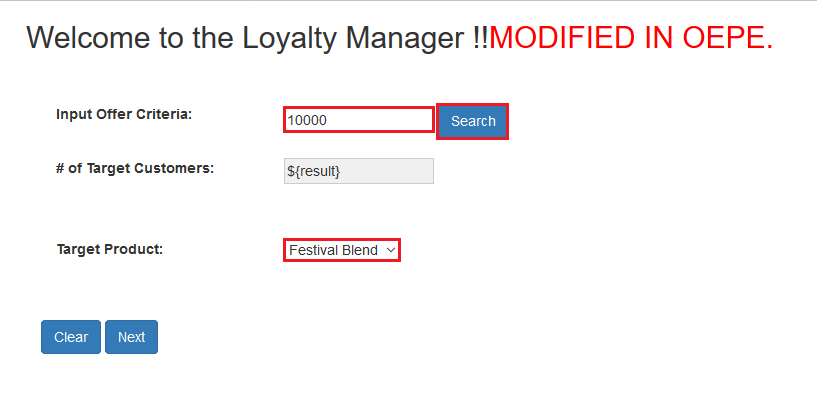
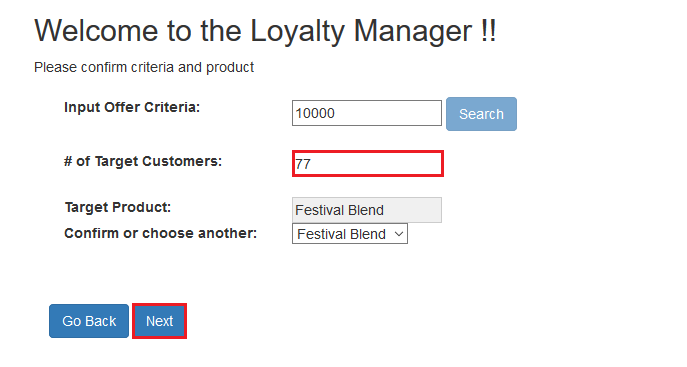
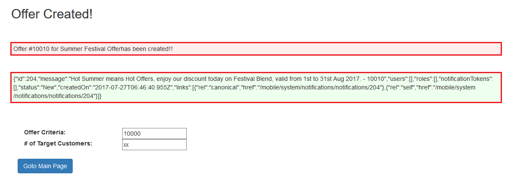
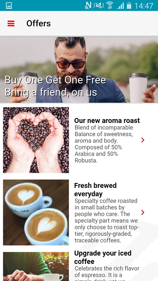
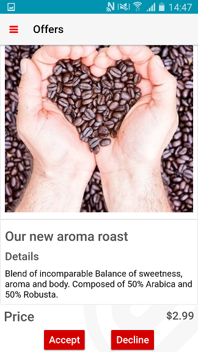
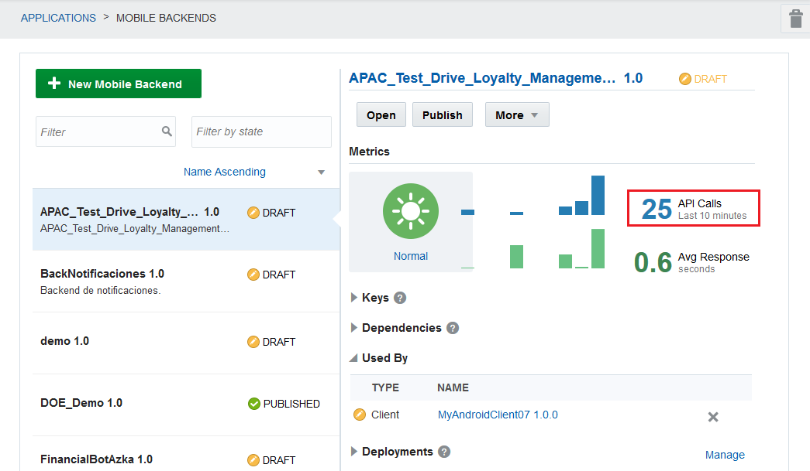
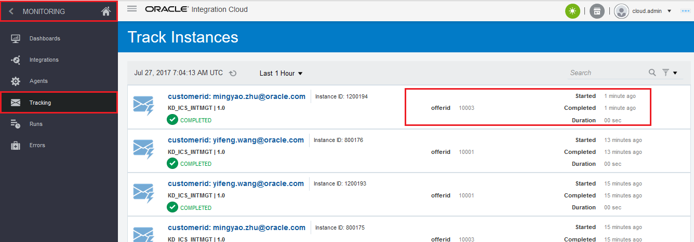
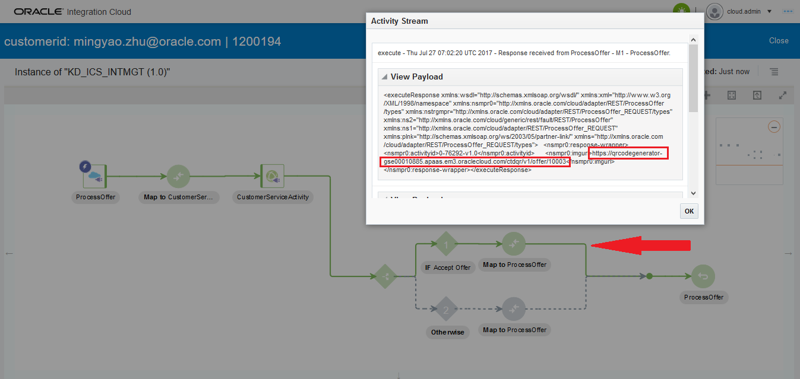

# ORACLE Cloud Test Drive #
-----
## 502: End-to-End Testing ##

### Introduction ###
You can 

### About the Exercise Today ###
In this exercise, we will:
- Test run the loyalty management application and 'Cafe Supremo' mobile app as per roles of marketing manager and end customer respectively
- Identify and monitor message flow across components used in all lab exercises today

### Prerequisites ###
+ Completion of previous lab exercise: [501: Update Source Code for Sending Push Notification from JEE Application to Mobile Cloud Service](501-PuttingAllTogetherLab.md)

----

#### Create An Offer from Loyalty Management Application ####

1. .

#### Respond to Offer from Mobile App ####

Congratulations! You have finished this lab section and all workshop exercises of today.

[Back to Putting All Together Lab Home](README.md)
