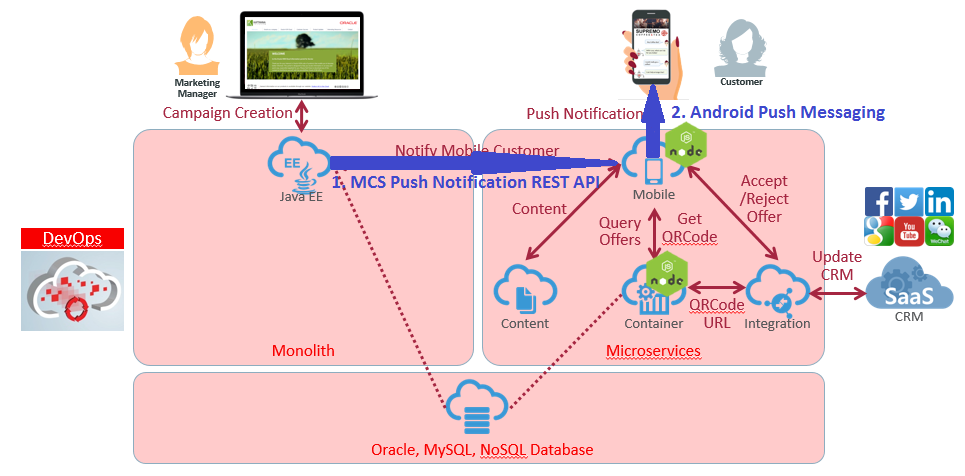
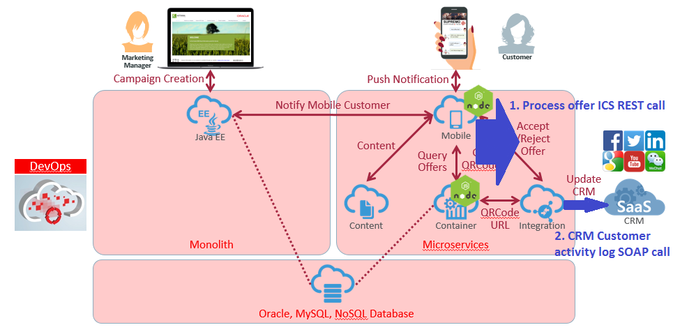
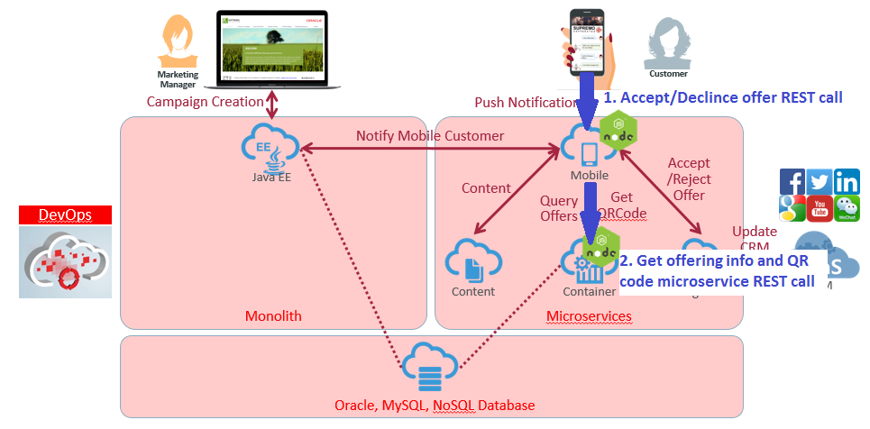

# ORACLE Cloud Test Drive #
-----
## 502: 端到端测试 ##

### 介绍 ###
最后，我们可以通过端到端的测试运行把所有东西放在一起，通过监视来跟踪消息如何跨系统，设备和组件进行传输.

### 关于本次练习 ###
在这个练习中，我们将:
- 根据营销经理和最终客户的角色，测试运行忠诚度管理应用程序和“Cafe Supremo”移动应用程序
- 识别并监控当前所有实验练习中使用的组件的消息流

### 先决条件 ###
+ 完成以前的实验练习: [501：更新从JEE应用程序发送推送通知到移动云服务的源代码](501-PuttingAllTogetherLab.md)

----

#### 忠诚度管理应用程序创建一个优惠 ####

1. 转到忠诚度管理应用程序的主页。 忠诚度管理应用程序的URL应采用以下格式:  
`https://**<JCS WLS instance IP Adress>**/loyalty/jsp/welcome.jsp`  
为“输入优惠标准”提供一个整数值，在本例中输入10000表示任何具有10000点或以上的客户以符合优惠标准。
选择 一个**Target Product**, 在这个例子中选择Festival Blend.  
然后点击搜索按钮。

2. 显示符合要约条件的总客户数量，单击Next按钮.

3. 通过以下示例提供此新优惠的详细信息:  
**Offer Name** : `Summer Festival Offer`  
**Offer Period** : `01-08-2017` To `31-08-2017`  
**Offer Message** : `Hot Summer means Hot Offer. Enjoy our discount today on Festival Blend. Valid from 1st to 31st Aug 2017, terms and conditions apply.`  
然后点击 `Create Offer`按钮.

4. 在成功的报价创建和客户推送通知中，应显示以下结果:  
(用红色突出显示关于创建的报价和蓝色突出显示的通知JSON消息的文本.

**刚刚发生了什么？?**    
在之前的实验中: [501: Update Source Code for Sending Push Notification from JEE Application to Mobile Cloud Service](501-PuttingAllTogetherLab.md), 我们使用开发人员和Java云服务在忠诚度管理JEE应用程序下的confirm.jsp中修改了一些代码，以便应用程序可以调用移动云服务 推送通知REST API，然后通过MCS与Google Firebase交换，向注册的Android设备发送推送通知。

#### 从移动应用程序响应优惠 ####

5. 在几秒钟内，应用程序推送通知应该到达您的Android设备，并提供以前提供的优惠信息.

6. 滑动/点击打开通知消息，“Cafe Supremo”移动应用程序，打开优惠列表。 点击打开现有优惠列表中的最新或任何饮料优惠.

7. 显示有关饮料产品图片，描述和报价的报价详细信息，显示“接受/拒绝”按钮，单击“接受”或“拒绝”按钮以进行操作.

**刚刚发生了什么？**    
在早期的集成实验室中: [3. Rapid Connect Applications by Oracle Integration Cloud Service](../Integrations/README.md), 我们已经建立了一个集成流程，连接了CRM客户活动日志SOAP API，并在Integration Cloud服务上显示为REST API，允许移动用户操作 并处理报价结果。

8. 提供QR码图片和饮料产品说明。 您也可以使用QR扫描仪打开优惠网址。

**刚刚发生了什么?**    
在早期的微服务实验室 [Microservice Lab](../Microservices/README.md), 我们已经部署了2个微服务 - Offer和QR分别利用开发人员和应用程序容器云服务。 在客户接受报价后，结果报价细节和QR图像将显示在移动设备上。

9. 从MCS仪表板转到应用程序 - >移动后端 - >您的忠诚度管理API，您应该能够从移动平均响应时间中找到最近的API调用。 有关MCS监控的更多信息，请参阅 [404: Track customer behaviors](../Mobile%20Service%20and%20App/404-MobileLab.md)

10. 从ICS仪表板转到“监测” - >“跟踪”，您应该能够找到最近提供的响应操作消息跟踪。 有关ICS监控的更多信息，请参阅o [304: Testing the service and Monitoring with ICS Dashboards](../Integrations/304-IntegrationsLab.md)

11.从跟踪实例流程中，可以找到消息流的接受或拒绝的if-then执行路径.  
从“活动流”中，您可以找到已接受或已拒绝的优惠的QR码图片网址。

12. 恭喜！ 你已经完成了这个实验部分和今天的所有实验练习.

[Back to Putting All Together Lab Home](README.md)
