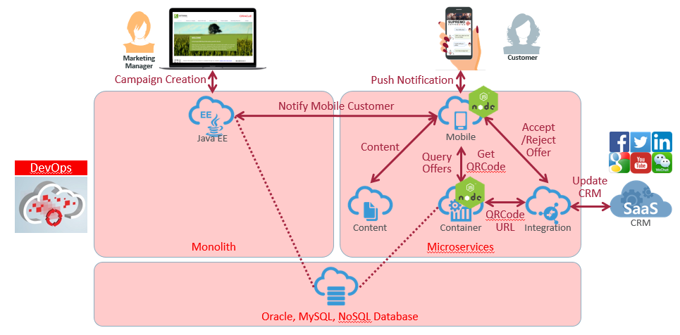

# ORACLE Cloud Test Drive #
-----
## 5. Putting All Together ##

### Introduction ###
This lab is part of the APAC Cloud Test Drive and is the final lab about wire and test all native cloud and mobile components end-to-end.  
This section describes how to interact with mobile via Mobile Cloud Service push notification API and test thru the workshop scenario.

#### About the Exercise Today ####

In this exercise, we will conduct several tasks to complete cloud native and mobile test drive workshop by:
- Complete the Loyalty Management JEE Application
- End-to-end testing on everything built today

**Lab Assumption**
+ Your first role is an 'Application Architect' or 'Developer' who makes further code changes to wire up mobile application.
+ Your second role is a 'Marketing Manager' who creates a new campaign offer based on selected group of customers.
+ Your third role is a 'Customer' who receives mobile app push notification, explore the offer detail and respond to offer from mobile app.

### This tutorial demonstrates how to: ###
- Walkthru another iteration of 'Continuous Integration & Delivery' code change to send push notification from JEE application to Mobile Cloud Service
- Create a new offer from Loyalty Management Application
- Receive offer from mobile device, accept or decline the offer and monitor the result
At the end of this workshop, you will have a basic understanding of how Oracle Cloud helps you to:
- Bring Agile application development with continuous integration and continuous delivery automation
- 'Lift-and-Shift' traditional monolith Java EE application into cloud
- Build cloud native 'polyglot' microservices on cloud
- Extend application development with Platform-as-a-Service (PaaS) such as integration and mobile application services

### Prerequisites ###
- Completion of all previous 4 lab exercises: [Java Apps](../Java%20Apps/README.md), [Microservices](../Microservices/README.md), [Integration](../Integrations/README.md) and [Mobile](Mobile%20Service%20and%20App/README.md)
- Running Virtual Machine image used previously in Java Apps and Microservices labs
- An Android OS Device (mobile phone or tablet) with an active Google Account, or check with instructor if you don't.

# Lab Exercise: #

## 501: Update Source Code for Sending Push Notification from JEE Application to Mobile Cloud Service ##

[Click Here.](501-PuttingAllTogetherLab.md)

## 502: End-to-End Testing ##

[Click Here.](502-PuttingAllTogetherLab.md)

or

[Back to Cloud Test Drive Home](../README.md)
