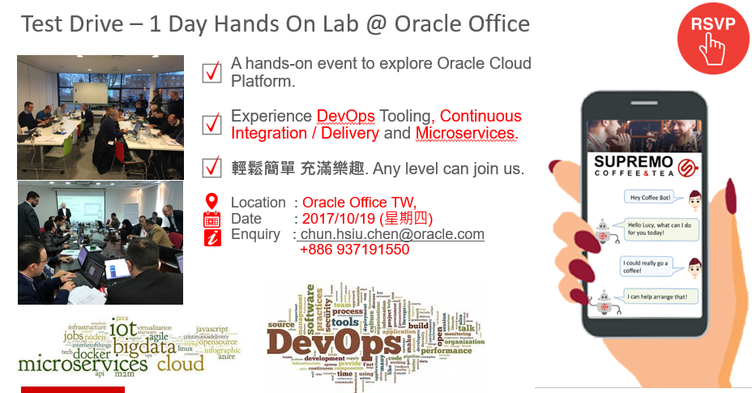

---
# ORACLE Cloud Test Drive #

## Introduction ##

This Oracle Cloud project contains the lab materials for the Oracle Cloud Test Drive events for Cloud Native Apps and Mobile organized in various locations. Participants can experiment through these labs with a series of Oracle Cloud Services like JCS (Java Cloud Service), DevCS (Developer Cloud Service), ACCS (Application Container Cloud Service), ICS (Integration Cloud Service) and MCS (Mobile Cloud Service). Through this Cloud Native and Mobile Test Drive, participants will have chances to know how they can use Oracle Cloud Services to implement Cloud Native Apps, Microservices, Integrations and Mobile Services. For better understanding on how and when companies can use Oracle Cloud Services, we will use a service scenario (a business use case) called "[loyalty management](https://github.com/APACTestDrive/CloudNative_Mobile/blob/master/common/scenario/README.md)".   

More specifically, following topics are currently included in this project:

## Java Apps Lab ##
[Java Apps lab](https://github.com/APACTestDrive/CloudNative_Mobile/tree/master/Java%20Apps) is composed of:
+ Backgrounds on DevOps Tooling - Business Value in DevOps, What is DevCS (Developer CS) for DevOps tooling like CI/CD.
+ Create Oracle Developer Cloud Service (DevCS) Loyalty Management Application Project using Initial GitHub repository.
+ Define Continuous Integration 'Build' and 'Deploy' Configuration in Oracle Developer Cloud Service.
+ Continuous Integration & Delivery (CICD): Using Eclipse IDE, Commit and Push Code Change to Oracle Developer Cloud Service.

## Microservices ##
[Microservices lab](https://github.com/APACTestDrive/CloudNative_Mobile/tree/master/Microservices) shows you how to prepare an environment for Microservices and develop Microservices using Oracle ACCS (Application Container Cloud Services). This lab is composed of: 
+ Backgrounds on Microservices - What is Microservices?, Why you need Microservices?, Examples of Microservices, About ACCS etc.
+ Import Code from external Git Repository for the creation of microservices like offer information query and QR code generation.
+ Build and Deploy project using Developer Cloud Service and Oracle Application Container Cloud Services.

## Integrations ##
[Integrations lab](https://github.com/APACTestDrive/CloudNative_Mobile/tree/master/Integrations) shows you how to connect to backend application and serve frontend mobile consumer request using Oracle Integration Cloud Services (ICS). This lab is composed of: 
+ Backgrounds on Integration - About Oracle Integration Cloud Service (ICS).
+ Configure Connection definition to a Simple Object Access Protocol (SOAP) based Customer Relationship Management (CRM) service and Expose into Representational State Transfer (REST) based service to process offer results.
+ Configure Integration flow to interconnect service endpoints, mapping request and response data attributes and orchestrate decision logic.
+ Monitor integration flow transaction and endpoint status, performance statistics and business identifiers.

## Mobile Service and Application ##
[Mobile Service and Application lab](https://github.com/APACTestDrive/CloudNative_Mobile/tree/master/Mobile%20Service%20and%20App) shows you how to create mobile services for mobile applications and to connect backend services using Oracle Mobile Cloud Service (MCS). This lab is composed of: 
+ Backgrounds on Mobile Service - Challenges and solutions, About Oracle Mobile Cloud Service (MCS) etc.
+ Import a mobile backend package to Oracle Mobile Cloud Service (MCS).
+ Create connectors to integrate with external services for offer information query, QR code creation, etc.
+ Create a Custom API and Custom Code to integrate with external services.
+ Set up Push Notification and Send Notification to mobile app.
+ Create Custom Analytics Report to track “Offer Completion by User”
At the end of this lab, we will give you End to End demo on Loyalty Management based on all the labs we’ve done. 

## Putting All Together ##
[Putting All Together lab](https://github.com/APACTestDrive/CloudNative_Mobile/tree/master/Putting%20All%20Together) is the final lab about wire and test all native cloud and mobile components end-to-end. This section describes how to interact with mobile via Mobile Cloud Service push notification API and test thru the workshop scenario. This lab is composed of: 
+ Complete the Loyalty Management JEE Application
+ End-to-end testing on everything built today.

The workshop is intended to work with the Oracle Cloud account information handed out to you during the event. You will need the following information to start working on these exercises:

+ Oracle Cloud account **username** and **password**
+ Oracle Cloud **identity domain**

Including above information, we will distribute "Access Document" to give you information on how to access each of Cloud Services for this Cloud Test Drive.
