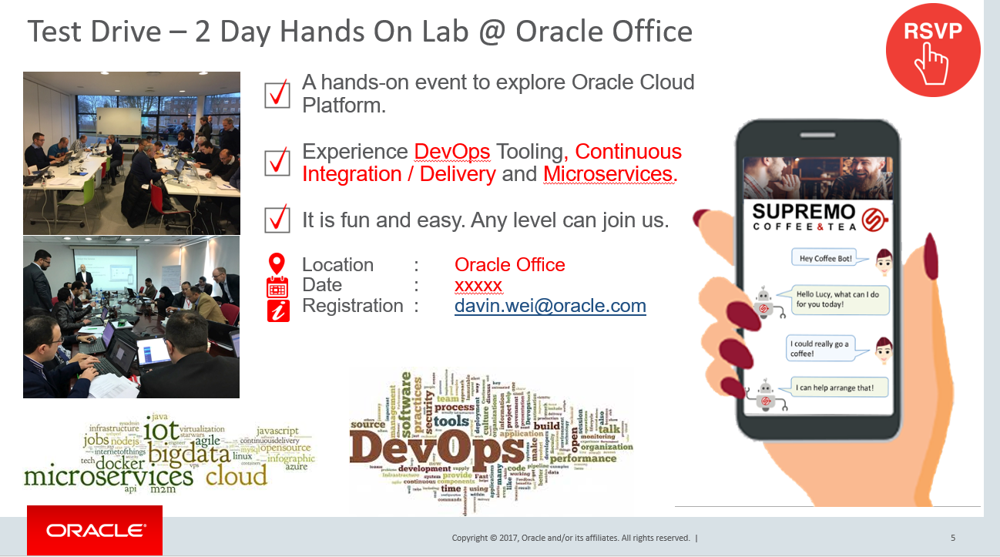

---
# 甲骨文云试驾 #

## 介绍 ##

本Oracle云项目包含在不同地点组织的针对云原生应用程序和移动设备的Oracle云试驾活动实验室材料。 参与者可以通过这些实验室使用JCS（Java云服务），DevCS（开发人员云服务），ACCS（应用程序容器云服务），ICS（集成云服务）和MCS（移动云服务）等一系列Oracle云服务进行实验。 通过这个云原生和移动测试驱动，参与者将有机会了解他们如何使用Oracle云服务实现云原生应用，微服务，集成和移动服务。 为了更好地了解公司如何以及何时可以使用Oracle云服务，我们将使用一个称为业务用例的服务场景 "[忠诚度管理](https://github.com/oraclechinaappdev/CloudNative_Mobile/blob/master/common/scenario/README.md)".   

更具体地说，该项目目前包含以下主题：

## Java Apps Lab ##
[Java Apps lab](https://github.com/oraclechinaappdev/CloudNative_Mobile/tree/master/Java%20Apps) 由以下部分组成:
+ DevOps工具的背景 - DevOps中的商业价值什么? DevCS（Developer CS），适用于像CI / CD这样的DevOps工具。
+ 使用初始GitHub存储库创建Oracle开发人员云服务（DevCS）忠诚度管理应用程序项目。
+ 在Oracle开发人员云服务中定义持续集成的“构建”和“部署”配置。
+ 持续集成和交付（CICD）：使用Eclipse IDE，将提交和推送代码更改为Oracle开发人员云服务。

## Microservices ##
[Microservices lab](https://github.com/oraclechinaappdev/CloudNative_Mobile/tree/master/Microservices) 向您展示如何使用Oracle ACCS（应用程序容器云服务）为微服务准备环境并开发微服务。 这个实验室是由以下部分组成:
+ 微服务的背景 - 什么是微服务？，为什么你需要微服务？，微服务的例子，关于ACCS等。
+ 从外部Git仓库导入代码，用于创建微服务，如提优惠息查询和QR代码生成。
+ 使用开发人员云服务和Oracle应用程序容器云服务构建和部署项目。

## Integrations ##
[Integrations lab](https://github.com/oraclechinaappdev/CloudNative_Mobile/tree/master/Integrations) 向您展示如何使用Oracle集成云服务（ICS）连接到后端应用程序并服务前端移动消费者请求。 本实验室由以下部分组成：
+ 集成背景 - 关于Oracle集成云服务（ICS）。
+ 配置到一个基于简单对象访问协议（SOAP）的客户关系管理（CRM）服务的连接，并将其展示为基于具象状态传输（REST）的服务，以处理优惠结果。
+ 配置集成流程以互连服务端点，映射请求和响应数据属性并编排决策逻辑。
+ 监控集成流事务和端点状态，性能统计信息和业务标识。

## Mobile Service and Application ##
[Mobile Service and Application lab](https://github.com/oraclechinaappdev/CloudNative_Mobile/tree/master/Mobile%20Service%20and%20App) 向您展示如何为移动应用程序创建移动服务，以及如何使用Oracle移动云服务（MCS）连接后端服务。 本实验室由以下部分组成：
+ 移动服务背景 - 挑战与解决方案，关于Oracle移动云服务（MCS）等。
+ 将移动后端程序包导入Oracle移动云服务（MCS）。
+ 创建连接器与外部服务集成以提供信息查询，QR码创建等
+ 创建自定义API和自定义代码以与外部服务集成。
+ 设置推送通知并发送通知到移动应用程序。
+ 创建自定义分析报告以跟踪“用户提交完成”
在本实验结束时，我们将根据我们所做的所有实验，为您提供忠诚度管理的端到端演示。

## Putting All Together ##
[Putting All Together lab](https://github.com/oraclechinaappdev/CloudNative_Mobile/tree/master/Putting%20All%20Together) 是端到端测试所有本地云和移动组件的最终实验室。 本节介绍如何通过移动云服务推送通知API与移动设备交互，并通过研讨会场景进行测试。 本实验室由以下部分组成：
+完成忠诚度管理JEE应用程序。
+今天所做的一切端到端测试。

本次研讨会要使用向您提供的Oracle Cloud帐户信息。 您将需要以下信息开始这些练习：
+ Oracle Cloud account **username** and **password**
+ Oracle Cloud **identity domain**

我们将分发“访问文档”，包括以上信息，为您提供有关如何访问此Cloud Test Drive的每个Cloud Services的信息。
