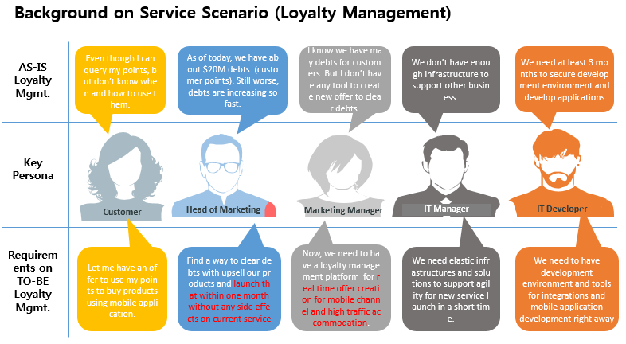
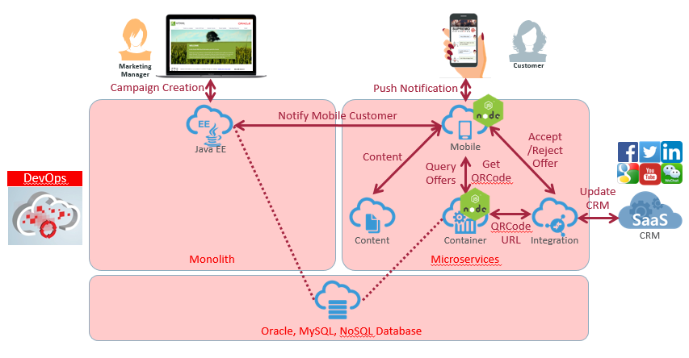

# Service Scenario for Test Drive #

## Introduction ##
We are going to use a service scenairo called "loyalty managment" for Cloud Native App and Mobile Test Drive. Loyalty Management can be summarized as a series of activities aimed at better serving customers. The concept explores the ways in which companies can acquire, engage and retain their customers and reviews the relationship between customer retention and the other aspects of the business. It is indeed one of mandatory weapons for your successful business. So, loyalty management based on proactive and real-time ways could be a good candidate for your business innovation. 
Through this Test Drive, we would like to let participants know how easy and fast companies can innovate their businesses using Oracle Cloud Services without any side effects on current business.

## Backgound on Service Scenario (Loyalty Management) ##
Nowadays, most of companies are providing (membership) points as a reward to customers who bought products or services. But it is not easy for customers to find when and how they use their points. For companies, accumulated points are debts to customers.That's why companies are looking for a proactive way to clear debts (customer points). We can also think about a situation like that specific products are selling well. In that case, we can design an offer targeted to those specific products. The below picture shows you major challenges and requirements on a proactive and real-time loyalty management.

## Overall service flow for Loyalty Managment ##
The below picture shows you overall service flow for proactive and real-time Loyalty Management. As you can see in the picture, loyalty manager can start the service flow by desinging and creating offers for customers. Customers will get push notification on offer, see the details in offer, and make a decision on whether she/he accept or reject the offer. And we will have offer results stored in CRM (Sales CS) for furthur marketing/sales activities. 

